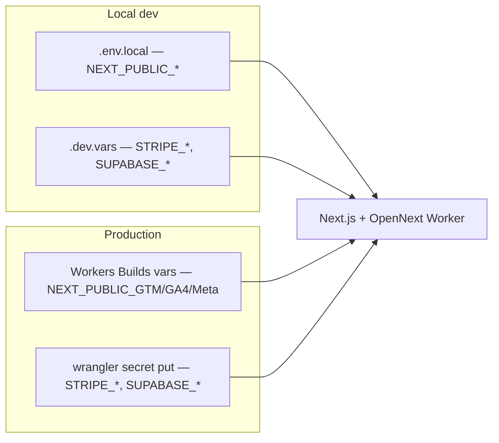

# Stripe Projects relevance for ceramics-drop

## Current state

| Signal | Finding |
|--------|---------|
| `.projects/` | **Absent** — Stripe Projects not initialized |
| `.skills/stripe-projects-cli/` | **Absent** — would appear after `stripe projects init` |
| Payments | **Stripe API** in-app ([`src/lib/stripe.ts`](src/lib/stripe.ts), webhook, Payment Element) — this is your **merchant** Stripe account, not “Projects provisioning” |
| Database | **Supabase** ([`src/lib/supabase.ts`](src/lib/supabase.ts)) |
| Hosting | **Cloudflare Workers** via OpenNext ([`wrangler.jsonc`](wrangler.jsonc), [`docs/cloudflare-deployment.md`](docs/cloudflare-deployment.md)) — custom domain `anna-ciok.studio`, Workers Builds on `main` |
| Analytics | **GTM + GA4 + Meta** — build-time `NEXT_PUBLIC_*` vars; GTM container managed via GCP scripts ([`docs/analytics-stack.md`](docs/analytics-stack.md)) |
| Planned (worktree only) | **InPost ShipX + Resend** in [`.claude/worktrees/inpost-shipping/.env.example`](.claude/worktrees/inpost-shipping/.env.example) — **not** in main `src/` yet |

**Credential layout today** (important for Projects fit):

Stripe Projects defaults to syncing into **`.env`** (or named env files like `.env.dev`). This repo intentionally splits **build-time** (`.env.local` / Workers Builds) vs **runtime Worker secrets** (`.dev.vars` / `wrangler secret put`). Projects does **not** push to Cloudflare production for you ([docs: production env vars](https://docs.stripe.com/projects.md#production-env)).

---

## What is relevant

### 1. Bootstrap workflow (if you adopt Projects)

Applies when you want an agent or CLI to manage infra credentials:

- Install: `stripe plugin install projects`
- Check catalog: `stripe projects search supabase`, `stripe projects search cloudflare`
- Init in repo root: `stripe projects init` (creates `.projects/`, updates `.gitignore`, installs local agent skill)
- Link existing accounts: `stripe projects link supabase`, `stripe projects link cloudflare`
- Pull credentials locally: `stripe projects env --pull`

Use **`--json`** on commands for agent-driven workflows (per Stripe’s agent guide).

### 2. Providers that match this codebase

| Provider | Relevance | Why |
|----------|-----------|-----|
| **Supabase** | **High** | Orders/inventory already use `SUPABASE_URL` + `SUPABASE_SERVICE_ROLE_KEY` ([`cloudflare-env.d.ts`](cloudflare-env.d.ts)). Projects can link an existing project or provision DB/auth and sync keys to a local env file. |
| **Cloudflare** | **Medium** | Production is already on Workers with manual Wrangler + dashboard setup. Projects can associate your CF account and expose API tokens, but **won’t replace** your OpenNext deploy flow, custom domains in `wrangler.jsonc`, or Workers Builds config. Useful mainly for **new** CF resources (KV, R2, D1) if you add them later — your deployment doc explicitly says v1 does **not** use those. |
| **Sentry** | **Low (optional)** | Not integrated today; only relevant if you add error monitoring. |
| **PostHog / Mixpanel / Amplitude** | **Low** | You use GTM/GA4/Meta, not these providers. |

### 3. Commands useful for this repo (conceptually)

| Command area | Use case here |
|--------------|---------------|
| `init` / `pull` / `status` | Onboard repo or clone; see linked services |
| `link` + `add supabase/...` | Connect existing Supabase or provision new DB for a greenfield teammate |
| `env --pull` | Refresh local secrets after teammate rotates keys |
| `env create` / `env use` | Separate **development** vs **production** credential sets (maps well to `.env.local` vs production-only secrets, if you configure output paths deliberately) |
| `rotate` | Rotate Supabase service role without manual dashboard copy-paste |
| `catalog` / `search` | Discover what Projects can provision before asking an agent |

### 4. Agent integration

The pasted **Agent integration guide** applies when you ask Cursor to “provision Supabase” or “set up Cloudflare for this repo.” The global skill at `stripe-projects` (already in your Cursor plugins) bootstraps CLI + catalog; after `init`, the **project-local** skill under `.skills/stripe-projects-cli/` takes over.

**Rules that matter for this repo:**

- Never print secret **values** (only names) — aligns with your security posture.
- Don’t hand-edit `.projects/` or vault — CLI is authoritative.
- **Do not** use Projects to “sign up for Stripe payments” — payment keys still come from the Stripe Dashboard / `stripe listen` for webhooks ([`docs/superpowers/plans/2026-06-02-stripe-payments.md`](docs/superpowers/plans/2026-06-02-stripe-payments.md)).

---

## What is partially relevant (caveats)

### Production on Cloudflare Workers

After `env --pull`, you still must:

1. Copy runtime secrets into **`.dev.vars`** for `preview:cf` / local Worker runtime, **or** run `npx wrangler secret put` for production.
2. Copy `NEXT_PUBLIC_*` into **`.env.local`** and **Workers Builds** dashboard (build embeds analytics IDs at compile time).

Projects does not automate Workers Builds or `wrangler secret` — your [cloudflare-deployment.md](docs/cloudflare-deployment.md) workflow stays the source of truth for prod.

### Merging with existing env files

Docs say `add` **merges** into existing `.env`. Here you have **`.env.example`** (analytics only), **`.env.local`**, **`.dev.vars`**, and **`.env.cf-typegen`**. You would need an explicit convention, e.g.:

- `stripe projects env create development --output .dev.vars` for Worker runtime secrets, and
- keep analytics in `.env.local` manually, **or**
- single `.env` + a small script to split into `.dev.vars` / `.env.local` (not provided by Stripe).

Without that convention, `env --pull` to default `.env` will **not** match how OpenNext/Wrangler load secrets today.

### Team sharing

- Commit **`state.json`** and **`state.local.json`** (per Stripe docs).
- Each developer runs **`env --pull`** locally; vault is not shared via git.
- Teammates use **`stripe projects link`** to attach their provider accounts.

---

## What is not relevant (for this codebase)

| Topic in Stripe Projects docs | Why it doesn’t apply |
|-------------------------------|----------------------|
| **Vercel, Netlify, Railway, Render, Fly.io** | You deploy to **Cloudflare Workers**, not those hosts. |
| **Neon, PlanetScale, Turso, Upstash** | DB is **Supabase**, already chosen. |
| **Clerk, Auth0, WorkOS** | No third-party auth product; storefront is anonymous + Stripe checkout email. |
| **Stripe Projects for Stripe Payment keys** | **Payments** use Dashboard API keys + webhook signing secret; Projects provisions **other** vendors. |
| **InPost / ShipX** | Not in the [30+ provider catalog](https://projects.dev/providers); upcoming shipping work must stay manual (Manager Paczek + `wrangler secret`). |
| **Resend** | Not listed as a Projects provider; use Resend dashboard + secrets manually (worktree plan). |
| **GTM / GCP / Meta** | Analytics stack is custom GTM API scripts + GCP service account ([`.env.example`](.env.example)); not in Projects catalog. |
| **`share` / `import` / `init --from URL`** | Only useful if you want to clone **this** stack to a new repo/teammate greenfield — optional, not needed for day-to-day on an existing production app. |
| **Billing / spend limits** | Relevant only if you provision **new paid** services through Projects (e.g. paid Supabase tier upgrade via CLI). |
| **Multi-environment prod sync** | Projects won’t write secrets to Workers Builds; you keep dashboard/`wrangler` for prod. |

---

## Practical recommendation

**Worth adopting (optional):** `stripe projects init` + `link`/`add` for **Supabase** (and optionally **Cloudflare** if you want centralized API token management), mainly to:

- Onboard new machines/teammates (`env --pull` instead of copying keys from 1Password)
- Rotate Supabase credentials with `rotate`

**Not worth forcing:** Replacing your entire secret pipeline with Projects-only `.env` without mapping to `.dev.vars` + Workers Builds + `wrangler secret put`.

**No action needed** for: Vercel-style hosting, auth SaaS, vector DBs, InPost, Resend, GTM/GCP, or Stripe payment key provisioning.

---

## If you proceed later (implementation sketch)

1. `stripe plugin install projects` && `stripe projects init` in repo root.
2. `stripe projects link supabase` (existing project `wnlysejenowymjdxlnaq` per payment plan doc).
3. Configure environment output to align with repo: e.g. `development` → `.dev.vars`, document that `NEXT_PUBLIC_*` stay in `.env.local`.
4. Document in README or cloudflare-deployment.md: after `env --pull`, run `wrangler secret put` for any new runtime keys before deploy.
5. Do **not** commit vault or `.env` files (Projects adds gitignore entries; your `.gitignore` already covers `.env`, `.dev.vars`).

No code changes required unless you choose to adopt Projects and update deployment docs.
