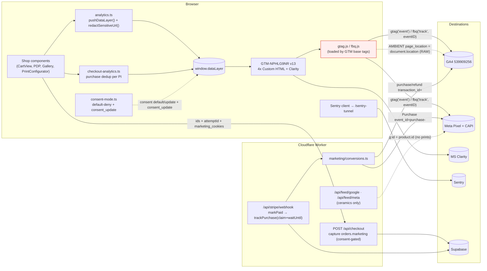

# Analytics event & parameter architecture — deep audit (2026-07-28)

- **Author:** Claude Code (deep-audit pass, follow-up to `docs/audits/event-system-audit.md`)
- **Scope:** every code path that creates, enriches, transports, or receives analytics data — `src/lib/analytics.ts`, `src/lib/checkout-analytics.ts`, `src/lib/marketing/*`, `src/components/{analytics,consent,shop}/**`, `src/app/api/{checkout,stripe/webhook,feed,auth,resend/webhook}/**`, `scripts/gtm-api.mjs`, the live GTM container, and the live GA4 property.
- **Method:** static code trace **+ live validation** against the production GTM container (`GTM-NPHLG9NR`) and GA4 property (`539909256`) using the local `gtm-api-deploy` service-account key (`.secrets/gtm-api-deploy.json`). No production analytics config was changed; no real purchases were made; all API calls were read-only (Tag Manager `versions:live`, GA4 Data API `runReport`, GA4 Admin API `customDimensions`/`dataStreams` GET).
- **Relationship to the prior audit:** the 2026-07-26 audit (`event-system-audit.md`, findings F-01…F-25) was a static-only pass on `main@4afef79`. Since then PRs #196/#198/#199/#200/#202/#203 landed. **Part 0 reconciles each prior finding against current code.** Parts 1-8 are this pass's own work; findings introduced here are prefixed **`N-`** and are clearly separated from the prior `F-` set.

> **Legend for confidence:** `[CONFIRMED-LIVE]` proven against the running GA4/GTM; `[CONFIRMED-CODE]` proven by reading current source; `[INFERRED]` strong reasoning not independently verified.

---

## Part 0 — Reconciliation of the prior audit (F-01 … F-25)

Verified this pass. "Fixed" means the code change is present **and** I checked it does what was intended.

| ID | Prior severity | Status now | Evidence |
|---|---|---|---|
| **F-01** payment_failed terminal → money-loss | Critical | **FIXED** `[CONFIRMED-CODE]` | `src/lib/webhook.ts:59-68` returns without releasing the hold; `succeeded`-on-dead-order now alerts (`stripe/webhook/route.ts:171-172`) and the under-fulfilment path auto-refunds (`:205-214`). |
| **F-02** live GTM consent state unverifiable | High | **FIXED + VERIFIED** `[CONFIRMED-LIVE]` | Live container = **v13**; all 5 tags `consentStatus:needed` gated on `analytics_storage`/`ad_storage` (see §2 matrix). |
| **F-03** GTM Custom-HTML bridges | High | **OPEN** `[CONFIRMED-CODE]` | Still 4 Custom-HTML tags + hand-written bridges (`scripts/gtm-api.mjs:324-414`). |
| **F-04** `fbq('set','userData')` advanced matching likely dead | Medium | **OPEN** `[CONFIRMED-CODE]` | Still present `scripts/gtm-api.mjs:383-385`; effectiveness unverifiable without Events Manager. |
| **F-05** conversions re-sent per redelivery | Medium | **FIXED** `[CONFIRMED-CODE]` | `orders.conversions_sent_at` CAS claim `stripe/webhook/route.ts:630-640`; migration `20260726120000`. |
| **F-06** no timeout/retry on CAPI/MP | Medium | **FIXED** `[CONFIRMED-CODE]` | `AbortSignal.timeout(8000)` in `meta-capi.ts:86`, `ga4-mp.ts:71,119`; send deferred to `ctx.waitUntil` (`route.ts:647`). |
| **F-07** print funnel missing view/list/select/remove | Medium | **OPEN** `[CONFIRMED-CODE]` | No `view_item`/`view_item_list`/`select_item` on print PDP/collection; print removal fires nothing (`CartView.tsx:575`, `PrintConfigurator.tsx:191`). See **N-2**. |
| **F-08** no `refund`/`add_shipping_info` | Medium | **PARTLY FIXED** `[CONFIRMED-CODE]` | GA4 `refund` shipped (`ga4-mp.ts:89-124`, `conversions.ts:224-263`). `add_shipping_info`/`add_payment_info`/`login`/`sign_up` still absent (see **N-7**). |
| **F-09** `begin_checkout` counted per click | Medium | **OPEN** `[CONFIRMED-CODE]` | `CartView.tsx:349` still fires per pay-click, no `attemptId` dedup. |
| **F-10** marketing context stored on consent=denied | Medium | **FIXED** `[CONFIRMED-CODE]` | `checkout/route.ts:356-381` nulls `fbp/fbc/ga_*/ip/ua` when denied. Banner still all-or-nothing (by design). |
| **F-24** `?sale=`/`?preview=` leak to analytics | Medium | **RE-OPENED, WORSE** `[CONFIRMED-LIVE]` | App-layer redaction shipped (`analytics.ts:377-383`) but **bypassed by gtag.js**; real tokens + Stripe client secrets are live in GA4. Escalated to **N-1 (Critical)**. |
| **F-11** CSP report-only, no report-uri | Low | **OPEN** `[CONFIRMED-CODE]` | `middleware.ts:69`; also Clarity host not allowlisted (**N-9**). |
| **F-13** Resend delivery statuses not persisted | Medium | **PARTLY FIXED** `[CONFIRMED-CODE]` | Inbound webhook now records `email_id` (`resend/webhook/route.ts:86`); send-time `resend_email_id`↔order correlation still not persisted in `email.ts`. |
| **F-16** Sentry env/`beforeSend` | Low | **OPEN** `[CONFIRMED-CODE]` | `sentry-options.ts:15` env falls back to `NODE_ENV`; no `beforeSend` in any of the 4 config files. |
| **F-18** no `webhook_events` ledger for Stripe | Medium | **OPEN** `[CONFIRMED-CODE]` | No `webhook_events` usage in the Stripe webhook; idempotency is per-step CAS only. |
| **F-19** analytics test gaps | Low | **PARTLY FIXED** | Conversion/webhook tests added (`conversions.test.ts`, `webhook/route.test.ts:749`); no e2e `dataLayer` smoke, no ESLint `gtag`/`fbq` guard. |
| **F-20** docs drift | Low | **MOSTLY FIXED** | `analytics-stack.md` updated for app_version, consent re-fire, engagement types. |
| **F-21** CAPI token in query string | Low | **OPEN** `[CONFIRMED-CODE]` | `meta-capi.ts:76-77` still `?access_token=`. |
| **F-22** GA4 `value` excludes shipping, Meta includes | Low | **OPEN (by design)** `[CONFIRMED-CODE]` | `ga4-mp` value=subtotal, `meta-capi` value=total. Internally consistent client↔server. |
| **F-23/F-25** StrictMode dev double-fire / `cart.purchased` no Sentry | Info/Info | **OPEN** | `route.ts:300-302` still `console.error` only. |
| app_version/app_git_sha dimensions | (follow-up) | **DONE + LIVE** `[CONFIRMED-LIVE]` | Registered as event-scoped custom dimensions (see §4). |
| consent re-fire | (new work) | **DONE + LIVE** `[CONFIRMED-LIVE]` | `ACC - Consent Update` trigger on GA4 base / Meta base / Clarity (v13). |

**Net:** the critical money bug and every High/Medium reliability + consent gap the prior audit prioritised are closed and verified. What remains open is mostly architectural (GTM bridges), the print funnel, and polish — **plus one control (F-24) that shipped but does not actually work**, which this pass caught only because it validated against live data.

---

## 1. Executive assessment

**Overall maturity: high for a store this size — one genuinely dangerous data/privacy defect, an incomplete prints funnel, and a pile of low-risk polish.** The foundations are unusually disciplined: a single typed event-builder layer (`src/lib/analytics.ts`), one dataLayer entry point (`pushDataLayer`), a deterministic cross-channel purchase key (`purchase-<payment_intent_id>`), consent-gated dual browser+server conversions, and a clean separation of analytics from operational side-effects (email/fulfilment/invoicing are idempotent and never coupled to tracking).

**Can the data be trusted?**
- **Purchases: yes.** `[CONFIRMED-LIVE]` GA4 shows `purchase` eventCount = **29** and transactions = **29** over 90 days (revenue ≈ 11,134) — the browser and server-MP channels are deduplicating **exactly 1:1** in production. Purchase is gated on `stripe.retrievePaymentIntent()` success, not on landing on the success page.
- **Top of funnel: partially.** Ceramics are well instrumented; **prints are a blind spot** (no view/list/select/remove events, and their Meta `content_ids` reference a catalog that contains no prints). GA4 **Enhanced Measurement runs in parallel** with hand-rolled scroll/form events, so several behaviours are double-instrumented.
- **Privacy: a live failure.** `[CONFIRMED-LIVE]` Single-use private-sale tokens, CMS preview JWTs, and Stripe `payment_intent_client_secret` values are sitting in GA4's `page_location` **right now** — the shipped F-24 redaction is silently bypassed.

**Highest-risk weaknesses (ranked):**
1. **N-1 (Critical):** capability tokens + Stripe client secrets leak to GA4 via gtag's ambient `page_location`. Confirmed live.
2. **N-2 (High):** prints absent from both merchant feeds while print events emit `fap0x` content ids → catalog attribution / dynamic remarketing structurally broken for the print line.
3. **N-3 (Medium):** Enhanced Measurement (`scroll`, `form_*`, site search) duplicates hand-rolled instrumentation — inflated volume, ambiguous "source of truth" per behaviour.
4. **N-4 (Medium):** client vs server GA4 `purchase` item arrays diverge (`item_variant`/list context client-only).

**Strongest parts:** the deterministic dedup key and its live 1:1 proof; the `conversions_sent_at` claim + `ctx.waitUntil` deferral (correct at-least-once handling without holding the webhook 200); consent default-deny + mid-session re-fire; SHA-256 hashing of match data before it ever hits the dataLayer; and the fact that **no application code calls `gtag()`/`fbq()` directly** — the only direct calls are the consent snippet and the GTM-internal `consent_update` push, both correct.

**Most important improvements, in order:** (0) stop leaking tokens/secrets to GA4; (1) put prints in the feed or stop emitting their catalog events; (2) pick one source per behaviour (kill EM duplicates or the hand-rolled ones); (3) register the ecommerce custom parameters as GA4 dimensions so they're queryable; (4) finish the print funnel and `begin_checkout` dedup.

---

## 2. Architecture & data-flow map

Transport is correct in scope: browser behaviour → dataLayer → GTM → GA4/Meta/Clarity (consent-gated); server conversions go **directly** to Meta CAPI + GA4 MP (not through GTM, deliberately — secrets can't live client-side and ssGTM has no ROI at this volume); operations (Stripe/Resend/InPost/Prodigi/Supabase) and observability (Sentry) are correctly outside the tag layer.

The dotted `AMBIENT page_location` edge is **N-1**: gtag.js attaches the unredacted URL to every event the app's redaction never touches.

---

## 3. Complete event inventory

Client events flow `pushDataLayer` → `window.dataLayer` → GTM trigger `ACC - analytics dataLayer events` (regex on `_event`) → GA4 bridge (`gtag('event')`) + Meta bridge (`fbq`). Server events go direct. Origin: **C**=client, **S**=server webhook.

| Event | Meaning | Trigger (code) | Origin | Transport | Dest | Key params | Identity | Consent | Dedup | Quality |
|---|---|---|---|---|---|---|---|---|---|---|
| `page_view` | page / route view | `AnalyticsEvents.tsx:13` effect on `[locale,pathname]` | C | dataLayer→GTM | GA4, Meta `PageView` | `page_location`,`page_path` (redacted), `page_title`,`locale` | — | analytics/ad | none (1×/nav) | app payload redacted; **ambient URL not — N-1** |
| `view_item_list` | gallery render | `Gallery.tsx:54`, `GroupedGallery.tsx:81` | C | GTM | GA4 | `items[]`,`item_list_id/name`,`currency` | — | analytics | none (effect deps) | ceramics only (**N-2**); StrictMode 2× in dev |
| `select_item` | tile click | `Gallery.tsx:93`, `GroupedGallery.tsx:153` | C | GTM | GA4 | item,`index`,list | — | analytics | n/a | ceramics only |
| `view_item` | PDP / lightbox | `ProductViewAnalytics.tsx:18`, `Lightbox.tsx:83` | C | GTM | GA4, Meta `ViewContent` | 1 item,`currency` | — | analytics/ad | none (re-fire on remount) | **no print PDP** (**N-2**) |
| `add_to_cart` | add | `AddToCartButton.tsx:62`, `ProductTile.tsx:156`, `Lightbox.tsx:256`, `PrintConfigurator.tsx:197` | C | GTM | GA4, Meta `AddToCart` | 1 item,`currency` | — | analytics/ad | store-transition guard | prints **present** here (only print funnel event that is) |
| `remove_from_cart` | remove | ceramic: `CartView.tsx:602`, tile/lightbox | C | GTM | GA4 | 1 item,`currency` | — | analytics | n/a | **print removal fires nothing** (**N-2**); no Meta signal |
| `view_cart` | cart render | `CartView.tsx:280` | C | GTM | GA4 | `items[]` (ceramic+print) | — | analytics | `viewedCartKeys` ref | properly deduped |
| `begin_checkout` | pay click | `CartView.tsx:349` | C | GTM | GA4, Meta `InitiateCheckout` | items,`shipping_tier`,`checkout_total`,`user_data.em` | hashed em | analytics/ad | **none per attempt (F-09)** | inflated on retry-after-error |
| `purchase` | confirmed order | `koszyk/return/page.tsx:38` → `checkout-analytics.ts` | C | GTM | GA4, Meta `Purchase` | items,`transaction_id=<pi>`,`shipping`,`order_total`,`user_data.em` | hashed em | analytics/ad | sessionStorage `acc_purchase_pi:<pi>` + cookie snapshot; `event_id=purchase-<pi>` | **verified 1:1 live** |
| Meta CAPI `Purchase` | server backup | `webhook.ts:46`→`conversions.ts:135` | S | direct HTTPS | Meta CAPI | value=**total**, hashed `em/ph/fn/ln/ct/zp/country`+`fbp/fbc/ip/ua`, `order_id` | hashed PII | `marketing.consent==='granted'` | `event_id=purchase-<pi>` + `conversions_sent_at` claim | 8s timeout, waitUntil, claim-once |
| GA4 MP `purchase` | server backup | `conversions.ts:170`→`ga4-mp.ts:57` | S | direct HTTPS | GA4 | value=**subtotal**, `shipping`, items (**no item_variant**), `session_id`, `app_version` | `client_id`+`session_id` from `_ga*` | granted | `transaction_id=<pi>` | skips + Sentry-warns if `client_id` null (**N-6**) |
| GA4 MP `refund` | revenue reversal | `releaseSale`→`conversions.ts:224` | S | direct HTTPS | GA4 | value=subtotal, `transaction_id=<pi>` | `client_id` | granted | GA4 by `transaction_id` | GA4-only (Meta can't un-fire) |
| `site_engagement` (×17 `engagement_type`) | funnel/demand | many (see §parameter dict) | C | GTM | GA4, Meta `SiteEngagement` | `engagement_type`+per-type | mostly none | analytics/ad | per-type | some carry currency-less money (**N-5**) |
| `consent_update` | GTM re-fire signal | `consent-mode.ts:61` | C | dataLayer→GTM only | — (never GA4/Meta) | `consent_state` | — | n/a | n/a | correctly excluded from analytics regex |

**GA4 Enhanced Measurement auto-events (not app code)** `[CONFIRMED-LIVE]`, stream `G-WPJ3RE32M6`, all enabled: `session_start`, `first_visit`, `user_engagement`, `scroll`, `click` (outbound), `form_start`, `form_submit`, `view_search_results`, plus video/file-download. These are emitted by gtag.js independently of the dataLayer contract — see **N-3**.

---

## 4. Parameter dictionary

Canonical types are from `src/lib/analytics.ts` (`AnalyticsItem`, `EcommercePayload`, `MetaPayload`) and `src/lib/marketing/{ga4-mp,meta-capi,context}.ts`. "Registered" = present in GA4 custom dimensions `[CONFIRMED-LIVE]`.

### Ecommerce item (`AnalyticsItem`, `analytics.ts:16-27`)

| Param | Meaning | Type / format | Source | Required | Notes / inconsistency |
|---|---|---|---|---|---|
| `item_id` | product/design id | string `k01`,`fap01` | `product.id` / design id | yes | matches Meta `content_ids`; matches **ceramic** feed `g:id`; **no print feed row** (**N-2**) |
| `item_name` | display name | string `"Kubek Nº 5"` | derived | yes | high-cardinality by design (unique pieces) |
| `item_brand` | brand | const `"Anna Ciok Ceramics"` | hardcoded | yes | consistent |
| `item_category` | category slug | string | `product.category` / `'fine-art-prints'` | yes | consistent |
| `item_variant` | variant | string | ceramic `"Nº <num>"`; print size/frame label | no | **semantics differ** (ceramic = piece number, not a variant); **omitted server-side** (**N-4**) |
| `price` | unit price | number, **major units** | `priceOfCurrency` (client) / `unit_price/100` (server) | yes | demand events send base PLN (**N-5**) |
| `quantity` | qty | literal `1` | const | yes | always 1 (unique/POD) |
| `index`,`item_list_id`,`item_list_name` | list context | number/string | list render | no | **client-only**; absent server-side |

### Ecommerce envelope + purchase

| Param | Meaning | Type | Source | Notes |
|---|---|---|---|---|
| `currency` | display currency | `'PLN'\|'EUR'\|'GBP'` | `useCurrency()` (client) / `orders.currency` (server) | client fallback const `ANALYTICS_CURRENCY='PLN'` is unreachable from real call-sites |
| `ecommerce.value` | **item subtotal** | number major | `sumItems()` | GA4 revenue **excludes shipping** (F-22) |
| `ecommerce.shipping` | shipping | number major | checkout | on purchase/refund |
| `order_total`/`checkout_total` | subtotal+shipping | number major | builder | **NOT registered** as GA4 dimension (**N-8**) |
| `transaction_id` | order key | string = `payment_intent_id` | Stripe PI | client==server; GA4 dedup key |
| `shipping_tier` | delivery method | string | checkout | **NOT registered** (**N-8**) |
| `event_id` (Meta) | dedup key | string `purchase-<pi>` (purchase) / random (others) | builder | only purchase's is deterministic/meaningful |
| `meta.value` | **order total** | number major | `withMeta(orderTotal)` | Meta value **includes** shipping (≠ GA4) |
| `user_data.em` | hashed email | SHA-256 hex | `sha256Hex` before dataLayer | only on begin_checkout + purchase |

### Server match data (`MetaUserData`, `meta-capi.ts:5-12`) — Meta CAPI only

`em/ph/fn/ln/ct/zp/country` = `string[]` of SHA-256 hex (normalised then hashed, `hash.ts`); `client_ip_address`/`client_user_agent` = raw (CAPI requirement); `fbp`/`fbc` = raw cookie values. All pruned if null (`pruneUserData`). Captured at checkout into `orders.marketing` (`context.ts`), consent-gated.

### `site_engagement` extra params — live 90-day volumes `[CONFIRMED-LIVE]`

`scroll_depth`(1008), `time_on_page`(538), `shop_filter`(243), `sold_item_view`(84), `parcel_locker_point_selected`(66), `showroom_product_view`(47), `language_change`(32), `cart_cta_click`(26), `checkout_error`(19), `showroom_view`(13), `courier_select`(5), `pickup_select`(3), `showroom_interest_submit`(3), `parcel_locker_select`(2), `payment_failed`(2), `cart_clear`(1), `newsletter_signup`(1). (`contact_form_mailto_open` = 0 in window.)

### GA4 registered custom dimensions (15/50) `[CONFIRMED-LIVE]`

`item_id`, `item_category`, `engagement_type`, `reason`, `status`, `method`, `page`, `locale`, `from_locale`, `to_locale`, `filter_status`, `topic`, `locker_name`, `app_version`, `app_git_sha`.
**Collected but NOT registered (unqueryable in Explore/reports):** `order_total`, `checkout_total`, `shipping_tier`, `percent_scrolled`, `engagement_seconds`, `num_items`, `item_name`, `price`, `count`, `location`, `filter_status` values beyond the registered dim.

---

## 5. Client / server responsibility matrix

| Event | Correct home | Current | Verdict |
|---|---|---|---|
| `page_view`, `view_item_list`, `select_item`, `view_item`, `view_cart`, `add_to_cart`, `remove_from_cart` | client-only | client | correct (behavioural, needs no server truth) |
| `begin_checkout` | client-only | client | correct — but dedup per `attemptId` (F-09) |
| `purchase` | **both, deduped** | both (browser + CAPI + GA4 MP), keyed `purchase-<pi>`/`transaction_id=<pi>` | correct & **live-verified 1:1**; keep |
| `refund` | server-only | server (GA4 MP) | correct (browser can't observe refunds) |
| `login` / `sign_up` | client or server | **absent** | gap (**N-7**) — add lightweight client event on `/api/auth/callback` success |
| `add_shipping_info` | client-only | emitted as custom `*_select` | acceptable; optionally map to the standard name |
| Scroll / form-interaction / site-search | **pick one** | **both** (EM auto + hand-rolled) | wrong — dedupe by turning off one side (**N-3**) |
| Server match data (hashed PII) | server-only | server (CAPI) + a hashed `em` also client-side for advanced matching | acceptable; the client `em` is hashed and consent-gated |

Guiding principle already followed well: **confirmed outcomes** (purchase, refund) get a server channel; **intent/behaviour** stays client. The only misplacements are the EM duplicates and the missing auth events.

---

## 6. Findings

### 🔴 Critical

#### N-1 — Capability tokens and Stripe client secrets leak to GA4 via gtag's ambient `page_location`
- **Evidence `[CONFIRMED-LIVE]`** (GA4 Data API, `pageLocation` dimension, 180d):
  - `https://anna-ciok.studio/koszyk?sale=b3926c5d-6afa-4679-8767-42874e3d603d` — **51 events**, a complete, readable private-sale token.
  - `.../fine-art-prints/fap01?preview=eyJraW5kIjoicHJvZHVjdF9ub3Rlcy…` — CMS preview JWT.
  - `.../koszyk/return?payment_intent=pi_3Teiio…&payment_intent_client_secret=pi_3Teiio…` — **Stripe client secret**.
  - The **same** report also contains `payment_intent=redacted` rows — proving the app-layer redaction works for the `page_view` event but is bypassed elsewhere.
- **Mechanism `[CONFIRMED-CODE/INFERRED]`:** `redactSensitiveUrl()` (`analytics.ts:388`) only rewrites the `page_location`/`page_path` params the app puts on its **own** `page_view` event (`:416-417`). gtag.js (loaded by `ACC - GA4 base`, `send_page_view:false`) independently attaches `page_location = document.location.href` as a **default parameter on every event** — GA4 auto-events (`session_start`, `user_engagement`, `scroll`) and the app's own non-page_view events (`view_cart`, `add_to_cart`, `site_engagement`) all inherit the raw URL. The redaction never reaches them.
- **Affected events:** every GA4 hit fired while the URL carries `?sale=`/`?preview=`/`?payment_intent[_client_secret]=`/`?order=`.
- **Business/security impact:** anyone with GA4 read access (or a future BigQuery export, or Google internally) can read valid single-use purchase links for reserved/sold pieces, admin preview tokens, and Stripe client secrets. This silently defeats the F-24 control the team believes shipped. Stripe explicitly classifies `client_secret` as sensitive.
- **Recommended fix (defence in depth):**
  1. **Strip the token from the URL after consumption** via `history.replaceState` on the routes that own it: `/koszyk` (after reading `?sale=`), PDPs (after reading `?preview=`), and `/koszyk/return` (after `retrievePaymentIntent`). This fixes gtag ambient capture, browser history, and `Referer` in one move.
  2. **Belt-and-braces:** override `page_location` at the GA4 layer — either `gtag('set', { page_location: <redacted> })` in the base tag, or a GTM "Page Location" variable that runs the same redaction, so nothing depends on the URL being clean.
  3. Longer term, stop putting capability tokens in query strings (path segment + `POST`, or a short server-set cookie).
- **Complexity:** S–M. **Regression risk:** medium on `/koszyk/return` (must `replaceState` *after* the PI retrieve, or a refresh loses the secret) — low elsewhere.
- **Exploitability of what already leaked `[CONFIRMED-LIVE]`:** I checked the two exposed `?sale=` tokens against `private_sales` — both are now **expired** (`934a877f…` consumed 2026-06-15, expired 06-29; `b3926c5d…` never consumed, expired 06-29), so no emergency rotation is needed for these two. **This does not lower the finding's severity:** the leak is continuous, so any *newly minted* private-sale token or CMS preview JWT is exposed to GA4 during its entire valid window (these had ~2-week windows), and the Stripe `client_secret` leaks in **real time** while the buyer is on `/koszyk/return`. Fix the mechanism regardless; rotate the CMS preview secret as hygiene.

### 🟠 High

#### N-2 — Prints are absent from both merchant feeds while their events emit `fap0x` catalog ids (and their funnel is unmeasured)
- **Evidence `[CONFIRMED-CODE]`:** `/api/feed/{google,meta}` iterate `getPublicProducts()` (ceramics only); `fine-art-prints` is explicitly excluded (`feed.ts:51,64,88`, `// ponytail: excluded from feed`). Yet print events emit `content_ids = fap0x` / `item_id = fap0x` (`analytics.ts:129-130,176-184`). Print PDP fires no `view_item`/`ViewContent` (`PrintProductScreen.tsx` mounts only `PrintConfigurator`); collection fires no `view_item_list`/`select_item` (`PrintCollectionScreen.tsx` server-only links); print removal fires no `remove_from_cart` (`CartView.tsx:575`, `PrintConfigurator.tsx:191`).
- **Impact:** Meta `AddToCart`/`Purchase` for prints reference catalog ids that don't exist → **dynamic remarketing and catalog-attributed conversions for the entire print line are impossible**. In GA4, prints "appear from nowhere" at `add_to_cart` with no list/detail funnel. This is a distinct, deeper issue than the prior F-07 (which only noted the missing events).
- **Fix:** (a) add prints to `/api/feed/meta` (and Google) with `id = fap0x` matching `content_ids` — the correct move since prints are actively sold; **or** (b) if catalog ads for prints aren't wanted, stop sending Meta content events for prints to avoid dangling ids. Then add the missing client events (mirror the ceramic islands into `PrintProductScreen`/`PrintCollectionScreen`, add a `buildPrintRemoveFromCartEvent`).
- **Complexity:** M. **Regression risk:** low.

### 🟡 Medium

#### N-3 — GA4 Enhanced Measurement duplicates hand-rolled instrumentation
- **Evidence `[CONFIRMED-LIVE]`:** stream `G-WPJ3RE32M6` has `scrollsEnabled`, `formInteractionsEnabled`, `siteSearchEnabled` (`q,s,search,query,keyword`), `outboundClicksEnabled`, video, file-downloads all `true`. Live counts: auto `scroll` 128/28d **and** custom `scroll_depth` 1008/90d; auto `form_start`(26)/`form_submit`(23) **and** custom `newsletter_signup`/`contact_form_mailto_open`; `view_search_results`(20) despite no real on-site search.
- **Impact:** two parallel measures of scroll and form behaviour (no single source of truth); inflated event volume; `view_search_results` is likely noise (inbound URLs carrying `s`/`q`). Not double-counting a single event *name*, but redundant taxonomy that confuses reporting.
- **Fix:** decide per behaviour and turn off the loser in **GA4 Admin → Data Streams → Enhanced Measurement** (config, not code): keep EM `scroll`/`form_*` and delete the custom `scroll_depth`/newsletter/contact engagement events, **or** keep the custom ones and disable those EM toggles. Disable site search (no real search). **Complexity:** S (admin toggle). **Regression risk:** low; **update historical-reporting expectations** if a metric's source changes.

#### N-4 — Client vs server GA4 `purchase` item arrays diverge
- **Evidence `[CONFIRMED-CODE]`:** client items carry `item_variant` (+`index`/`item_list_*`) (`analytics.ts:97-108`); server `Ga4Item` (`ga4-mp.ts:1-8`) and `conversions.ts:81-88` **omit `item_variant`** for ceramics and all list context. Both hits share `transaction_id`; GA4 keeps the first-arriving purchase for that id, so item detail is a **race** between channels.
- **Impact:** item-level reporting (variant/list dimensions) for the same order is non-deterministic. Low revenue impact (value/ids agree), real for item analytics.
- **Fix:** add `item_variant` (and, if desired, `item_brand` already present) to the server item builder so both channels agree. **Complexity:** S. **Risk:** low.

#### N-5 — Demand-signal events carry currency-less or base-PLN money
- **Evidence `[CONFIRMED-CODE]`:** `showroom_product_view`/`sold_item_view` send `price` from `toAnalyticsItem(product)` with **no `priceOverride`** → raw base `product.price` (PLN units) regardless of the visitor's currency, and no `currency` field (`ProductTile.tsx:69,85`). `cart_clear`/`cart_cta_click` send `value`/`total` in display currency but **no `currency` field** (`SelectionBar.tsx:38,53`). This is the same class of bug the #203 fix closed for `remove_from_cart` — its siblings were missed.
- **Impact:** demand signals (which drops to reprint, cart-abandon value) mix currencies with no label → unusable for value analysis for non-PLN visitors.
- **Fix:** pass `priceOfCurrency(product, currency)` and include a `currency` field (both are already in scope via `useCurrency()`). **Complexity:** S. **Risk:** low.

### 🔵 Low

- **N-6 — GA4 MP purchase silently skipped when `_ga` client_id is absent** `[CONFIRMED-CODE]` (`ga4-mp.ts:66`, escalated to Sentry warning in `conversions.ts:173-187`). Safari ITP / cleared cookies drop the server GA4 channel; the browser channel usually covers it, but server was meant to be the safety net. Observable (good). Consider a fallback `client_id` derived from a first-party server cookie.
- **N-7 — No `login`/`sign_up` events; `user_id` never set on any analytics hit** `[CONFIRMED-CODE]` (`/api/auth/*`, `GoogleTagManager.tsx`). Logged-in customers are indistinguishable from guests; no cross-device stitching. Add a `login`/`sign_up` dataLayer event on `/api/auth/callback` success and set GA4 `user_id` for authenticated sessions.
- **N-8 — `order_total`/`shipping_tier`/`checkout_total` collected but not registered as GA4 dimensions** `[CONFIRMED-LIVE]` (15 dims, none of these). Register them (headroom is 15/50) or drop them from payloads.
- **N-9 — Clarity host not in CSP allowlist** `[CONFIRMED-CODE]` (`middleware.ts:71,74` lack `*.clarity.ms`). Harmless while CSP is report-only; **will break Clarity the moment CSP is enforced.** Add `https://*.clarity.ms` to `script-src`+`connect-src` before enforcing. (Extends F-11.)
- **N-10 — `newsletter_signup` counts request-accepted, not confirmed subscription** `[CONFIRMED-CODE]` (`FooterNewsletterForm.tsx:40` fires on the POST 200; the double-opt-in confirmation GET has no event). Overcounts subscribers vs actual Resend contacts.
- **N-11 (Info) — GA4 revenue float noise** `[CONFIRMED-LIVE]` (total = `11134.000004`): major-unit float summation. Cosmetic; avoidable by summing minor units and dividing once.
- **N-12 (Info) — `item_variant` semantics inconsistent** (ceramic piece number vs print variant label): a GA4 "variant" dimension carrying a per-piece id inflates cardinality with no analytical meaning.

**Still-open prior findings** (full status in Part 0): F-03 (GTM bridges), F-04 (fbq advanced matching), F-07 (print funnel — subsumed by N-2), F-09 (begin_checkout dedup), F-11 (CSP), F-16 (Sentry env/beforeSend), F-18 (Stripe event ledger), F-21 (CAPI token in query), F-22 (value convention), F-25 (cart.purchased Sentry).

---

## 7. Recommended target architecture

The prior audit's target (its §G) is right and ~85% built. This pass adds four things it didn't surface. **No rewrite is warranted** — the typed builder layer, dedup key, and idempotent conversions are already the target shape.

1. **Redaction that can't be bypassed.** Treat "no capability token reaches any third party" as an invariant, not a per-event filter: `history.replaceState` on token-bearing routes **plus** a GA4-layer `page_location` override. Add a Playwright assertion that loads `/koszyk?sale=TEST` and asserts no `dataLayer`/network hit contains the token. (Fixes N-1; hardens F-24.)
2. **One catalog id space.** Feed `g:id`, analytics `item_id`, and Meta `content_ids` must be the same set for **both** product types. Either prints go in the feed or they stop emitting catalog events. (Fixes N-2.)
3. **One source per behaviour.** EM auto-events vs hand-rolled are a governance choice — document which owns scroll/form/search and disable the other. (Fixes N-3.)
4. **Symmetric purchase payloads.** The server conversion item builder should produce the same item shape as the client builder (share `toAnalyticsItem` fields). (Fixes N-4.)

Everything else the prior audit proposed stays: keep server conversions direct (no ssGTM at this volume), keep Sentry/Resend/Stripe out of the tag layer, optionally migrate the GTM Custom-HTML bridges to native GA4-Event + Meta-template tags (F-03) — that removes the ~998-event loop class of bug but is not urgent now that the guard and consent gating are verified live.

**Lightweight schema/typing** (evidence-supported, not speculative): the builders in `analytics.ts` already are the typed contract. The cheap wins are (a) a Zod parse at `pushDataLayer` in dev to catch missing `currency`/`item_id` (would have caught N-5), and (b) an ESLint `no-restricted-globals` for `gtag`/`fbq` to protect the current discipline (F-19). A full shared client/server event map or runtime validation on the hot path is not justified at this volume.

---

## 8. Prioritized implementation plan

### Phase 0 — Immediate (privacy / data corruption)
| Task | Findings | Files | Acceptance | Complexity | Risk | Reporting impact |
|---|---|---|---|---|---|---|
| 0.1 Stop token/secret leak: `replaceState` on `/koszyk`, PDP, `/koszyk/return` + GA4-layer `page_location` override; Playwright assertion on `?sale=TEST` | **N-1**, F-24 | `koszyk/page`, PDP screens, `koszyk/return/page.tsx`, GTM base tag, new e2e | GA4 `pageLocation` for those routes shows only redacted values | S–M | Med on return page | rotate exposed private-sale tokens + CMS preview secret |
| 0.2 Disable GA4 EM site-search (noise) + decide scroll/form ownership | N-3 | GA4 Admin (no code) | one source per behaviour | S | Low | note metric source change |

### Phase 1 — High-ROI reliability / correctness
| Task | Findings | Files | Acceptance | Complexity | Risk |
|---|---|---|---|---|---|
| 1.1 Prints in the Meta/Google feed (or stop print catalog events) | **N-2**, F-07 | `feed.ts`, feed routes | feed `g:id` ⊇ every emitted `content_ids` | M | Low |
| 1.2 Print funnel events: `view_item`/`view_item_list`/`select_item` + `buildPrintRemoveFromCartEvent` | N-2, F-07 | `PrintProductScreen`, `PrintCollectionScreen`, `CartView`, `PrintConfigurator`, `analytics.ts` | GA4 shows print view→cart funnel | M | Low |
| 1.3 Currency on demand events | N-5 | `ProductTile.tsx`, `SelectionBar.tsx` | every money param has a `currency` sibling in display currency | S | Low |
| 1.4 `begin_checkout` dedup per `attemptId` | F-09 | `CartView.tsx`, `checkout-analytics.ts` | one event per attempt across retries | S | Low |

### Phase 2 — Schema / consistency
| Task | Findings | Files | Acceptance | Complexity | Risk |
|---|---|---|---|---|---|
| 2.1 Symmetric server purchase items (`item_variant` etc.) | N-4 | `conversions.ts`, `ga4-mp.ts` | client & server item arrays match | S | Low |
| 2.2 Register `order_total`/`shipping_tier`/`checkout_total` as GA4 dims (or drop) | N-8 | GA4 Admin | params queryable in Explore | S | none |
| 2.3 `login`/`sign_up` + GA4 `user_id` for auth | N-7, F-08 | `auth/callback`, GTM config | account funnel visible | M | Low |
| 2.4 Optional: migrate GTM Custom-HTML bridges → native tags | F-03/F-04 | `gtm-api.mjs`, container | container editable in UI; advanced matching via documented API | M–L | Med (collection gap) |

### Phase 3 — Testing / observability / governance
| Task | Findings | Files | Acceptance | Complexity |
|---|---|---|---|---|
| 3.1 e2e `dataLayer` smoke via `acc_analytics_debug` + token-leak assertion | F-19, N-1 | `e2e/*` | CI fails on missing/renamed events or leaked tokens | M |
| 3.2 ESLint `no-restricted-globals` for `gtag`/`fbq` in `src/` | F-19 | eslint config | direct calls rejected | S |
| 3.3 Sentry `SENTRY_ENVIRONMENT=preview` + minimal `beforeSend` scrub | F-16 | Workers Builds, `sentry-options.ts` | preview events isolated; `extra` scrubbed | S |
| 3.4 CSP: add `*.clarity.ms`, add `report-to`, then enforce | F-11, N-9 | `middleware.ts` | reports collected; enforce without breakage | S |
| 3.5 Stripe `webhook_events` ledger; `cart.purchased` Sentry | F-18, F-25 | webhook route | one dedup pattern across webhooks | M |

---

## Appendix A — Live validation performed
- **GTM Tag Manager API** `versions:live` → container **v13**, 5 tags, consent matrix in §2 (resolves prior "could not verify #1").
- **GA4 Data API** `runReport`: event breakdown (28/90d), purchase 29 events == 29 transactions (dedup proof), `engagement_type` taxonomy, and the `pageLocation` token-leak probe (N-1 proof).
- **GA4 Admin API**: 15 custom dimensions listed (§4); Enhanced Measurement settings (N-3 proof).
- **Supabase (read-only SELECT)**: confirmed both leaked `?sale=` tokens are expired (one consumed) — see N-1 "Exploitability".
- Tooling: `.secrets/gtm-api-deploy.json` via `google-auth-library`, scopes `tagmanager.readonly` + `analytics.readonly`. Reusable for CI Measurement-Protocol validation and a periodic "UI-added tag went ungated" check.

## Appendix B — Not verified (needs dashboards this pass couldn't reach)
- **Meta Events Manager:** actual browser↔CAPI dedup rate, `fbq('set','userData')` advanced-matching effectiveness (F-04), whether a print Meta catalog exists separately.
- **Stripe Dashboard:** webhook endpoint API version vs SDK `2026-05-27.dahlia`; subscribed events; PMC config.
- **Resend Dashboard:** automation config, suppression policy, send-time `email_id` persistence (F-13 send side).
