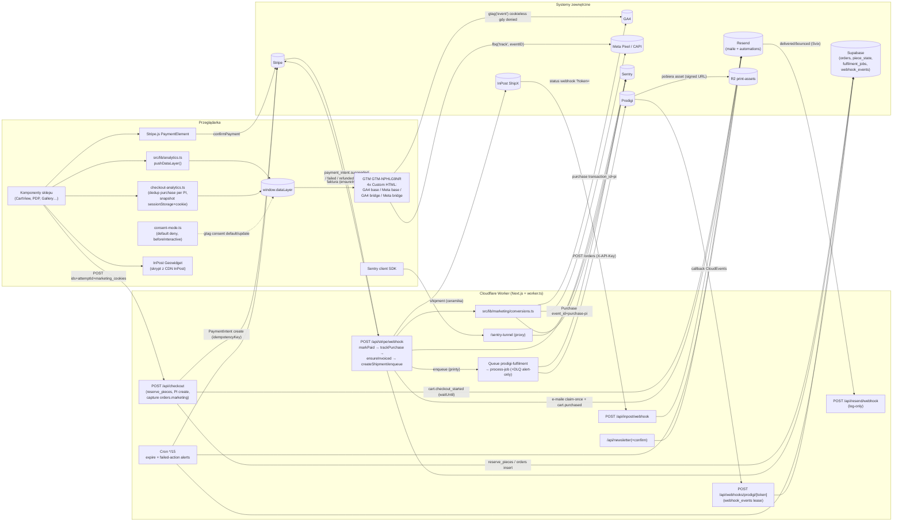

# Audyt systemu eventów, telemetrii i wysyłki danych

- **Data:** 2026-07-26
- **Zakres:** całe repozytorium (`src/`, `worker.ts`, `scripts/`, `supabase/`, `e2e/`, konfiguracje, workflowy CI)
- **Stan repo:** branch `claude/ecommerce-event-system-audit-83hkip` na bazie `main@4afef79` (v0.10.0)
- **Metoda:** statyczna analiza kodu + eksporty konfiguracji zapisane w repo (kontener GTM, Tag Assistant). Żaden produkcyjny event nie został wysłany, żaden kod aplikacji nie został zmieniony.

---

## A. Executive summary

**Ocena ogólna: system jest zaskakująco dojrzały jak na sklep tej skali — z jedną architektoniczną decyzją wysokiego ryzyka (własnoręczne „bridge'e" w GTM) i kilkoma konkretnymi dziurami.**

1. **Czy system jest spójny?** W dużej mierze tak. Istnieje jedna, typowana warstwa budowania eventów (`src/lib/analytics.ts`), jeden punkt wejścia do dataLayer (`pushDataLayer`), wspólny deterministyczny `event_id` dla dedupu browser↔serwer (`purchase-<payment_intent_id>`), a operacje biznesowe (e-maile, fulfilment, faktury) są konsekwentnie oddzielone od analityki i chronione idempotentnymi claimami. Główne niespójności to: ślepe pola lejka dla printów (brak `view_item`/`remove_from_cart`), brak `refund`/`add_shipping_info`/`add_payment_info` oraz rozjazd dokumentacji z kodem.

2. **Czy można ufać raportowanym danym?** Danym o **zakupach** — w przeważającej mierze tak (podwójny tor browser+serwer, dedup po `event_id`/`transaction_id`, zakup potwierdzany przez `stripe.retrievePaymentIntent`, nie przez samo wejście na stronę sukcesu). Danym o **górze lejka** — z zastrzeżeniami: konsent w modelu „wszystko albo nic", brak widoczności, czy live kontener GTM ma bramki consent na tagach (eksport w repo jest przestarzały — patrz F-02), oraz udokumentowany, naprawiony dopiero w wersji kontenera v6 incydent pętli ~998 eventów na jeden `page_view` (`docs/gtm-hotfix.md`), który mógł zniekształcić dane historyczne.

3. **Czy istnieje ryzyko utraty albo duplikacji eventów?** Duplikacja `purchase` jest dobrze zabezpieczona (sessionStorage + cookie po stronie klienta; `event_id`/`transaction_id` po stronie dostawców). Ryzyka realne: (a) utrata zamówienia i wszystkich jego eventów w scenariuszu „nieudana próba płatności → ponowna próba na tym samym PaymentIntencie" (F-01 — najpoważniejsze znalezisko audytu, dotyczy pieniędzy, nie tylko danych); (b) bezpowrotna utrata konwersji serwerowej przy chwilowej awarii Meta/GA4 (brak retry, F-06); (c) duplikacja Meta CAPI przy redeliveries Stripe po >48h (poza oknem dedupu Mety, F-05).

4. **Czy GTM jest używany poprawnie?** Ładowanie, kolejność consent-default → GTM, pojedynczy `page_view` (własny event + `send_page_view: false`) i obsługa zmian tras są poprawne. Natomiast **sposób użycia kontenera jest niekonwencjonalny i kruchy**: zamiast natywnych tagów GA4/Meta kontener zawiera cztery tagi Custom HTML, w tym dwa ręcznie napisane „bridge'e" czytające surowe obiekty z `window.dataLayer` przez nieoficjalne API `google_tag_manager[ID].dataLayer.get()`. Ta konstrukcja już raz położyła analitykę na produkcji (pętla eventów). GTM pełni tu rolę „hostingu skryptów", a nie platformy zarządzania tagami — szczegóły w sekcji F.

5. **Trzy największe problemy:**
   - **F-01 (Critical):** `payment_intent.payment_failed` traktowany jako zdarzenie terminalne — zwalnia rezerwacje i flaguje zamówienie `failed`, mimo że kupujący może ponowić płatność na tym samym PaymentIntencie; udany retry kończy się pobraniem pieniędzy bez zamówienia, e-maila, fulfilmentu i konwersji.
   - **F-02/F-03 (High):** stan consent w live kontenerze GTM jest nieweryfikowalny z repo (przestarzały eksport v3 pokazuje tagi bez bramek consent; Meta Pixel nie honoruje Google Consent Mode sam z siebie), a cała architektura bridge'ów Custom HTML jest utrzymaniowo krucha.
   - **F-04/F-24 (Medium):** wycieki tokenów-sekretów do analityki (`?sale=` w `page_location`) oraz prawdopodobnie martwe advanced matching przeglądarkowe (`fbq('set','userData')` nie jest udokumentowanym API Mety).

---

## B. Inventory — wszystkie zidentyfikowane integracje

Legenda: C = client (przeglądarka), S = server (Worker/route handler), Q = queue consumer, CR = cron, CLI = skrypt operacyjny, B = build.

| # | System | Lokalizacja w kodzie (główne punkty) | Typ danych | C/S | Przez GTM | Consent | Retry | Deduplikacja | Ocena |
|---|--------|--------------------------------------|-----------|-----|-----------|---------|-------|--------------|-------|
| 1 | **GTM (kontener)** | `src/components/analytics/GoogleTagManager.tsx`, mount: `src/app/[locale]/layout.tsx:89`; definicja kontenera: `scripts/gtm-api.mjs`; eksport: `docs/GTM-NPHLG9NR_v3.json` | eventy analityczne (dataLayer) | C | — (to jest GTM) | Consent Mode v2, default deny (`consent-mode.ts`) | n/d | `event_id` na każdym evencie; `__accBridgeSent` w bridge'ach | Poprawne ładowanie; kruche tagi Custom HTML (F-03), stan live kontenera nieweryfikowalny (F-02) |
| 2 | **GA4 (browser, przez GTM)** | eventy: `src/lib/analytics.ts`, `src/lib/checkout-analytics.ts` + ~30 call-sites w `src/components/**`; bridge: `scripts/gtm-api.mjs:330` | e-commerce + engagement | C | **tak** | tak (bramka na tagu wg skryptu; live niepotwierdzone) | brak (fire-and-forget) | GA4: `transaction_id` dla purchase; klient: sessionStorage per PI | Dobra warstwa builderów; luki lejka (F-07, F-08) |
| 3 | **GA4 Measurement Protocol (serwer)** | `src/lib/marketing/ga4-mp.ts`, wywołanie: `src/lib/marketing/conversions.ts:170` ← `src/app/api/stripe/webhook/route.ts:558` | `purchase` (backup konwersji) | S | **nie — celowo** | tak (`orders.marketing.consent`) | **brak** (F-06) | `transaction_id` = PI id (dedup po stronie GA4) | Poprawny wzorzec; brak retry/timeout |
| 4 | **Meta Pixel (browser, przez GTM)** | payload `meta` w `src/lib/analytics.ts:479` (`withMeta`); bridge: `scripts/gtm-api.mjs:357` | standard events + `SiteEngagement` | C | **tak** | wg skryptu: bramka `ad_storage`; live niepotwierdzone (F-02) | brak | `eventID` przekazywany do `fbq` | Advanced matching przez `fbq('set','userData')` prawdopodobnie martwe (F-04) |
| 5 | **Meta Conversions API (serwer)** | `src/lib/marketing/meta-capi.ts`, `conversions.ts:135` | `Purchase` z hashowanym user_data | S | **nie — celowo** | tak | **brak** (F-06) | `event_id` = `purchase-<pi>` wspólny z browserem | Wzorcowy dedup; token w query stringu (F-21), brak timeoutu |
| 6 | **Sentry** | `src/instrumentation-client.ts`, `src/sentry.{server,edge}.config.ts`, `src/lib/sentry-options.ts`, `next.config.ts:47` (`tunnelRoute: '/sentry-tunnel'`); ~25 punktów `captureException/Message` | błędy + tracing (10% prod) | C+S+Q+CR | **nie — słusznie** | nie podlega (uzasadnione: żywotny interes, `sendDefaultPii: false`) | SDK (wewnętrzny) | fingerprinty ustawiane ręcznie tam, gdzie trzeba (`conversions.ts:147`) | Solidne; brak `beforeSend`, brak separacji środowiska preview (F-16) |
| 7 | **Resend — wysyłka e-maili** | `src/lib/email.ts`, `src/lib/newsletter.ts`, `worker.ts:144,321`, `scripts/reconcile-orders.mjs` | e-maile transakcyjne + alerty operacyjne | S+Q+CR+CLI | **nie — słusznie** | transakcyjne: nie wymaga; newsletter: double opt-in | 3 próby z backoff (webhook Stripe, callbacki Prodigi); cron: retry następnym tickiem | claim-once na kolumnach `*_sent_at` (CAS) | Bardzo dobre wzorce idempotencji; odpowiedź Resend (id e-maila) wyrzucana (F-13) |
| 8 | **Resend — eventy automations** | `src/lib/resend-events.ts` (`cart.checkout_started`, `cart.purchased`) | eventy domenowe → automation „porzucony koszyk" | S | nie | e-mail transakcyjno-marketingowy — patrz F-20/uwagi | brak (best-effort, swallow) | `checkout_started` tylko przy nie-replayu; `purchased` tylko przy `newSale` | Przemyślane; awaria `cart.purchased` ⇒ recovery-mail trafi do kupującego (Low) |
| 9 | **Resend — webhook przychodzący** | `src/app/api/resend/webhook/route.ts` | delivered/bounced/complained | S (inbound) | nie | n/d | po stronie Resend/Svix | brak mutacji ⇒ dedup zbędny; podpis Svix weryfikowany | Log-only: statusy nie są persystowane ani korelowane z zamówieniami (F-13); brak testu route'a (F-19) |
| 10 | **Stripe** | `src/lib/stripe.ts`, checkout: `src/app/api/checkout/route.ts:270`, webhook: `src/app/api/stripe/webhook/route.ts`, faktury: `src/lib/invoice.ts`, cron: `worker.ts:182` | płatności, refundy, faktury; webhook = źródło prawdy o zapłacie | S+CR+CLI | nie | n/d (niezbędne do usługi) | Stripe retryuje webhook do 3 dni; `idempotencyKey` na create PI/refund | CAS na statusach zamówienia; brak ledgera event-id (F-18) | Wzorowa maszyna stanów **z wyjątkiem F-01** |
| 11 | **InPost ShipX** | `src/lib/inpost.ts` (10s timeout), `src/lib/shipment.ts`, webhook: `src/app/api/inpost/webhook/route.ts`, zwroty: `src/app/api/returns/route.ts` | wysyłki, etykiety, statusy | S (inbound+outbound) | nie | n/d | 5xx z webhooka ⇒ redelivery InPost; adopcja osieroconych przesyłek | claimy `inpost_label_emailed_at`, `customer_notified_at` (CAS) | Dobre; token webhooka w query stringu (udokumentowany trade-off) |
| 12 | **Prodigi** | `src/server/prodigi/client.ts` (bez timeoutu!), pipeline: `enqueue.ts` → CF Queue → `process-job.ts`; callback: `src/server/prodigi/callbacks.ts` | fulfilment printów | S+Q (inbound+outbound) | nie | n/d | Queue `max_retries: 10` + DLQ; callback 5xx ⇒ redelivery | **najlepszy dedup w repo**: tabela `webhook_events` z lease/CAS per event-id | Wzorzec do skopiowania dla innych webhooków; dodać timeout |
| 13 | **Supabase (PostgREST + Auth)** | `src/lib/supabase.ts`, `src/lib/auth/*`, RPC: `reserve_pieces`, `link_orders_to_user`, `publish_cms_version` itd. | stan domeny (orders, piece_state, fulfilment_jobs, webhook_events…) | S+Q+CR+CLI | nie | n/d | per-caller (throw ⇒ retry Stripe/Queue) | CAS/unikalne indeksy w SQL | Solidne; brak DB-triggerów wysyłających cokolwiek na zewnątrz (sprawdzone w `supabase/migrations/` — 43 migracje, brak Edge Functions) |
| 14 | **Cloudflare (platforma)** | `wrangler.jsonc`: cron `*/15`, kolejki `prodigi-fulfilment(+dlq)`, R2 `PRINT_ASSETS`, observability logs (100% sampling, persist), traces **wyłączone**; `worker.ts` | infrastruktura + logi Workers | S | nie | n/d | kolejki: wbudowany retry | n/d | Logi strukturalne JSON (`console.*`) jako warstwa observability — świadomie; brak Logpush/Analytics Engine (nie są potrzebne przy tej skali) |
| 15 | **Cloudflare Access** | `src/lib/admin/access.ts` (JWKS fetch), `worker.ts:34` | autoryzacja `/admin` | S | nie | n/d | n/d | cache JWKS | OK |
| 16 | **InPost Geowidget (skrypt zewn.)** | `src/components/shop/GeowidgetPicker.tsx:32` (CSS+JS z CDN InPost) | widget wyboru paczkomatu | C | nie | ładowany bez consentu — **funkcjonalnie niezbędny**, ładowany dopiero po intencji użytkownika (otwarcie mapy) | timeout 8s + fallback UI | n/d | OK |
| 17 | **Stripe.js** | `src/lib/stripe-client.ts:21` (`js.stripe.com`) | Payment Element | C | nie | niezbędny do usługi | n/d | singleton | OK |
| 18 | **Google APIs (GTM API, GA4 Data API, BigQuery)** | `scripts/gtm-api.mjs`, `scripts/ga4-data.mjs`, `scripts/bq-query.mjs` | operacje na kontenerze / raporty | CLI | n/d | n/d | domyślne googleapis | n/d | Narzędzia operatorskie, nie ścieżka produkcyjna |
| 19 | **Notion** | `scripts/notion-i18n/lib.mjs:305` | sync tłumaczeń | CLI | n/d | n/d | **jedyny pełny retry+backoff w repo** (4 próby na 429/5xx) | n/d | OK |
| 20 | **OpenAI** | `scripts/generate-product-notes.mjs`, `scripts/translate-product-notes.mjs` | generowanie opisów | CLI | n/d | n/d | brak | n/d | Narzędzie contentowe |
| 21 | **R2 (S3 API + wrangler)** | `scripts/lib/r2.ts` | assety print-fulfilmentu | CLI | n/d | n/d | celowo `retries: 0` + `If-None-Match` (create-only) | warunkowe PUT-y | Przemyślane |
| 22 | **Sentry source maps (build)** | `next.config.ts:47-57` (`SENTRY_AUTH_TOKEN` tylko w Workers Builds) | artefakty buildu | B | n/d | n/d | n/d | n/d | OK; CI używa placeholderów — brak przypadkowych eventów z CI |
| 23 | **Wewnętrzne API analityczno-pomocnicze** | `/api/inventory` (rekoncyliacja koszyka), `/api/debug/fulfilment-status` (tylko preview, fail-closed), `/sentry-tunnel` (proxy Sentry) | dane pomocnicze | C→S | nie | n/d | n/d | n/d | OK |

Nie znaleziono: Supabase Edge Functions, Supabase Realtime, DB-triggerów z egressem, Cloudflare Analytics Engine/Logpush, server actions z egressem (mutacje idą przez route handlers), żadnych ukrytych SDK analitycznych poza wymienionymi. Jedyny „niespodziewany" egress produkcyjny to logo w e-mailach (`src/lib/email-layout.ts:36` — obrazek ładowany przez klienta pocztowego odbiorcy).

---

## C. Event catalog

### C.1 Eventy analityczne (dataLayer → GTM → GA4/Meta)

| Event | Trigger | Źródło (plik:linia) | Odbiorca | Payload (istotne pola) | PII | Deduplikacja | Uwagi |
|---|---|---|---|---|---|---|---|
| `page_view` | mount + zmiana `pathname` | `src/components/analytics/AnalyticsEvents.tsx:13` | GA4 (`page_view`), Meta (`PageView` z `eventID`) | `page_location`, `page_path`, `page_title`, `locale`, `app_version`, `app_git_sha` | URL może nieść tokeny — `order`/`payment_intent*` redagowane, **`sale`/`preview` NIE** (F-24) | brak (1× per nawigacja z definicji) | brak podwójnego page_view: GA4 config ma `send_page_view: false` (`scripts/gtm-api.mjs:262`) |
| `view_item_list` | render galerii (memoizowane `products`) | `src/components/shop/Gallery.tsx:54`, `GroupedGallery.tsx:81` | GA4 | `items[]` z `index`, `item_list_id/name`, waluta wg cookie | nie | 1× per mount listy | brak dla listy printów (F-07); Strict Mode w dev podwaja (F-23) |
| `select_item` | klik w kafelek (lightbox) | `Gallery.tsx:93`, `GroupedGallery.tsx:153` | GA4 | item + `index`, lista | nie | n/d (każdy klik = intencja) | brak dla printów |
| `view_item` | PDP ceramiki / otwarcie lightboxa | `src/components/shop/ProductViewAnalytics.tsx:18`, `Lightbox.tsx:83` | GA4, Meta `ViewContent` | 1 item, `priceOverride` wg waluty | nie | brak (refire przy remount — akceptowalne) | **brak na PDP printów** (`PrintProductScreen` nie ma odpowiednika) — F-07; showroom celowo wyłączone (`ProductPageScreen.tsx:51-54`) |
| `add_to_cart` | toggle w kafelku/lightbox/PDP; konfigurator printów | `AddToCartButton.tsx:62`, `ProductTile.tsx:156`, `Lightbox.tsx:256`, `PrintConfigurator.tsx:197` | GA4, Meta `AddToCart` | 1 item; print: wariant w `item_variant` | nie | n/d | spójne ceny wg waluty |
| `remove_from_cart` | toggle off / usunięcie z koszyka | jw. + `CartView.tsx:601` | GA4 | 1 item | nie | n/d | **print w koszyku: brak eventu** (`CartView.tsx:575` woła tylko `remove(l.id)`) — F-07 |
| `view_cart` | render koszyka z pozycjami | `CartView.tsx:280` | GA4 | pełne items (ceramika+printy) | nie | per `cartKey` w ref (1× per skład koszyka na mount) | poprawne |
| `begin_checkout` | klik „zapłać" (przed POST `/api/checkout`) | `CartView.tsx:349` (`pushCheckoutStartedItems`) | GA4, Meta `InitiateCheckout` | items, `shipping_tier`, `checkout_total`, `user_data.em` (SHA-256) | e-mail **hashowany przed** dataLayer (`CartView.tsx:345`) | brak — każdy klik = nowy event (retry po błędzie liczy się drugi raz, F-09) | zgodne z decyzją „begin = intencja zapłaty" |
| `purchase` | `/koszyk/return` po `stripe.retrievePaymentIntent()` → `succeeded` | `src/app/[locale]/koszyk/return/page.tsx:38` → `checkout-analytics.ts:85` | GA4, Meta `Purchase` | items ze snapshotu (sessionStorage+cookie), `transaction_id`=PI id, `shipping`, `order_total`, `user_data.em` | hash e-maila | **tak, wielowarstwowa**: klucz `acc_purchase_pi:<pi>` w sessionStorage; deterministyczny `event_id purchase-<pi>`; GA4 `transaction_id`; snapshot kasowany po odpaleniu | wzorcowe; gap-detection do Sentry (`return/page.tsx:45-59`) |
| `site_engagement` (`payment_failed`) | PI failed/canceled na stronie powrotu | `return/page.tsx:76` | GA4, Meta `SiteEngagement` | `status` (bez PI id) | nie | per PI w sessionStorage (`pushPaymentFailedOnce`) | poprawne |
| `site_engagement` (`checkout_error`) | błędy POST `/api/checkout` | `CartView.tsx:382-477` | GA4, Meta | `reason`, `status`, `sold_count` | nie | n/d | dobra taksonomia przyczyn |
| `site_engagement` (pozostałe) | `time_on_page` (30s), `scroll_depth` (50/90), `language_change`, `newsletter_signup`, `contact_form_mailto_open`, `showroom_view`, `showroom_product_view`, `sold_item_view`, `shop_filter`, `cart_clear`, `cart_cta_click`, `showroom_interest_submit`, `parcel_locker_select`, `courier_select`, `pickup_select`, `parcel_locker_point_selected` | `AnalyticsEvents.tsx:27,48`, `LangSwitch.tsx:26`, `FooterNewsletterForm.tsx:40`, `ContactForm.tsx:28`, `ShowroomViewAnalytics.tsx:9`, `ProductTile.tsx:69,85`, `StatusFilter.tsx:37`, `SelectionBar.tsx:38,53`, `ShowroomInterestForm.tsx:48`, `CartView.tsx:288,713` | GA4, Meta `SiteEngagement` | `engagement_type` + parametry per typ | `locker_name` = kod paczkomatu (nie PII); reszta bez PII | scroll: per próg per mount; ship-select: tylko przy realnej zmianie | 7 z 16 typów nieudokumentowanych w `docs/analytics-stack.md` (F-20) |

### C.2 Konwersje serwerowe

| Event | Trigger | Źródło | Odbiorca | Payload | PII | Deduplikacja | Uwagi |
|---|---|---|---|---|---|---|---|
| Meta CAPI `Purchase` | `payment_intent.succeeded` (każde delivery) | `conversions.ts:135` → `meta-capi.ts:70` | `graph.facebook.com/v21.0/<pixel>/events` | `event_id purchase-<pi>`, value=total (z wysyłką), contents, hashed `em/ph/fn/ln/ct/zp/country` + `fbp/fbc/ip/ua` | hash SHA-256 z normalizacją (`hash.ts`); IP/UA jawnie (wymóg CAPI) | `event_id` (okno Mety ~48h) — F-05 | bramki: `consent==='granted'` i `status==='paid'`; `event_time` = moment checkoutu (`captured_at`), nie zapłaty |
| GA4 MP `purchase` | jw. | `conversions.ts:170` → `ga4-mp.ts:48` | `google-analytics.com/mp/collect` | `client_id`+`session_id` z cookies `_ga*` zebranych przy checkoucie, `transaction_id`=PI, value=subtotal (bez wysyłki), `shipping` osobno, items, `user_data.sha256_email_address` | hash e-maila | `transaction_id` po stronie GA4 | skip przy braku `client_id` → warning w Sentry (świadoma obserwowalność luki atrybucji) |

### C.3 Eventy domenowe / operacyjne (celowo poza analityką)

| Event | Trigger | Źródło | Odbiorca | Idempotencja | Uwagi |
|---|---|---|---|---|---|
| `cart.checkout_started` | udany POST `/api/checkout` (nie-replay) | `checkout/route.ts:473` → `resend-events.ts:214` | Resend Automations (porzucony koszyk) | skip przy replayu attemptId | zawiera wyrenderowany HTML maila + `order_id`, e-mail, imię |
| `cart.purchased` | `markPaid` przy `newSale` | `stripe/webhook/route.ts:283` | Resend Automations (anulowanie recovery) | tylko `newSale` | awaria = klient dostanie „porzucony koszyk" mimo zakupu (swallow, tylko console.error) |
| e-maile transakcyjne (potwierdzenie, studio, etykieta, tracking, zwrot, print-tracking) | webhook Stripe / webhook InPost / callback Prodigi / admin / CLI | `email.ts`, wywołania: `stripe/webhook/route.ts:262,269`, `inpost/webhook/route.ts:119,171,248`, `prodigi/callbacks.ts` | Resend | **claim-once CAS** na `*_sent_at` + 3 próby + release przy porażce | wzorcowy mechanizm; `resendOrderConfirmation` (admin) celowo omija claim (to funkcja „wyślij ponownie") |
| Stripe webhook events (in) | Stripe | `stripe/webhook/route.ts` | maszyna stanów orders/piece_state | CAS per status; **brak ledgera event-id** (F-18) | at-least-once; wszystkie kroki idempotentne |
| InPost webhook (in) | ShipX | `inpost/webhook/route.ts` | statusy + e-maile | claimy CAS | token w query (udokumentowane) |
| Prodigi callback (in) | Prodigi CloudEvents | `webhooks/prodigi/[token]` → `callbacks.ts` | `prodigi_orders`, e-mail tracking | **tabela `webhook_events`** (done/processing+lease/failed, CAS takeover) | najlepszy wzorzec dedupu w repo; stan re-fetchowany z API, nie z payloadu |
| Kolejka `prodigi-fulfilment` | `enqueueProdigi` z webhooka | `enqueue.ts` → `worker.ts:51` → `process-job.ts` | Prodigi POST /orders | `idempotency_key` joba + recovery po 409 Prodigi | max_retries 10 → DLQ alert-only (Sentry+e-mail, nigdy re-queue) |
| Cron `*/15` | Cloudflare | `worker.ts:73` | expire abandoned (Stripe cancel → dopiero potem expiry) + alerty `failed_action_required` | cancel-first (oversell-safe); `alerted_at` po udanym mailu | poprawna kolejność; duplikat alertu możliwy i świadomie zaakceptowany (komentarz `worker.ts:243-254`) |
| Sentry captures | ~25 miejsc | patrz sekcja 6 | Sentry (tunel `/sentry-tunnel`) | fingerprinty tam, gdzie grupowanie by się rozpadło | wszystkie wywołania „best-effort" — nigdy nie blokują ścieżki biznesowej |

---

## D. Data-flow diagram



Kluczowa własność: **konwersja `purchase` płynie dwoma niezależnymi torami** (przeglądarka przez GTM oraz serwer z webhooka Stripe) i jest sklejana po stronie dostawców wspólnym identyfikatorem (`purchase-<pi>` / `transaction_id=pi`). Odporność: adblock/brak JS ubija tor przeglądarkowy, ale tor serwerowy zostaje (o ile consent i `_ga` istnieją); śmierć przeglądarki po zapłacie ubija tor kliencki — tor serwerowy zostaje; awaria Meta/GA4 w webhooku ubija tor serwerowy — tor kliencki zwykle zdąży (ale patrz F-06).

---

## E. Findings

Format: ID · severity · lokalizacja · opis · dlaczego problem · skutki · rekomendacja · pewność · effort.

---

### F-01 · **Critical** · `payment_intent.payment_failed` traktowany jako terminalny
- **Lokalizacja:** `src/lib/webhook.ts:53-58` (dispatch), `src/app/api/stripe/webhook/route.ts:311-337` (`releaseHold`), w połączeniu z `src/components/shop/CheckoutForm.tsx:19-28` i `src/app/api/checkout/route.ts:184` (order id = attemptId).
- **Implementacja:** `payment_intent.payment_failed` → `releaseHold` robi CAS `pending→failed` na zamówieniu i zwalnia rezerwacje (`releaseReservedPieces`). PaymentIntent **nie jest anulowany**.
- **Dlaczego to problem:** `payment_intent.payment_failed` to zdarzenie **per próba**, nie stan terminalny. Po odrzuconej karcie `CheckoutForm` zostaje na stronie z tym samym `clientSecret` i kupujący może ponowić płatność na **tym samym PI** (typowe: druga karta). Jeśli webhook o porażce dotarł przed udanym retry: (1) zamówienie jest już `failed`, (2) pieczątki `piece_state` wróciły do `available` i mogły zostać kupione przez kogoś innego, (3) po `payment_intent.succeeded` `markPaid` trafia w fallback `existing.status !== 'paid'` → `return false` (`route.ts:162`), więc **nie dzieje się nic**: brak e-maila, brak fulfilmentu, brak faktury, brak konwersji — a środki zostały pobrane. Jedyny ślad to `console.error('createShipment: skipping fulfilment for non-paid order', …)` (`route.ts:464`) — bez Sentry. Cron `sweepAbandoned` też tego nie złapie (szuka `pending`, nie `failed`).
- **Skutki:** realna utrata pieniędzy/zamówienia klienta + cicha dziura w danych (zamówienie „nie istnieje" w żadnej analityce); potencjalny podwójny sold tej samej pracy.
- **Rekomendacja:** wybrać jedno: (a) przy `payment_failed` **anulować PI** (`paymentIntents.cancel`) zanim zwolni się hold — wtedy retry na starym PI jest niemożliwy, a klient dostaje czysty restart; albo (b) nie zwalniać niczego na `payment_failed` (rezerwacja i tak wygasa po 15 min TTL, cron domyka po 1h) i traktować tylko `canceled` jako terminalne; dodatkowo w `markPaid` ścieżka `succeeded` na zamówieniu `failed/expired` powinna **alarmować w Sentry i/lub refundować** (analogicznie do gałęzi under-fulfilment `route.ts:189-211`), nigdy nie kończyć się cicho.
- **Pewność:** wysoka co do logiki kodu (wszystkie gałęzie prześledzone); semantyka emisji `payment_intent.payment_failed` przy odrzuconej karcie to standardowe zachowanie Stripe — do potwierdzenia w logach webhooka na koncie testowym.
- **Effort:** M.

### F-02 · **High** · Stan consent live kontenera GTM nieweryfikowalny; eksport w repo przestarzały i bez bramek consent
- **Lokalizacja:** `docs/GTM-NPHLG9NR_v3.json` (wszystkie 4 tagi: `consentSettings: NOT_SET`), `scripts/gtm-api.mjs:95-122` (skrypt ustawia `consentStatus:'needed'` + `analytics_storage`/`ad_storage`), `docs/gtm-hotfix.md:29-32` (live to **v6+**, eksport w repo to **v3**), `docs/analytics-stack.md:204` („keep the repo as the source of truth").
- **Implementacja:** app-side Consent Mode v2 jest poprawny (default deny w `beforeInteractive`, restore z cookie, `wait_for_update: 500` — `src/components/consent/consent-mode.ts:12-35`). Ale to, czy tagi Custom HTML w **live** kontenerze mają „additional consent checks", zależy od tego, którą wersję opublikowano — a committowany eksport (v3) ich **nie ma**.
- **Dlaczego to problem:** tagi Custom HTML **nie** honorują Consent Mode automatycznie. GA4 (gtag) zdegraduje się do cookieless pings przy `analytics_storage: denied`, ale **Meta Pixel w ogóle nie integruje się z Google Consent Mode** — bez bramki na tagu `fbq('init')` + bridge wysyłają dane do Facebooka niezależnie od zgody (w repo nie ma ani jednego `fbq('consent', …)`).
- **Skutki:** jeżeli live kontener odpowiada stanowi v3, Meta Pixel śledzi użytkowników, którzy odmówili zgody — ryzyko GDPR/ePrivacy; jeżeli odpowiada skryptowi — wszystko OK. Nie da się tego rozstrzygnąć z repo.
- **Rekomendacja:** (1) wyeksportować live kontener i re-committować jako `GTM-NPHLG9NR_v<current>.json`; (2) potwierdzić w GTM UI, że wszystkie 4 tagi mają consent checks zgodne ze skryptem; (3) rozważyć dodatkowo `fbq('consent','revoke')`/`grant` sprzężone z bannerem jako defense-in-depth; (4) dodać do checklisty release'ów zasadę „zmiana kontenera ⇒ commit eksportu".
- **Pewność:** wysoka co do rozbieżności artefaktów; **niemożliwe do potwierdzenia z repo**, który stan jest live (oznaczone jako luka weryfikacji — sekcja „Czego nie dało się zweryfikować").
- **Effort:** S (weryfikacja + eksport), M (fbq consent).

### F-03 · **High** · GTM jako ręcznie pisany event bus (Custom HTML bridges na nieoficjalnym API)
- **Lokalizacja:** `scripts/gtm-api.mjs:292-394` (`resolveTriggeringEventSnippet` czyta `google_tag_manager['GTM-…'].dataLayer.get('event_id')` i skanuje `window.dataLayer` od końca; `ga4BridgeHtml`, `metaBridgeHtml`), incydent: `docs/gtm-hotfix.md`.
- **Implementacja:** zamiast natywnych tagów „GA4 Event" + zmiennych dataLayer, kontener ma 2 tagi Custom HTML, które własnym JS-em odtwarzają payload eventu i wołają bezpośrednio `gtag()`/`fbq()`.
- **Dlaczego to problem:** (1) opiera się na wewnętrznym, niegwarantowanym API GTM i na strukturze surowego `window.dataLayer`; (2) **już spowodowało produkcyjny incydent**: `gtag('event', …)` pushuje z powrotem do dataLayer, co re-triggerowało custom-event trigger — ~998 eventów na 1 `page_view`, aż do capa GTM (naprawione dopiero guardem `__accBridgeSent` w v6); (3) unieważnia połowę wartości GTM — marketer nie może nic zmienić w UI, bo cała logika mapowania siedzi w stringach JS w repo; (4) Custom HTML wymusza `unsafe-inline`-owy styl pracy i utrudnia przyszłe zaostrzenie CSP.
- **Skutki:** wysoki koszt utrzymania, podatność na regresje przy zmianach GTM/gtag, historia danych sprzed v6 zanieczyszczona pętlą.
- **Rekomendacja:** docelowo (sekcja G): natywny tag **GA4 Event** z `Event Name = {{Event}}` + zmienne dataLayer (`ecommerce` przechodzi automatycznie), natywny szablon Meta Pixel (z galerii) z mapowaniem `meta.*`; bridge'e zostawić tylko jeśli świadomie akceptujecie koszt — wtedy przenieść je do wersjonowanych szablonów (custom templates z sandboxed JS), nie gołego HTML.
- **Pewność:** wysoka (incydent udokumentowany w repo).
- **Effort:** M (migracja kontenera) — bez zmian w kodzie aplikacji, kontrakt dataLayer może zostać.

### F-04 · **Medium** · Browserowe advanced matching Mety prawdopodobnie martwe (`fbq('set','userData')`)
- **Lokalizacja:** `scripts/gtm-api.mjs:363-365` (`window.fbq('set', 'userData', { em: … })`).
- **Dlaczego to problem:** udokumentowane API advanced matching (manual) to `fbq('init', '<pixel>', {em: …})`; wywołanie `fbq('set','userData', …)` nie występuje w oficjalnej dokumentacji Mety i najpewniej jest ignorowane. Pixel init jest w osobnym tagu bez user data.
- **Skutki:** eventy przeglądarkowe (ViewContent/AddToCart/InitiateCheckout) idą bez advanced matching → niższy match rate; Purchase ratuje CAPI (pełne hashowane dane).
- **Rekomendacja:** zweryfikować w Events Manager (kolumna „Advanced matching") i przejść na udokumentowany mechanizm (drugi `fbq('init')` z user data po begin_checkout albo natywny szablon z polem user data).
- **Pewność:** średnia — **oznaczone jako przypuszczenie**; nie da się potwierdzić bez Events Managera.
- **Effort:** S.

### F-05 · **Medium** · Konwersje serwerowe wysyłane przy każdym redelivery webhooka; dedup w 100% delegowany do vendorów
- **Lokalizacja:** `src/lib/webhook.ts:46` (`trackPurchase` bezwarunkowo po `markPaid`), `src/app/api/stripe/webhook/route.ts:558-605`, brak kolumny typu `conversions_sent_at`.
- **Implementacja:** każdy retry `payment_intent.succeeded` (a Stripe retryuje do 3 dni, m.in. gdy `createShipment` rzuci później w tym samym handlerze) ponawia Meta CAPI i GA4 MP z tym samym `event_id`/`transaction_id`. Test `src/lib/webhook.test.ts:61-65` wprost pinuje to zachowanie („conversions dedup via event_id").
- **Dlaczego to problem:** okno dedupu Mety po `event_id` to ~48h — redelivery po 48h (rzadkie, ale możliwe przy dłuższej awarii InPost/Prodigi, która 5xx-uje handler) policzy konwersję drugi raz. GA4 deduplikuje `purchase` po `transaction_id`, ale to zachowanie produktowe, nie kontrakt API.
- **Skutki:** sporadyczne zawyżenie konwersji Meta; kruchy fundament (vendor-side dedup zamiast własnego stanu).
- **Rekomendacja:** kolumna `orders.conversions_sent_at` z claim-once CAS (dokładnie wzorzec `sendEmailOnceWithClaim`, `route.ts:39-87`) — wysyłka najwyżej raz, retry tylko po releasie clama.
- **Pewność:** wysoka co do kodu; skala skutku niska.
- **Effort:** S.

### F-06 · **Medium** · Brak retry i timeoutu dla Meta CAPI / GA4 MP; cicha utrata konwersji serwerowej
- **Lokalizacja:** `src/lib/marketing/meta-capi.ts:82` i `ga4-mp.ts:62` (gołe `fetch` bez `AbortSignal`), `conversions.ts:135-203` (błąd → Sentry i koniec), `route.ts:577-586` (`loadOrder` ignoruje `error` z `.single()` → chwilowy błąd DB = cichy skip konwersji).
- **Dlaczego to problem:** jednorazowa próba w ścieżce webhooka. Chwilowa awaria Grafu/GA4 lub hiccup Supabase = konwersja serwerowa przepada na zawsze (tor przeglądarkowy zwykle ratuje, ale to on jest „primary", a serwer miał być siatką bezpieczeństwa). Brak timeoutu = wiszący fetch przedłuża wykonanie webhooka (limity Workers).
- **Rekomendacja:** timeout 8s (jak w Resend); po wdrożeniu F-05 można bezpiecznie **rzucać** błąd transientny przed zapisem clama, żeby Stripe redeliver ponowił wysyłkę; względnie mini-kolejka (druga CF Queue) dla konwersji.
- **Pewność:** wysoka.
- **Effort:** M.

### F-07 · **Medium** · Lejek printów dziurawy: brak `view_item`, `view_item_list`, `select_item` i `remove_from_cart`
- **Lokalizacja:** `src/components/shop/PrintProductScreen.tsx` (brak odpowiednika `ProductViewAnalytics`), `PrintCollectionScreen.tsx` (brak `view_item_list`), `CartView.tsx:575` (usunięcie printa bez eventu — vs `:599-602` dla ceramiki).
- **Skutki:** w GA4 printy „pojawiają się znikąd" na `add_to_cart`; współczynniki PDP→cart dla printów nieobliczalne; Meta `ViewContent` dla printów nie istnieje (gorsze sygnały dla kampanii katalogowych).
- **Rekomendacja:** dodać `view_item` na PDP printa (item_id = design id, item_variant = aktualna konfiguracja), `view_item_list` na kolekcji, `remove_from_cart` w koszyku — buildery już to wspierają (`analyticsItemForId` rozumie tokeny printów).
- **Pewność:** wysoka.
- **Effort:** S.

### F-08 · **Medium** · Braki względem modelu e-commerce GA4: `refund`, `add_shipping_info`, `add_payment_info`, `sign_up`/`login`
- **Lokalizacja:** grep po repo: zero wystąpień tych nazw eventów; refund obsługiwany tylko biznesowo (`releaseSale`, `route.ts:338-429`); wybór dostawy emitowany jako custom `parcel_locker_select`/`courier_select`/`pickup_select` (`CartView.tsx:55-59`); logowanie Google (konta klientów) bez żadnego eventu.
- **Skutki:** (1) **przychód GA4 nigdy nie jest korygowany o zwroty** — po każdej refundacji raporty zawyżają revenue na stałe (Meta nie wspiera cofania, ale GA4 MP ma event `refund` z `transaction_id`); (2) standardowe raporty lejka checkoutu GA4 (kroki shipping/payment) puste — dane są, ale pod niestandardowymi nazwami; (3) brak `login`/`sign_up` — niska szkoda dziś, konta są poboczne.
- **Rekomendacja:** minimalnie: wysyłać GA4 MP `refund` z `releaseSale` (transaction_id = PI, pełna kwota); tanio: zmapować istniejące `*_select` dodatkowo na `add_shipping_info` (to jedna linijka w miejscu `handlePickShip`), `add_payment_info` pominąć świadomie (Payment Element nie daje sensownego triggera przed submit) i to udokumentować.
- **Pewność:** wysoka.
- **Effort:** S–M.

### F-09 · **Medium** · `begin_checkout` liczony per klik, nie per próba
- **Lokalizacja:** `CartView.tsx:349` — event idzie przed POST-em; po błędzie (`sold_out`, `network_error`…) kolejny klik emituje kolejny `begin_checkout` z nowym `event_id`.
- **Skutki:** inflacja `begin_checkout`/`InitiateCheckout` u użytkowników z błędami; CR lejka checkout→purchase zaniżony w dokładnie tych segmentach, które chcecie obserwować (błędy!).
- **Rekomendacja:** deduplikować per `attemptId` (jest pod ręką) w sessionStorage, wzorem `pushPaymentFailedOnce`; alternatywnie zaakceptować i opisać w `docs/analytics-stack.md`.
- **Pewność:** wysoka.
- **Effort:** S.

### F-10 · **Medium** · Consent „wszystko albo nic" + kontekst marketingowy zapisywany mimo `denied`
- **Lokalizacja:** `consent-mode.ts:45-52` (jedna decyzja ustawia wszystkie 4 sygnały), `ConsentBanner.tsx` (tylko Accept/Reject), `checkout/route.ts:345-366` (`orders.marketing` z `fbp/fbc/ga_client_id/ga_session_id/ip/user_agent` zapisywane **także przy consent=denied**, tylko z flagą).
- **Dlaczego to problem:** minimalizacja danych — identyfikatory reklamowe (`fbp`, `fbc`) i `ga_client_id` osoby, która odmówiła zgody, nie mają legalnego celu przechowywania (bramka i tak nigdy ich nie wyśle). IP/UA można bronić celami fraud/realizacji umowy, ale cookies reklamowe — trudno.
- **Rekomendacja:** przy `consent === 'denied'` zapisywać `marketing = { consent:'denied', captured_at }` i nic więcej; opcjonalnie rozdzielić w bannerze analytics od ads (dwa checkboxy) — dziś odrzucenie „reklam" wyłącza też bezkosztową analitykę.
- **Pewność:** wysoka.
- **Effort:** S.

### F-24 · **Medium** · Token private-sale (`?sale=`) i token preview (`?preview=`) wyciekają do analityki
- **Lokalizacja:** `src/lib/analytics.ts:375` — `SENSITIVE_QUERY_PARAMS = ['order','payment_intent','payment_intent_client_secret']`; brak `sale` i `preview`. `page_view` wysyła `page_location = window.location.href` (`AnalyticsEvents.tsx:15`), a `/koszyk?sale=<TOKEN>` to sekretny, jednorazowy link kapability (`src/app/[locale]/koszyk/page.tsx:29`, `docs/plans/private-sale-cart-link.md`).
- **Skutki:** sekretne tokeny lądują w GA4, Mecie i (przy consent granted) w cookies-treściach narzędzi trzecich; każdy z dostępem do raportów GA4 może odczytać ważny link umożliwiający zakup zarezerwowanej pracy. Ten sam mechanizm redakcji chroni już `order` — pominięcie `sale` wygląda na przeoczenie przy późniejszym dodaniu featuru.
- **Rekomendacja:** dopisać `'sale'` i `'preview'` do `SENSITIVE_QUERY_PARAMS` (+ test w `analytics.test.ts` obok istniejących redakcji).
- **Pewność:** wysoka.
- **Effort:** S (dwie linie + test).

### F-13 · **Medium** · Statusy doręczeń Resend nietrwałe i nieskorelowane z zamówieniami
- **Lokalizacja:** `src/app/api/resend/webhook/route.ts:77-91` (log-only, świadomie), `src/lib/email.ts:71-119` (odpowiedź Resend — w tym `id` e-maila — wyrzucana).
- **Skutki:** bounce potwierdzenia zamówienia jest widoczny wyłącznie w Workers logs jako `email_id`, którego nie da się połączyć z zamówieniem (id nie jest nigdzie zapisany). Klient z literówką w adresie nie dostanie potwierdzenia i nikt się nie dowie; brak pętli supresji.
- **Rekomendacja:** zapisywać `resend_email_id` przy wysyłce (kolumny obok `*_sent_at`), a w webhooku przy `bounced`/`complained` podnosić alert (Sentry + opcjonalnie e-mail do studia) z order_id. Nie budować z tego eventów analitycznych — to telemetria operacyjna.
- **Pewność:** wysoka.
- **Effort:** M.

### F-18 · **Medium** · Brak ledgera event-id dla webhooka Stripe (asymetria z Prodigi)
- **Lokalizacja:** `src/app/api/stripe/webhook/route.ts` (całość) vs `src/server/prodigi/callbacks.ts:44-93` (tabela `webhook_events` z lease/CAS).
- **Opis:** poprawność opiera się wyłącznie na idempotencji każdego kroku (CAS-y statusów, claimy e-maili, `refund_<pi>`, idempotency_key kolejki). To działa, ale każdy **nowy** krok w handlerze musi samodzielnie wymyślić swoją idempotencję — i historia pokazuje, że łatwo o lukę (F-05: konwersje są dokładnie takim krokiem bez własnego guardu).
- **Rekomendacja:** rozszerzyć istniejącą tabelę `webhook_events` o `provider='stripe'` i objąć nią handler (koszt minimalny — mechanizm już istnieje i jest przetestowany). Zostawić CAS-y jako drugą linię obrony.
- **Pewność:** wysoka.
- **Effort:** M.

### F-11 · **Low** · CSP-Report-Only bez endpointu raportowania (i drobne braki w allowliście)
- **Lokalizacja:** `src/middleware.ts:69-79` — nagłówek bez `report-uri`/`report-to`; komentarz zapowiada „tighten + enforce after observing reports", ale raporty nie mają dokąd trafiać. Brak `https://www.googletagmanager.com` w `frame-src` (noscript iframe GTM), brak hosta sandbox Geowidgetu w `script-src`/`style-src`.
- **Rekomendacja:** dodać `report-to` (np. darmowy endpoint report-uri.com albo własny route + Workers logs), uzupełnić allowlistę, po 2–4 tygodniach przełączyć na enforce.
- **Effort:** S.

### F-16 · **Low** · Sentry: brak separacji środowisk preview/prod i brak `beforeSend`
- **Lokalizacja:** `src/lib/sentry-options.ts:15` (`environment = SENTRY_ENVIRONMENT ?? NODE_ENV` — na Workers Builds preview też `production`), brak `beforeSend` (dziś nie jest krytyczny: `sendDefaultPii: false`, a payloady `extra` zawierają tylko `payment_intent_id`/order_id — identyfikatory pseudonimowe potrzebne operacyjnie).
- **Rekomendacja:** ustawiać `SENTRY_ENVIRONMENT=preview` w buildach preview; dodać prosty `beforeSend` wycinający `request.cookies`/nagłówki na wszelki wypadek. Poza tym konfiguracja jest wzorowa: tunel `/sentry-tunnel` omija adblocki, `ignoreErrors` tnie znany artefakt WebView z GTM, `tracesSampleRate` 0.1, release spięty z wersją i source maps.
- **Effort:** S.

### F-19 · **Low** · Luki testowe dokładnie w miejscach o największym ryzyku regresji
- **Lokalizacja/opis:** (1) `src/app/api/checkout/route.test.ts` — zero asercji na zapis `orders.marketing` (regresja gubiąca `fbp`/`consent` przejdzie zielono); (2) brak testu route'a `resend/webhook`; (3) `setConsent()` i ścieżka „odmowy" nietestowane na poziomie gtag; (4) e2e nie asertują dataLayer, mimo że aplikacja ma gotowe hooki QA (`acc_analytics_debug` w sessionStorage i `data-acc-analytics-debug` na `<html>` — `analytics.ts:435-461`); (5) 6 z 11 builderów eventów bez testów; (6) `vitest environment: 'node'` — żaden komponent nie jest montowany, więc guardy Strict Mode są testowane tylko funkcyjnie.
- **Rekomendacja:** dopisać asercje marketing-capture do testów checkoutu; smoke e2e `@ci` czytający `acc_analytics_debug` po przejściu koszyka (bez realnych eventów — hooki działają na localhost); test route'a Resend.
- **Effort:** M.

### F-20 · **Low** · Dryf dokumentacji `docs/analytics-stack.md` względem kodu
- **Lokalizacja:** `docs/analytics-stack.md:41-51` — tabela `engagement_type` nie zawiera 7 typów (`newsletter_signup`, `contact_form_mailto_open`, `showroom_view`, `showroom_product_view`, `showroom_interest_submit`, `cart_clear`, `cart_cta_click`, `time_on_page`, `scroll_depth`); `:55` — „currency: PLN" nieaktualne po multi-currency; `:50` — lista `reason` bez `print_asset_unavailable`, `private_sale_prints_unsupported`, `service_unavailable`. Eksport kontenera nieaktualny (F-02). `.env.example` nie zawiera `STRIPE_PAYMENT_METHOD_CONFIGURATION_ID` ani `CMS_PREVIEW_SECRET` (są w `cloudflare-env.d.ts:18,68`).
- **Rekomendacja:** jednorazowa synchronizacja + zasada „nowy engagement_type ⇒ wiersz w tabeli" (może pilnować test porównujący doc z listą typów użytych w kodzie).
- **Effort:** S.

### F-21 · **Low** · Token CAPI w query stringu; `event_time` = moment checkoutu
- **Lokalizacja:** `meta-capi.ts:76-77` (`?access_token=…` — Meta wspiera token w body), `conversions.ts:51` (`event_time` z `captured_at`, nie z momentu zapłaty — świadome, przetestowane `conversions.test.ts:124-130`; przesuwa event o minuty, bez praktycznego skutku w oknie 7 dni).
- **Rekomendacja:** przenieść token do body przy najbliższej edycji pliku; `event_time` zostawić lub zmienić na `paid_at` dla czystości.
- **Effort:** S.

### F-22 · **Low** · Konwencja `value` w GA4 niezgodna z przykładami Google i z Metą
- **Lokalizacja:** klient: `analytics.ts:471-477` + `:335-339` (value = suma itemów, wysyłka osobno w `shipping`, total w custom `order_total`); serwer: `conversions.ts:123-124` (identycznie). Meta: value **z** wysyłką po obu stronach (`withMeta` z `orderTotal`; serwer `order.total`).
- **Opis:** wewnętrznie spójne (klient=serwer po obu kanałach — to najważniejsze dla dedupu), ale „purchase revenue" w GA4 będzie się systematycznie różnić od Stripe i od Mety o koszt dostawy. To utrudnia rekonsyliację między platformami.
- **Rekomendacja:** decyzja świadoma + wpis do `analytics-stack.md`; jeśli zmiana — jednocześnie klient i serwer (inaczej dedup GA4 skleja dwa różne value).
- **Effort:** S (dokumentacja) / M (zmiana konwencji).

### F-23 · **Info** · Strict Mode w dev podwaja eventy efektowe; brak wpływu na produkcję
- **Lokalizacja:** `ProductViewAnalytics.tsx:17-29`, `Gallery.tsx:50-65`, `AnalyticsEvents.tsx:12-21` — efekty bez guardów na podwójny mount. W produkcji React montuje raz; w dev double-mount zaśmieca `acc_analytics_debug` i GTM Preview. Ścieżki krytyczne (`purchase`, `payment_failed`, gap-report) mają guardy jawnie projektowane pod Strict Mode (`checkout-analytics.ts:126,161`).
- **Effort:** S, opcjonalne.

### F-25 · **Info** · `sendPurchasedEvent` bez Sentry przy porażce
- **Lokalizacja:** `stripe/webhook/route.ts:283-289` — swallow z samym `console.error`. Skutek: kupujący może dostać e-mail „porzucony koszyk" po zakupie. Rekomendacja: dodać `Sentry.captureMessage` (jak w innych best-effortach) — spójność wzorca.
- **Effort:** S.

---

## F. GTM architecture assessment

### Co powinno iść przez client-side GTM (i słusznie idzie)
- **Cały ruch behawioralny i e-commerce z przeglądarki**: `page_view`, `view_*`, `select_item`, `add/remove_from_cart`, `view_cart`, `begin_checkout`, `purchase` (tor przeglądarkowy), `site_engagement`. To klasyczny przypadek GTM: consent-gating w jednym miejscu, możliwość dodania narzędzia (np. planowany Microsoft Clarity — `analytics-stack.md:193-205`) bez deployu aplikacji.
- Werdykt: **właściwy zakres**. Zastrzeżenie dotyczy nie *czy*, tylko *jak* — patrz F-03: obecne tagi Custom HTML należy zastąpić natywnymi szablonami (GA4 Event + Meta Pixel z galerii), zachowując istniejący kontrakt dataLayer (jest dobry: jeden `event_id`, czysty obiekt `ecommerce`, osobny obiekt `meta`).

### Co powinno iść przez server-side GTM
- **Nic — w tym projekcie ssGTM nie ma wystarczającego ROI.** Argumenty: (1) sklep ma dokładnie **dwie** integracje serwerowe (Meta CAPI, GA4 MP), obie już zaimplementowane bezpośrednio, konsent-gated, z hashowaniem i dedupem — ssGTM dodałby ~120 zł+/mies. kosztu utrzymania kontenera (App Engine/Cloud Run/Stape), nowy komponent do monitorowania i zero nowych możliwości; (2) wolumen (~125 unikatów + printy) jest o rzędy wielkości poniżej progu, przy którym first-party serving i odciążenie przeglądarki mają znaczenie; (3) zespół jest jednoosobowy/agentowy — każda dodatkowa platforma to realny koszt. Jedyny scenariusz zmiany oceny: dojście 2–3 kolejnych serwerowych odbiorców konwersji (TikTok, Pinterest, Google Ads Enhanced Conversions) — wtedy ssGTM zaczyna spłacać złożoność.

### Co powinno zostać poza GTM (i słusznie jest poza)
| System | Ocena | Dlaczego |
|---|---|---|
| **Sentry** | poprawnie poza GTM | Observability musi działać, zanim GTM się załaduje, także przy odrzuconym consencie (podstawa: żywotny interes / niezbędność techniczna, `sendDefaultPii: false`) i także wtedy, gdy to GTM jest źródłem awarii (incydent pętli!). Wpięcie Sentry w GTM = utrata błędów z first-paint, z adblocków (tu rozwiązane tunelem) i pełna zależność diagnostyki od diagnozowanego systemu. Jedyne sensowne „powiązanie": breadcrumb/tag z decyzją consent, żeby segmentować błędy — nic więcej. |
| **Meta CAPI / GA4 MP** | poprawnie bezpośrednio | To nie jest „obejście architektury", tylko świadomy tor serwerowy z dedupem po wspólnym `event_id` — dokładnie tak wygląda referencyjna implementacja bez ssGTM. Wysyłka przez client-GTM byłaby niemożliwa (sekrety), a przez ssGTM — patrz wyżej. |
| **Resend (maile + eventy automations)** | poprawnie poza | Komunikacja transakcyjna i operacyjna to nie analityka: wymaga idempotencji claim-once, retry i gwarancji dostarczenia, których GTM nie daje; wpięcie w GTM oznaczałoby utratę e-maili przy adblocku/consent-denied — absurd dla potwierdzenia zamówienia. `cart.checkout_started`/`cart.purchased` to eventy **domenowe** konsumowane przez automation — słusznie emitowane z serwera, gdzie stan zamówienia jest pewny. |
| **Supabase** | poprawnie poza | To warstwa stanu, nie odbiorca eventów. Żadne zapytanie DB nie powinno zależeć od warstwy tagów. |
| **Stripe / InPost / Prodigi** | poprawnie poza | Operacje biznesowe i webhooki integracyjne. Ich „eventy" (`payment_intent.succeeded`, statusy ShipX, CloudEvents Prodigi) to komunikaty maszyny stanów zamówienia — jedyne styki z analityką to `trackPurchase` (serwer) i eventy `checkout_error`/`payment_failed` (klient), oba prawidłowo odseparowane. |
| **Logi Cloudflare Workers** | poprawnie poza | Strukturalne `console.log(JSON)` + `observability.logs` (100% sampling) to warstwa techniczna. Włączanie jej do „marketing analytics" nie ma sensu; ewentualna przyszłość to Workers Analytics Engine dla metryk operacyjnych — dziś zbędne. |

### Bezpośrednie integracje: świadome vs przypadkowe
- **Świadome i poprawne:** CAPI/GA4 MP (udokumentowane w `analytics-stack.md:152-168`), Sentry z tunelem, Resend, Stripe.js, Geowidget (funkcjonalny, ładowany po intencji).
- **Przypadkowe/niespójne:** brak — nie znaleziono ani jednego miejsca, gdzie kod aplikacji wołałby `gtag()`/`fbq()` z pominięciem dataLayer (deklaracja z `analytics-stack.md:3` potwierdzona grepem). To rzadko spotykana dyscyplina i warto ją chronić (np. regułą ESLint `no-restricted-globals` dla `gtag`/`fbq`).

### Czy GTM jest „niekontrolowanym event busem"?
Nie w kodzie aplikacji (kontrakt jest wąski i typowany). Ale **wewnątrz kontenera** — tak, bridge'e robią z dataLayer surowy bus z własnym parserem (F-03). Incydent z ~998 eventami to dokładnie ten koszt.

---

## G. Target architecture

Obecny podział warstw jest w ~85% zgodny z docelowym — nie proponuję rewolucji, tylko dokończenie istniejącego kierunku:

```
Akcja biznesowa (klik / webhook / cron)
      |
      v
Zdarzenie domenowe (kod aplikacji, typowane)
      |
      +--> Obsługa operacyjna  ..............  JUŻ DOBRZE
      |     maszyna stanów orders/piece_state (CAS)
      |     e-maile Resend (claim-once + retry)
      |     kolejka Prodigi (idempotency_key + DLQ)
      |     [DODAĆ] ledger webhook_events dla Stripe (F-18)
      |     [NAPRAWIĆ] semantyka payment_failed (F-01)
      |
      +--> Observability  .....................  JUŻ DOBRZE
      |     Sentry (tunel, fingerprinty, best-effort)
      |     strukturalne logi Workers (JSON)
      |     [DODAĆ] SENTRY_ENVIRONMENT dla preview (F-16)
      |     [DODAĆ] alerty bounce'ów Resend (F-13)
      |
      +--> Adapter analityczny
            |
            +-- klient: analytics.ts -> pushDataLayer -> dataLayer
            |     [BEZ ZMIAN w kodzie aplikacji]
            |     -> GTM: NATYWNE tagi GA4 Event + Meta Pixel
            |        (zamiast bridge'ów Custom HTML)  <- F-03
            |     -> consent checks na tagach + fbq consent  <- F-02
            |
            +-- serwer: conversions.ts -> CAPI + GA4 MP
                  [DODAĆ] claim conversions_sent_at (F-05)
                  [DODAĆ] timeout + retry-przez-redelivery (F-6)
                  [DODAĆ] GA4 MP refund z releaseSale (F-08)
```

Uzasadnienie odstępstw od „pełnej" architektury eventowej (szyna domenowa, outbox, wersjonowane schematy): przy tym wolumenie i jednoosobowym zespole outbox/emiter eventów domenowych byłby czystą złożonością — istniejący wzorzec „idempotentne kroki wewnątrz at-least-once webhooka + claim-once na skutkach ubocznych" daje te same gwarancje przy ułamku kodu. Jedno wspólne źródło prawdy dla identyfikatorów już istnieje i należy je tylko dopisać do dokumentacji:

| Identyfikator | Źródło prawdy | Uwagi |
|---|---|---|
| order id | `orders.id` = client `attemptId` (UUID) | sprytne: idempotencja checkoutu za darmo |
| payment intent id | Stripe | klucz całej korelacji |
| transaction_id (GA4) | = PI id | klient i serwer identycznie |
| Meta event_id | `purchase-<pi>` | klient i serwer identycznie |
| correlation operacyjny | order id w logach JSON + `payment_intent_id` w Sentry extra | wystarczające; nie ma rozproszonego trace'u i nie jest potrzebny |
| anonymous/session id | `_ga`/`_ga_<stream>` + `_fbp` (vendor cookies) | zbierane raz, przy checkoucie |
| cart id | brak (koszyk = Set w localStorage) | świadomie; `attemptId` pełni rolę checkout id |

---

## H. Prioritized remediation plan

### 1. Natychmiast (błędne dane / pieniądze / bezpieczeństwo)
| # | Działanie | Findings | Zależności | Ryzyko wdrożenia | Effort | Efekt | Pliki |
|---|---|---|---|---|---|---|---|
| 1.1 | Naprawić semantykę `payment_failed` (cancel PI przed releasem holdu **albo** release wyłącznie na `canceled`) + alarm Sentry na `succeeded`-na-`failed` | F-01 | test na koncie testowym Stripe | średnie (dotyka maszyny stanów — wymaga testów CAS) | M | eliminacja scenariusza „pobrane pieniądze, brak zamówienia" | `src/lib/webhook.ts`, `src/app/api/stripe/webhook/route.ts`, testy |
| 1.2 | Dopisać `sale`/`preview` do `SENSITIVE_QUERY_PARAMS` | F-24 | brak | zerowe | S | tokeny-sekrety przestają płynąć do GA4/Meta | `src/lib/analytics.ts`, `src/lib/analytics.test.ts` |
| 1.3 | Zweryfikować live kontener GTM: consent checks na 4 tagach; re-eksport do `docs/` | F-02 | dostęp do GTM UI | zerowe | S | pewność zgodności z RODO toru Meta | GTM UI + `docs/GTM-NPHLG9NR_v*.json` |
| 1.4 | Nie zapisywać `fbp/fbc/ga_*` przy consent=denied | F-10 | brak | niskie | S | minimalizacja danych | `src/app/api/checkout/route.ts:345-366` |

### 2. Wysoki ROI
| # | Działanie | Findings | Zależności | Ryzyko | Effort | Efekt | Pliki |
|---|---|---|---|---|---|---|---|
| 2.1 | Claim `conversions_sent_at` (wzorzec `sendEmailOnceWithClaim`) + timeout 8s na CAPI/MP; transient błędy → throw przed claimem (retry przez redelivery Stripe) | F-05, F-06 | migracja SQL | niskie | M | konwersje serwerowe: dokładnie-raz zamiast „ile razy Stripe dostarczy" | `supabase/migrations/*`, `conversions.ts`, `meta-capi.ts`, `ga4-mp.ts`, `stripe/webhook/route.ts` |
| 2.2 | GA4 MP `refund` z `releaseSale` | F-08 | 2.1 (wspólny klient MP) | niskie | S | przychód GA4 koryguje się o zwroty | `conversions.ts` (nowa funkcja), `stripe/webhook/route.ts` |
| 2.3 | Lejek printów: `view_item` (PDP), `view_item_list` (kolekcja), `remove_from_cart` (koszyk) | F-07 | brak | zerowe | S | printy przestają być ślepą plamą | `PrintProductScreen.tsx`, `PrintCollectionScreen.tsx`, `CartView.tsx:575` |
| 2.4 | Dedup `begin_checkout` per attemptId | F-09 | brak | zerowe | S | czysty CR lejka | `CartView.tsx`, `checkout-analytics.ts` |
| 2.5 | Asercje marketing-capture w testach checkoutu + smoke e2e na `acc_analytics_debug` + test route'a Resend | F-19 | brak | zerowe | M | regresje analityki wykrywalne w CI | `route.test.ts`, `e2e/*`, nowy test |
| 2.6 | Zapis `resend_email_id` + alert na bounce/complaint w webhooku Resend | F-13 | migracja SQL | niskie | M | widoczność niedoręczonych potwierdzeń | `email.ts`, `resend/webhook/route.ts` |

### 3. Refaktoryzacja architektury
| # | Działanie | Findings | Zależności | Ryzyko | Effort | Efekt |
|---|---|---|---|---|---|---|
| 3.1 | Migracja kontenera GTM na natywne tagi (GA4 Event z `{{Event}}` + oficjalny szablon Meta; zmienne dataLayer dla `ecommerce`/`meta.*`; advanced matching przez udokumentowane API — rozwiązuje też F-04); publikacja przez `gtm-api.mjs` przerobiona na deklaratywną definicję | F-03, F-04 | 1.3; GTM Preview + Tag Assistant przed publish | średnie (ryzyko przerwy w zbieraniu — mitygacja: workspace + preview, porównanie eventów przed/po) | M–L | koniec klasy błędów „bridge", kontener edytowalny w UI, prostszy CSP |
| 3.2 | Ledger `webhook_events` dla Stripe (rozszerzenie istniejącej tabeli) | F-18 | 1.1 | niskie | M | jeden wzorzec dedupu dla wszystkich webhooków |
| 3.3 | Timeout w kliencie Prodigi (`AbortSignal`), spójny z InPost/Resend | (agent HTTP, gap #1) | brak | zerowe | S | koniec ryzyka wiszącego konsumenta kolejki |

### 4. Niski priorytet / opcjonalne
| # | Działanie | Findings | Effort |
|---|---|---|---|
| 4.1 | Synchronizacja `docs/analytics-stack.md` (typy engagement, multi-currency, konwencja value) + `.env.example` (PMC id, CMS_PREVIEW_SECRET) | F-20, F-22 | S |
| 4.2 | `report-to` dla CSP + uzupełnienie allowlisty; docelowo enforce | F-11 | S |
| 4.3 | `SENTRY_ENVIRONMENT` dla preview + minimalny `beforeSend` | F-16 | S |
| 4.4 | Token CAPI do body; ewentualnie `event_time = paid_at` | F-21 | S |
| 4.5 | `add_shipping_info` obok `*_select`; udokumentowane pominięcie `add_payment_info`; `login` event przy callbacku OAuth (MP lub dataLayer na `/konto`) | F-08 | S |
| 4.6 | Sentry przy porażce `sendPurchasedEvent`; guardy Strict-Mode w efektach view_* (higiena dev) | F-25, F-23 | S |
| 4.7 | Reguła ESLint zakazująca bezpośrednich `gtag`/`fbq` w `src/` (ochrona obecnej dyscypliny) | — | S |

---

## Czego nie dało się zweryfikować (wymagane dane zewnętrzne)

1. **Live kontener GTM (v6+):** czy tagi mają consent checks; czy dedupe-guard z hotfixa jest opublikowany; czy nie ma tagów dodanych ręcznie poza skryptem. → Potrzebny eksport z GTM UI (ostatni commitowany to v3 z 2026-06-02, sprzed hotfixa).
2. **GA4 property:** rejestracja custom dimensions (`engagement_type`, `app_version`, `app_git_sha`, `order_total`, `shipping_tier`) — bez tego parametry są zbierane, ale niewidoczne w raportach; definicje enhanced measurement (możliwy nakład z własnym `scroll_depth`/`page_view` — jeśli enhanced measurement „Scrolls" i „Page changes based on browser history" są włączone, występuje **podwójne liczenie scrolli i page_view** — do sprawdzenia w Admin → Data Streams); filtr ruchu wewnętrznego; okno atrybucji.
3. **Meta Events Manager:** faktyczny match rate i status advanced matching (F-04); status dedupu browser/server dla `Purchase`; ewentualny automatic advanced matching (AAM potrafi zbierać dane z formularzy niezależnie od kodu — istotne przy F-02).
4. **Resend dashboard:** konfiguracja automation „Abandoned checkout — 30m" (kod pinuje tylko subjecty — `resend-events.ts:45-51`); rejestracja webhooka i jego sekret; szablony `label-to-studio`/`shipping-confirmation`/`return-label-customer`; polityka supresji.
5. **Stripe dashboard:** wersja API endpointu webhooka (rytuał z `AGENTS.md` — musi być zgodna z SDK `2026-05-27.dahlia`); lista subskrybowanych eventów; konfiguracja PMC.
6. **Cloudflare dashboard:** retencja Workers Logs; konfiguracja Workers Builds (env vars `NEXT_PUBLIC_*`, `SENTRY_AUTH_TOKEN`); brak Logpush potwierdzony tylko na poziomie `wrangler.jsonc`.
7. **Sentry:** faktyczne alerty/rules (kod tylko wysyła eventy); kwoty i rate-limity DSN.

---

## Werdykt końcowy

1. **Czy danym analitycznym można obecnie ufać?** — **Warunkowo tak.** Zakupy (GA4 + Meta) są wiarygodne co do liczby i wartości dzięki podwójnemu torowi z dedupem i weryfikacją płatności przez API Stripe. Zastrzeżenia: przychód GA4 nie uwzględnia zwrotów (F-08) i nie zawiera wysyłki (F-22), lejek printów jest niekompletny (F-07), dane sprzed kontenera v6 są skażone pętlą eventów, a zaufanie do toru Meta przy odmowie zgody wisi na nieweryfikowalnym stanie live kontenera (F-02).
2. **Czy eventy zakupowe są odporne na duplikację?** — **Tak, w praktyce.** Klient: guard per PaymentIntent w sessionStorage + snapshot z cookie-fallbackiem; dostawcy: `event_id`/`transaction_id`. Jedyna szczelina to redelivery webhooka po >48h dla Meta CAPI (F-05) — domyka ją tani claim `conversions_sent_at`. Odwrotny problem (utrata eventu) jest lepiej obsłużony niż w większości sklepów (gap-detection do Sentry), z jednym krytycznym wyjątkiem opisanym w F-01, gdzie ginie całe zamówienie, nie tylko event.
3. **Czy GTM jest właściwie wykorzystany?** — **W połowie.** Zakres (co przechodzi przez GTM, a co nie) jest wzorcowy i nie znaleziono ani jednej przypadkowej integracji obchodzącej architekturę. Sposób (cztery tagi Custom HTML z ręcznym bridge'em na nieoficjalnym API, z produkcyjnym incydentem na koncie) — nie; to najsłabszy element całego systemu i pierwszy kandydat do refaktoryzacji. Server-side GTM **nie jest** potrzebny przy obecnej skali.
4. **Punktowe poprawki czy większa refaktoryzacja?** — **Punktowe poprawki + jedna ograniczona refaktoryzacja.** Fundamenty (typowana warstwa eventów, dedup, idempotencja operacji, separacja observability/operacji/analityki) są zdrowe i nie wymagają przebudowy. Wymagane są: pilna korekta maszyny stanów płatności (F-01), domknięcie consentu i tokenów (F-02, F-24, F-10) oraz jedna zaplanowana refaktoryzacja kontenera GTM na tagi natywne (F-03). Pełna przebudowa architektury eventowej (szyna domenowa, ssGTM, outbox) byłaby przy tej skali przeinżynierowaniem.
