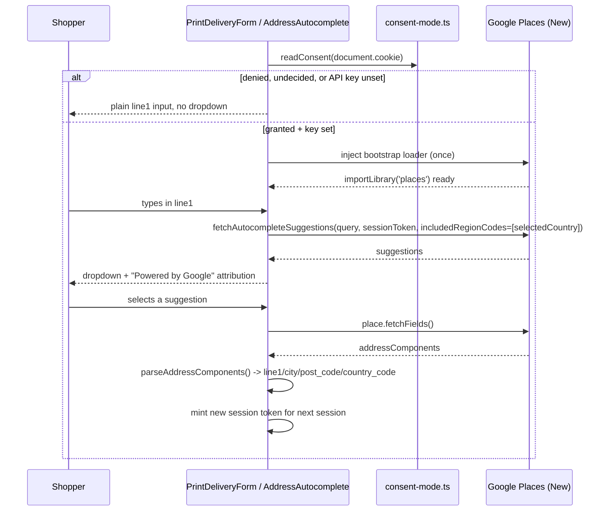

# Google Places address autocomplete for print checkout

## Summary

Add Google Places suggestion-as-you-type to the print checkout's `line1` street field (`src/components/shop/PrintDeliveryForm.tsx`) — the only free-text address entry point in the app, since ceramics deliveries use the InPost Geowidget locker picker instead. Picking a suggestion autofills `line1`, `city`, `post_code`, and `country_code`. This is autofill/UX assistance, not a new deliverability check: Google's separate Address Validation API (confidence scoring, "did you mean" corrections) is explicitly out of scope — the reference screenshot (a Spanish "Dirección" field with a Google-branded suggestion dropdown under it, address only, no confirmation/validation state) shows suggestion-as-you-type, and the existing server-side Zod validation in `src/lib/print-delivery.ts` is unchanged.

---

## Problem Frame

Print checkout collects a native, typed delivery address (`src/lib/print-delivery.ts`'s `printShippingAddressSchema`) with no assistance beyond browser autofill. `docs/plans/print-checkout-address-management.md` deliberately rejected Stripe's Address Element for this form partly because it would need its own Google Places key for autocomplete — this plan adds that autocomplete directly, on our own form chrome, without adopting Address Element.

---

## Requirements

**Suggestions and autofill**

- R1. As the shopper types in `line1`, Google Places suggestions appear in a custom-styled dropdown once cookie consent is granted and an API key is configured.
- R2. Selecting a suggestion fills `line1`, `city`, `post_code`, and `country_code` from the selected place, using a `locality → postal_town → sublocality_level_1` fallback for city and the ISO-2 `shortText` for country.
- R3. Suggestions are scoped to the country currently selected in the form's country dropdown, not the full ~28-country `PRINT_COUNTRIES` list.
- R10. Google's `includedRegionCodes` is a hard restriction, not a bias: when the seeded/selected country doesn't match what the shopper is actually typing, the dropdown simply shows no suggestions — no error state, no fallback message — and the shopper keeps typing normally into the plain field.

**Consent and degradation**

- R4. The autocomplete script loads only when the `ciok_consent` cookie is `granted`; otherwise (denied, undecided, or the API key unset) `line1` is a fully functional plain text input with no suggestions, and checkout is never blocked.
- R5. If Google's script fails to load or a request errors, the field silently falls back to plain typing — no visible error, matching the `GeowidgetPicker.tsx` fail-open precedent.

**Server contract and CSP**

- R6. `/api/checkout`'s existing `printShippingAddressSchema` validation is unchanged; autocomplete is a client-side aid only.
- R7. `https://maps.googleapis.com` is added to `script-src` and `connect-src` in the existing report-only CSP (`src/middleware.ts`), with no wildcard hosts.

**Provisioning and attribution**

- R8. A new browser-restricted `NEXT_PUBLIC_GOOGLE_PLACES_API_KEY` build-time env var is documented in `.env.example`, following the `NEXT_PUBLIC_INPOST_GEOWIDGET_TOKEN` pattern.
- R9. The suggestions dropdown displays Google's required "Powered by Google" attribution whenever suggestions are visible, per Google's Places API terms for unmapped predictive results.

---

## Key Technical Decisions

- **Places Autocomplete (New) Data API, not the `PlaceAutocompleteElement` web component**: use `google.maps.places.AutocompleteSuggestion` via `google.maps.importLibrary('places')`. We need a dropdown styled to match the existing `line1` input; Google's own docs steer custom-UI integrations toward the Data API, while the web component owns its own input chrome we can't reuse without restructuring the form.
- **Gate script loading behind consent**: check `readConsent(document.cookie) === 'granted'` (`src/components/consent/consent-mode.ts`) before injecting anything. Unconsented Google Maps Platform loads are a live, regulator-tested GDPR risk distinct from Stripe's PCI-processor relationship (German Google Fonts ruling; CNIL and Austrian DPA actions against unconsented Google Maps loads) — the consent-cookie helper already exists in this repo, so gating costs one check, not new infrastructure. Note this is a deliberate scope-widening of that cookie's meaning: `ciok_consent` is a single binary bucket built for Consent Mode v2's ad/analytics signals, and this repo has no separate "functional" consent category — see Open Questions for whether that reuse is itself sufficient disclosure for a different vendor relationship.
- **`AddressAutocomplete` takes controlled props, not direct state access**: it receives `value`/`onChange` plus an `onSelectPlace(parsed)` callback — mirroring `GeowidgetPicker`'s `onSelect` shape — and never reads or writes `PrintDeliveryForm`'s `Draft` state directly. This keeps the three-way module split (parsing logic / loader hook / UI component) a real boundary rather than a nominal one.
- **Scope `includedRegionCodes` to the form's currently-selected country, not all of `PRINT_COUNTRIES`**: Google's New API caps region restriction at 15 codes; `PRINT_COUNTRIES` has ~28. Scoping to the one already-chosen country is both under the cap and more relevant, and the existing `<select>` plus server-side Zod validation remain the real deliverability gate. This is a hard restriction, not a bias: if the seeded country doesn't match what the shopper types, suggestions come back empty rather than off-topic (R10). A wider (still ≤15-code) region cluster was considered and rejected: it wouldn't fix the actual failure mode (a wrong seed can still fall outside any fixed cluster), and it would let suggestions blend addresses from countries the shopper hasn't selected — the country `<select>` is the correct place to fix a wrong seed, not a looser Places request.
- **One `AutocompleteSessionToken` per typing session**, minted fresh after a place is selected (`Place.fetchFields()`) or the field resets. Session tokens are Google's billing-grouping mechanism, not a privacy control — reusing a stale token or never finalizing one bills every keystroke as a separate request.
- **Mirror `GeowidgetPicker.tsx`'s injection pattern**: guard-then-append via a `data-*` marker, an 8-second timeout falling back to "unavailable," adapted for Google's `importLibrary` bootstrap loader instead of a plain `<script src>` tag. This is the one third-party-widget precedent already in the codebase.
- **Fail-open means the unchanged existing input, not a substitute UI**: if `NEXT_PUBLIC_GOOGLE_PLACES_API_KEY` is unset, consent isn't granted, or loading fails, render the exact same `line1` `<input>` (attributes, `autoComplete`, validation) the form has today. This differs from `GeowidgetPicker.tsx`'s fail-open, which replaces its *entire* widget with an "unavailable" message because the shopper can switch delivery methods instead — `line1` has no equivalent escape hatch; it is still the sole required way to satisfy `printShippingAddressSchema`. The Geowidget precedent applies only to the script-injection/guard pattern, not to the shape of the degraded UI. Autocomplete must never become a checkout blocker.
- **Address-component parsing keys off `types.includes(...)`, never array position**, with an explicit city fallback chain. GB and SE — both in `PRINT_COUNTRIES` — return `postal_town` instead of `locality`; a naive lookup silently drops the city for two live markets.
- **Add `@types/google.maps` as a devDependency** rather than hand-rolling ambient declarations: the repo has no existing `google.maps` types (`package.json`'s devDependencies list only `@types/node`/`@types/react`/`@types/react-dom`) and `tsconfig.json` runs `strict: true` with no restrictive `types` array, so referencing the bare `google` global in U1-U3 fails `npm run typecheck` without it. The community-maintained package is the standard choice and avoids maintaining a hand-written surface for an API Google can extend.

---

## High-Level Technical Design

---

## Scope Boundaries

- In scope: the print checkout's `line1` field only. Ceramics checkout (InPost Geowidget) is untouched.
- In scope (added after code review): reactively re-checking consent. `setConsent()` dispatches `CONSENT_CHANGE_EVENT`; `useGooglePlacesLoader` listens for it and re-attempts the gated load when consent flips to granted mid-session, and deactivates (`ready` back to `false`) if consent is later withdrawn. Originally deferred as a v1 UX-polish item, then picked up during the residual work gate rather than left as a known gap.

**Outside this feature's identity:**

- Google's Address Validation API (deliverability confidence scoring, "did you mean" corrections) — a materially heavier product than the screenshot's suggestion-as-you-type UX, and not requested.
- A customer-account address book — doesn't exist yet.

---

## Risks & Dependencies

- **Manual provisioning dependency**: a Google Cloud project with billing enabled, both the Maps JavaScript API and the Places API (New) turned on, and a browser key restricted by HTTP referrer and API-restricted to those two APIs must exist before this can go live (see U5). This is an out-of-repo operational step this plan can't automate.
- **Billing-abuse exposure on the client-exposed key**: HTTP-referrer restriction is enforced via the `Referer`/`Origin` header, which non-browser clients can omit or spoof — a scraped key can be replayed outside the browser and billed against the project regardless of the referrer allowlist. U5's provisioning checklist requires a Google Cloud budget alert and/or a daily quota cap as the concrete mitigation, not referrer restriction alone. Provision separate keys for `https://anna-ciok.studio/*` and local-dev/preview origins rather than one shared key, so a leaked or over-broad dev referrer entry can't be replayed against production, and either key can be revoked independently.
- **Report-only CSP doesn't prove enforce-mode compatibility, and the allowlist entry is site-wide**: `maps.googleapis.com` is added to `src/middleware.ts`'s CSP, which applies to every matched route (all four locales, all non-admin pages) — not just print checkout, even though the code that uses it is checkout-scoped. Report-only violation reports are batched/rate-limited and easy to miss in the existing `/api/csp-report` sink, so before the already-pending report-only → enforce cutover, exercise this feature on a dedicated enforce-mode preview deploy and confirm zero CSP errors for `maps.googleapis.com` directly in the browser devtools console/network tab.
- **No Subresource Integrity on the dynamically-injected loader**: Google's `importLibrary` bootstrap payload is generated per-request, so it can't be pinned with SRI — this integration implicitly trusts `maps.googleapis.com` as a fully trusted origin beyond the CSP host allowlist. Accepted trade-off, consistent with the already-unpinned GTM loader in this codebase.
- **New Sentry noise is likely**: a blocked, slow, or failing `google.maps.importLibrary` call (ad-blockers, network issues) may surface as new client-side error noise post-launch, the same class of problem `src/lib/sentry-options.ts`'s existing `ignoreErrors` entry already suppresses for GTM/GA4. Watch Sentry after launch and extend `ignoreErrors` there if needed.
- **Attribution is a Google ToS requirement**, not decoration — the "Powered by Google" badge must not be visually suppressed or restyled away in a later pass without re-checking current terms.
- **Single-country scoping is a UX trade-off**: a shopper who types before adjusting the country dropdown gets suggestions biased to whatever's currently selected (seeded from `CF-IPCountry` per the existing print-delivery flow). Re-fetching suggestions when the country changes (already required by the React wiring) mitigates the ongoing case; R10 covers the immediate empty-result case.
- **Google is an independent data controller for query text**: every autocomplete request sends the partial `line1` string plus the client's IP to Google, which may log/use it under its own Maps Platform terms — a distinct processing activity from the GA4/Meta vendors the privacy policy currently discloses. The privacy policy needs Google named as a data recipient for this feature, independent of the consent-gating question below.

---

## Open Questions

- Does gating Places behind the existing `ciok_consent` cookie constitute valid, purpose-specific consent for a materially different vendor relationship (Google Maps Platform, loaded for UX/autofill), or does GDPR's purpose-specific-consent requirement (Art. 4(11)/Recital 32; EDPB Guidelines 05/2020 on bundling) mean that cookie — disclosed for Consent Mode v2's ad/analytics signals — can't silently also authorize this? If a privacy-policy/consent-banner copy update naming Google Maps Platform as a vendor under the existing category is sufficient, no code changes follow. If a stricter reading requires a new "functional" consent category instead, `shouldLoadGooglePlaces` (U2) needs a category parameter rather than the single granted/denied check — so this is not purely a copy decision, and resolving it before U2 lands avoids reworking the loader hook's signature after the fact. Flagging for a quick privacy-policy/legal check before implementation rather than deciding it here.

---

## Acceptance Examples

- AE1. Given `ciok_consent` is `denied`, when the shopper focuses `line1`, then it behaves exactly as the current plain text field — no dropdown, no attribution badge, no network request to Google. Covers R4.
- AE2. Given `NEXT_PUBLIC_GOOGLE_PLACES_API_KEY` is unset, when the shopper focuses `line1`, then the field is plain, same as AE1. Covers R4, R8.
- AE3. Given consent is granted and the shopper selects a suggestion for a UK address, when the result's city component is `postal_town` rather than `locality`, then `city` is still correctly filled. Covers R2.
- AE4. Given the shopper has typed into `line1` and then changes the country dropdown, when they resume typing, then new suggestions are scoped to the newly-selected country's region code, not the previous one. Covers R3.
- AE5. Given the country dropdown is seeded to a country the shopper doesn't actually live in and they haven't corrected it yet, when they type a real address in a different country, then the dropdown shows no suggestions (not off-topic ones) and typing continues to work normally. Covers R10.

---

## Sources & Research

- Google Places Autocomplete (New) overview and Data API guide: [developers.google.com/maps/documentation/javascript/place-autocomplete-overview](https://developers.google.com/maps/documentation/javascript/place-autocomplete-overview), [.../place-autocomplete-data](https://developers.google.com/maps/documentation/javascript/place-autocomplete-data)
- `AutocompleteRequest`/`includedRegionCodes` field reference (15-code cap) and session token semantics: [developers.google.com/maps/documentation/javascript/reference/autocomplete-data](https://developers.google.com/maps/documentation/javascript/reference/autocomplete-data)
- Dynamic bootstrap loader guidance: [developers.google.com/maps/documentation/javascript/load-maps-js-api](https://developers.google.com/maps/documentation/javascript/load-maps-js-api)
- CSP host recommendations (adapted to this repo's explicit-allowlist convention rather than Google's suggested wildcards): [developers.google.com/maps/documentation/javascript/content-security-policy](https://developers.google.com/maps/documentation/javascript/content-security-policy)
- Address-component parsing example (`types.includes(...)`, `postal_town` handling): [developers.google.com/maps/documentation/javascript/examples/places-autocomplete-addressform](https://developers.google.com/maps/documentation/javascript/examples/places-autocomplete-addressform)
- API key restriction guidance: [developers.google.com/maps/api-security-best-practices](https://developers.google.com/maps/api-security-best-practices)
- GDPR posture on unconsented Google Maps Platform loads: [devowl.io/gdpr-compliant/google-maps](https://devowl.io/gdpr-compliant/google-maps/), [iubenda: Google Maps and the GDPR](https://www.iubenda.com/en/help/62728-google-maps-and-the-gdpr-how-to-be-compliant/)
- Progressive-enhancement fallback UX consensus: [web.dev payment/address form best practices](https://web.dev/articles/payment-and-address-form-best-practices)

---

## Implementation Units

### U1. Address-parsing and session-token core logic

- **Goal**: pure, testable functions to build a country-scoped autocomplete request, parse a selected place's address components into `{line1, city, post_code, country_code}`, and manage session-token lifecycle.
- **Requirements**: R2, R3, R10 (the empty-suggestions-on-mismatch behavior is a direct consequence of this unit's hard `includedRegionCodes` scoping)
- **Dependencies**: none
- **Files**: `src/lib/google-places.ts` (new), `src/lib/google-places.test.ts` (new)
- **Approach**: `parseAddressComponents(components)` keys off `types.includes(...)`, never array position; city resolves `locality → postal_town → sublocality_level_1`; street composes as `${route} ${street_number}`.trim() (consistent with the store's existing single-line `line1` convention); country uses the `country` type's `shortText` (ISO-2). `buildAutocompleteRequest(query, sessionToken, countryCode)` sets `includedRegionCodes: [countryCode]`. `nextSessionToken()` wraps token creation so callers never construct one directly.
- **Patterns to follow**: `src/lib/print-delivery.ts`'s pure, framework-free function style.
- **Test scenarios**:
  - Happy path: a typical DE result (street_number + route + locality + postal_code + country) parses into all four fields correctly.
  - Edge: a GB result using `postal_town` instead of `locality` — `city` falls back correctly.
  - Edge: an SE result using `postal_town` — same fallback.
  - Edge: a result missing `street_number` or `route` — `line1` degrades gracefully (uses whatever component is present) without throwing.
  - Edge: the `country` component's `shortText` (not `longText`) is used for `country_code`.
  - `buildAutocompleteRequest`: `includedRegionCodes` contains exactly the one passed country code.
  - `nextSessionToken()`: each call returns a distinct token instance.
- **Verification**: unit tests pass; `parseAddressComponents` never accesses `addressComponents` by index.

### U2. Consent-gated script loader

- **Goal**: a hook that idempotently injects Google's bootstrap loader only when consent is granted and the API key is set, resolving once `importLibrary('places')` is ready, with a timeout-based failure state.
- **Requirements**: R1, R4, R5, R8
- **Dependencies**: none
- **Files**: `src/lib/use-google-places-loader.ts` (new — exports both the pure predicate and the hook), `src/lib/use-google-places-loader.test.ts` (new — predicate only)
- **Approach**: split the gating decision from the DOM effect. Export a pure `shouldLoadGooglePlaces(consentCookie: string, apiKey: string | undefined): boolean` that just checks `readConsent(consentCookie) === 'granted' && Boolean(apiKey)` — this is the only part of this unit that's unit-testable in this repo's actual test setup (`vitest.config.ts` runs `environment: 'node'` with no jsdom/DOM-rendering library installed; `src/lib/use-strip-url-token.ts` is the precedent for extracting the pure decision and stubbing globals rather than rendering a hook). The hook itself reads `process.env.NEXT_PUBLIC_GOOGLE_PLACES_API_KEY` via direct property access (matches `GeowidgetPicker.tsx`'s pattern so `scripts/env-example-completeness.test.ts` detects the read), calls the predicate, and — only if it passes — guard-then-appends the bootstrap script via a `data-google-places` marker (once per page), then `await google.maps.importLibrary('places')`; an 8-second timeout sets `failed: true` if it never resolves, mirroring `GeowidgetPicker.tsx`. The script-injection/timeout behavior itself is verified manually (U3's manual smoke), not by an automated test — `GeowidgetPicker.tsx`, the closest precedent for this exact kind of DOM-injecting hook, has no test file either.
- **Patterns to follow**: `src/lib/use-strip-url-token.ts` for the pure-predicate-plus-`vi.stubGlobal` testing shape; `src/components/shop/GeowidgetPicker.tsx`'s `ensureAssets()` guard + timeout-fallback shape for the DOM effect.
- **Test scenarios**:
  - Happy path: `shouldLoadGooglePlaces('ciok_consent=granted', 'a-key')` returns `true`.
  - Edge: consent denied (`ciok_consent=denied`) with a key present returns `false`.
  - Edge: consent undecided (no `ciok_consent` cookie) with a key present returns `false`.
  - Edge: consent granted with an empty/undefined key returns `false`.
  - Edge: malformed cookie string doesn't throw, returns `false`.
  - Enforcement: with the predicate stubbed to `false` (via `vi.stubGlobal` on `document`/`window`, the same node-environment stubbing `src/lib/use-strip-url-token.test.ts` already uses — no jsdom required), asserting the hook never appends the `data-google-places` script element and never calls `google.maps.importLibrary`. This is the one DOM-adjacent assertion worth automating: it's the load-bearing check for the GDPR consent-gate risk in Open Questions, and a future refactor that silently drops the predicate call would otherwise go undetected until a manual preview check.
- **Verification**: `shouldLoadGooglePlaces` unit tests plus the stubbed-global enforcement test pass. `importLibrary` resolution and the timeout fallback are confirmed manually on a preview deploy (consent granted vs. denied vs. key unset) — no automated coverage for that success-path DOM behavior, consistent with `GeowidgetPicker.tsx`.

### U3. Suggestions combobox and form integration

- **Goal**: render an ARIA-combobox suggestions dropdown under `line1`; wire selection into `PrintDeliveryForm`'s existing draft/validation flow; show required attribution; fall back to the untouched plain input when the loader isn't ready.
- **Requirements**: R1, R2, R4, R5, R9
- **Dependencies**: U1, U2
- **Files**: `src/components/shop/AddressAutocomplete.tsx` (new, no test file — see Verification), `src/components/shop/PrintDeliveryForm.tsx` (modify), `src/styles/site.css` (modify — new rules go immediately after the `.geowidget-msg` rule inside the existing `/* dane do dostawy (InPost) */` block, the same block `PrintDeliveryForm.tsx`'s other classes already live in), `messages/pl.json`, `messages/en.json`, `messages/es.json`, `messages/de.json` (modify — add a `delivery.suggestionsLabel` a11y string for the listbox, flat under the existing `delivery` key, matching that block's camelCase convention)
- **Approach**: `role="combobox"` on `line1` (`aria-expanded`, `aria-controls`, `aria-autocomplete="list"`); `role="listbox"` on the suggestion list with `role="option"` children; `aria-activedescendant` tracks arrow-key highlighting; Enter/Tab selects the highlighted option, Escape closes the list without altering typed text. Debounce `fetchAutocompleteSuggestions` calls (~200ms) with a plain `useRef` + `setTimeout`/`clearTimeout` — this repo has no existing debounce/throttle utility to reuse, so it's new inline code, not a wrapper around shared infrastructure. Tag each debounced fetch with a monotonic request id (or an `AbortController`) and discard any response that isn't the latest: two in-flight requests can resolve out of order on a real network, and without this guard a slower response for an earlier keystroke can silently reindex the list while `aria-activedescendant` still points at the position the shopper arrow-keyed to, so Enter would select the wrong suggestion. On selection, call `place.fetchFields()`, run `parseAddressComponents`, then hand the parsed result to `PrintDeliveryForm` via the `onSelectPlace` callback (KTD) — `PrintDeliveryForm` merges it into `draft.address`, clears the affected fields' errors, and re-runs `validateField` for each, reusing its existing helpers rather than `AddressAutocomplete` touching `draft` directly. Re-fetch (and rescope `includedRegionCodes`) whenever `draft.address.country_code` changes. A debounced response that comes back empty for a query in the correct country collapses the listbox exactly as the R10 case does (`aria-expanded="false"`, no rendered options) rather than leaving it open-and-empty — same resulting UI, distinct trigger (post-fetch vs. pre-fetch).
- **Patterns to follow**: `PrintDeliveryForm.tsx`'s `draft`/`setDraft`/`aria()`/`fieldError()` helpers; `GeowidgetPicker.tsx`'s controlled-callback (`onSelect`) and fail-open rendering shape.
- **i18n note**: `pl.json` is normally sourced from Notion (`npm run i18n:pull`/`:push`), unlike `en`/`es`/`de` which are edited directly in-repo. `src/i18n/messages.test.ts` asserts identical key shape across all four locale files, so deferring the `pl` key to a later Notion round-trip would break that test the moment this unit lands — add `delivery.suggestionsLabel` to `messages/pl.json` directly in this change as a documented exception to the normal flow, and flag it for the next `npm run i18n:pull`/`:push` cycle so Notion doesn't silently overwrite it.
- **Test scenarios** *(manual/preview verification — see Verification; this repo has no `.tsx` test glob, jsdom, or component-rendering library, so these are not automated)*:
  - Happy path: typing with consent granted and a key set shows suggestions; selecting one fills `line1`/`city`/`post_code`/`country_code` and clears their errors.
  - Edge: consent denied — `line1` behaves exactly as today's plain field (covers AE1).
  - Edge: key unset — same as above (covers AE2).
  - Edge: the shopper types but never selects a suggestion — whatever they typed is kept and validated normally on submit.
  - Edge: changing the country dropdown mid-session rescopes subsequent suggestion requests (covers AE4).
  - Edge: the seeded country doesn't match what the shopper types — no suggestions appear, typing is unaffected (covers AE5).
  - Edge: a valid in-country query returns zero predictions — the listbox collapses (not open-and-empty), same as the country-mismatch case.
  - Edge: two in-flight requests resolve out of order (a fast response for a later keystroke arrives before a slow response for an earlier one) — the stale response is discarded and never reindexes a list the shopper is arrow-key-navigating.
  - Integration: selecting a GB suggestion whose result uses `postal_town` fills `city` correctly end-to-end through the UI, not just the pure function (covers AE3).
  - Keyboard: ArrowDown/ArrowUp move `aria-activedescendant` through the list; Enter selects the highlighted option; Escape closes the list leaving typed text untouched; none of this regresses the form's existing Tab-order or Enter-to-submit behavior.
  - Accessibility: `aria-expanded`/`aria-controls` reflect open/closed state; the "Powered by Google" attribution is present exactly when suggestions are visible.
- **Verification**: the parsing/selection logic these scenarios exercise is already covered by U1's automated unit tests; the rendering, keyboard, and network-gating behavior above is confirmed manually against a live preview deploy (consent granted/denied, key set/unset), matching this repo's existing convention of not unit-testing DOM-injecting/rendering code (`GeowidgetPicker.tsx` has no test file). Mocking Google's bootstrap loader in Playwright is out of scope — brittle third-party UI surface, consistent with why Stripe Address Element was avoided in `print-checkout-address-management.md`.

### U4. CSP allowlist for Google Maps Platform

- **Goal**: add `https://maps.googleapis.com` to `script-src` and `connect-src` in the existing report-only CSP.
- **Requirements**: R7
- **Dependencies**: none
- **Files**: `src/middleware.ts` (modify), `src/middleware.test.ts` (modify)
- **Approach**: extend the existing directive strings; no wildcard hosts, matching the file's current convention. One host covers both the bootstrap script and the autocomplete calls — no separate `places.googleapis.com`/`gstatic` hosts are needed since this integration doesn't use `PlaceAutocompleteElement` or its icon/font assets.
- **Test scenarios**:
  - Happy path: the CSP report-only header contains `https://maps.googleapis.com` in both `script-src` and `connect-src`.
  - Regression: previously-allowlisted hosts (Stripe, GTM, GA, Meta, InPost, Clarity) remain unchanged.
- **Verification**: `middleware.test.ts` passes.

### U5. Env var and provisioning documentation

- **Goal**: document `NEXT_PUBLIC_GOOGLE_PLACES_API_KEY` following the existing InPost token convention.
- **Requirements**: R8
- **Dependencies**: none
- **Files**: `.env.example` (modify), `scripts/env-example-completeness.test.ts` (modify — add `NEXT_PUBLIC_GOOGLE_PLACES_API_KEY` to `UNTYPED_ALLOWLIST`, the same list `NEXT_PUBLIC_INPOST_GEOWIDGET_TOKEN` is already in, since U2 reads it via direct `process.env` access rather than a typed `CloudflareEnv` binding)
- **Approach**: a comment block noting it's a build-time Workers Build env var (not a wrangler secret), requires a Google Cloud project with billing enabled and a browser key restricted by HTTP referrer plus API restriction to both the Maps JavaScript API and the Places API (New) — the Autocomplete (New) Data API this feature calls needs both enabled, not just Maps JavaScript API — and is blank by default. Provisioning checklist (out-of-repo, tracked here so it isn't dropped): create the Cloud project, enable billing plus both APIs, generate two referrer-restricted keys (production origin, local-dev/preview origin — see Risks & Dependencies), and set a budget alert and/or daily quota cap on the project as the mitigation for a scraped key being replayed outside the browser's referrer check.
- **Test expectation**: none — pure documentation/config entry; covered by `scripts/env-example-completeness.test.ts`'s existing declared-vars check plus its `UNTYPED_ALLOWLIST` addition above, once U2's code consumes the var.
- **Verification**: `scripts/env-example-completeness.test.ts` passes.
