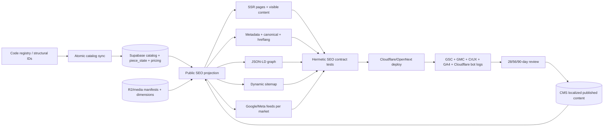

# Audyt SEO i roadmapa — Anna Ciok Ceramics

**Data audytu i researchu:** 2026-08-31  
**Repo / rewizja:** `ceramics-drop`, `08c1f46`  
**Zakres:** analiza i plan; bez zmian w kodzie produkcyjnym, zależnościach, bazie, Cloudflare i systemach zewnętrznych  
**Środowisko:** Windows/PowerShell, Node `24.19.0`, npm `12.0.2`, Next.js `16.2.9`, Playwright `1.60.0`  
**Serwis:** `https://anna-ciok.studio`  
**Aktualizacja:** 2026-08-31, ten sam dzień — rozdział 13 dodany po uzyskaniu uwierzytelnionego, read-only dostępu do Supabase SQL, Cloudflare API (config + GraphQL Analytics), Sentry i GA4 Data API, którego audyt w §1–§12 nie miał. Executive summary, findings register i roadmapa (§1, §4, §8, §12, „Ograniczenia audytu") zostały zaktualizowane o wyniki tej weryfikacji; oryginalny tekst audytu poniżej pozostaje nienaruszony poza tymi wstawkami.

## Metoda, status dowodów i założenia

Audyt łączy cztery źródła: aktualny kod, HTML/HTTP z lokalnej aplikacji i produkcji, pomiary przeglądarkowe oraz oficjalną dokumentację. Oznaczenia:

- **Fakt repo** — bezpośrednio potwierdzony w kodzie lub teście.
- **Fakt runtime** — odtworzony lokalnie albo na produkcji 2026-08-31.
- **Wymóg/rekomendacja oficjalna** — link do źródła pierwotnego.
- **Hipoteza** — wymaga danych z Google Search Console (GSC), Merchant Center (GMC), GA4, CrUX albo Cloudflare.

Jawne założenia: domeną kanoniczną pozostaje apex `anna-ciok.studio`; sprzedane prace mają nadal tworzyć publiczne archiwum twórczości; strony użytkowe pozostają `noindex`; docelowe rynki i konfiguracja GMC nie są znane. Zmiana któregokolwiek z tych założeń zmieni część roadmapy.

## 1. Executive summary

### Poziom przygotowania

Serwis jest na poziomie **solidnego technicznego fundamentu, ale bez zamkniętej kontroli jakości i procesu operacyjnego**. Nie jest to witryna „bez SEO”: ma SSR, poprawne statusy 404, kanoniczne URL-e, kompletne `hreflang`, dynamiczną sitemapę, noindex dla stron użytkowych, rozbudowane Product/Offer/ItemList/Breadcrumb JSON-LD, feedy merchant oraz dobre podstawy image SEO. Największe ryzyka powstają na granicach systemów: Cloudflare ↔ canonical host, Supabase ↔ fallback kodowy, cookie walutowe ↔ feed/JSON-LD/HTML oraz CMS ↔ obrazy/metadane.

### Najmocniejsze strony

- Treść, linki, metadata i JSON-LD są dostępne w server-rendered HTML; dynamiczne renderowanie samo w sobie nie blokuje crawlowania.
- 732 wpisy sitemap są unikalne, mają po pięć wersji językowych (`pl`, `en`, `es`, `de`, `x-default`) i nie zawierają koszyka ani konta.
- Nieistniejący produkt i zły slug istniejącego produktu zwracają prawdziwe HTTP 404, nie soft 404.
- Ceramiczne i printowe PDP mają Product + Breadcrumb, kolekcje mają ItemList + Breadcrumb, a oferta zawiera wysyłkę i zwroty.
- Sprzedane i showroomowe prace pozostają publiczne, lecz są niedostępne zakupowo i oznaczone jako niedostępne w schema/feedzie.
- 91 ukierunkowanych testów przechodzi, a produkcyjny build webpackowy kończy się poprawnie.

### Najważniejsze luki i ryzyka biznesowe

Pozycje 1–3 pochodzą z weryfikacji produkcyjnej 2026-08-31 opisanej w §13 (Supabase/Cloudflare/Sentry/GA4) i nie były widoczne w pierwszym przebiegu audytu z powodu braku dostępu do tych systemów; poprzedzają pozostałą listę, bo są aktywne i mierzalne teraz, nie potencjalne.

1. **Trwający incydent produkcyjny:** w ostatnich 24 h **10,3% requestów** do `anna-ciok.studio` (2502/24401) kończy się HTTP 504, rozłożone po PDP wszystkich czterech lokalizacji, ze szczytem 479/h; Sentry nie zarejestrował ani jednego zdarzenia w tym oknie, więc błąd dzieje się poniżej warstwy aplikacji i obecny monitoring go nie łapie. Fakt produkcyjny (Cloudflare GraphQL Analytics + Sentry), zob. §13.2.
2. **Zero sprzedaży od 59 dni i zerowa dostępna ceramika:** `piece_state` (126 wierszy) pokazuje 0 sztuk możliwych do kupienia — 121 w statusie `sold` (120 z nich dodatkowo `showroom=true`, 1 poza showroomem) i 5 `available` ale również `showroom=true`, więc żadna nie jest dziś kupowalna; ostatnie opłacone zamówienie to `2026-07-03`, czyli 59 dni przed datą audytu. GA4 potwierdza niezależnie 0 zakupów w każdej kategorii w oknie ostatnich 30 dni (`--days 30`, nie „cały sierpień"), lejek `add_to_cart → begin_checkout → purchase` = 10 → 1 → 0. Żadna poprawka techniczna SEO nie zwiększy przychodu, dopóki nie ma czego kupić — to zmienia sens priorytetyzacji reszty roadmapy. Fakt produkcyjny (Supabase + GA4), zob. §13.3.
3. **Martwe URL-e po migracji ze Shopify pochłaniają ok. ⅓ ruchu:** GA4 pokazuje, że landing pages typu `/en/products/{handle}`, `/en/pages/about-me`, `/en/products/appointment` (ślady starego sklepu Shopify — GA4 property jest opisana w repo jako będąca „pod kontem Shopify") odpowiadają za ok. 280 z ~830 sesji w 30 dni, niemal wszystkie z bounce rate 100%; wszystkie cztery sprawdzone przykłady zwracają dziś żywy HTTP 404 bez przekierowania. Fakt produkcyjny (GA4 + curl), zob. §13.4.
4. `www.anna-ciok.studio` serwuje duplikat z HTTP 200 zamiast stałego redirectu do apexu, i — potwierdzone teraz na poziomie konfiguracji Cloudflare, nie tylko curl — w strefie nie istnieje ani jedna reguła w fazie `http_request_dynamic_redirect`, ani żaden Page Rule, które mogłyby to robić. Canonical jest tylko sygnałem; redirect jest silniejszym sygnałem konsolidacji ([Google](https://developers.google.com/search/docs/crawling-indexing/consolidate-duplicate-urls)).
5. W trybie DB błąd odczytu katalogu przełącza storefront na pełny rejestr kodowy. Ponieważ wpisy kodowe domyślnie są publiczne, `draft`/`hidden`/`archived` mogą wrócić do sitemap, feedów i stron w czasie awarii. (Stan na 2026-08-31: w bazie nie ma obecnie żadnej ceramiki w statusie `draft`/`hidden` do ujawnienia — ryzyko jest strukturalne, nie aktywne w tej chwili; zob. §13.3.)
6. Dla `/en`, `/es`, `/de` cookie GBP zmienia widoczną cenę, ale JSON-LD i feed pozostają w EUR. To jest celowo deterministyczne, lecz bez jawnej strategii landing URL/GMC stwarza ryzyko price/currency mismatch. Google wymaga zgodności feedu, landing page i structured data ([Merchant Center](https://support.google.com/merchants/answer/4752265), [specyfikacja feedu](https://support.google.com/merchants/answer/7052112)). (Dane `orders`: wszystkie 28 opłaconych zamówień są w PLN; EUR ma tylko 3 `expired`, zero `paid`; GBP/USD/CAD zero zamówień w historii — mechanizm jest realny, ale na 2026-08-31 nie zjadł jeszcze żadnego zrealizowanego przychodu. Zob. §13.3.)
7. Kolekcja fine-art prints ma powtarzalny desktopowy CLS około `0.114–0.118` w badaniu lab; źródłem są obrazy bez wymiarów i bez zarezerwowanego ratio. Próg „good” to `≤0.1` w 75. percentylu danych terenowych ([web.dev](https://web.dev/articles/optimize-cls)).
8. Opublikowany hero CMS wysyła pojedyncze PNG: około `1.48 MB` mobile i `3.46 MB` desktop, mimo że fallback kodowy wspiera responsywne warianty.
9. Teksty meta zawierają ręcznie wpisane, już niespójne liczby produktów; kolekcje nie mają redakcyjnego modelu SEO w CMS.
10. Printy są modelowane w schema jako pojedynczy Product + AggregateOffer, a feed zawiera jeden wiersz na design. Nie opisuje to w pełni realnych wariantów size × frame × mount × colour.
11. Brakuje hermetycznej bramki obejmującej finalny `<head>`, statusy, wzajemność hreflang, spójność feed/PDP oraz przypadki awaryjne katalogu.

### Najważniejsze następne działania

0. **(Poza roadmapą SEO, ale blokujące jej sens)** Zdiagnozować i zatrzymać incydent 504 (§13.2); zdecydować z ownerem sklepu, co z zerowym dostępnym katalogiem ceramiki (§13.3) — nowy drop, re-open sprzedaży czy świadoma pauza.
1. Zbudować mapę przekierowań legacy Shopify → aktualne URL-e dla najgłośniejszych landing pages z GA4 (§13.4) — szybki, wysoki zwrot, odzyskuje realny ruch zamiast go odbijać.
2. Ustawić Cloudflare 301/308 `www → apex` z zachowaniem ścieżki i query; sprawdzić oba protokoły i wszystkie locale. Potwierdzone 2026-08-31: strefa nie ma dziś żadnej reguły redirectu ani Page Rule, więc to czysta implementacja, nie diagnoza.
3. Zmienić awaryjną politykę publicznego katalogu na fail-closed lub last-known-good dla widoczności, bez ujawniania wpisów niepublicznych.
4. Naprawić `?preview=` na PDP i dodać macierz testów `preview`/404/noindex.
5. Uzgodnić docelowe rynki GMC i kontrakt waluty; dopiero potem wybrać stabilne URL-e/parametry feedowe albo oficjalną konwersję walut. (Zerowy zrealizowany przychód EUR/GBP na 2026-08-31 obniża pilność względem P0-01/P0-06/P0-07, ale nie względem inwestycji w ruch międzynarodowy.)
6. Dodać wymiary/aspect ratio do kart printów; potwierdzić CLS w 5-run lab i później w CrUX.
7. Wprowadzić limity/formaty i responsywne pochodne dla hero CMS.
8. Usunąć ręczne liczniki z metadanych oraz dodać lokalizowany model treści SEO kolekcji z preview/publish/rollback.
9. Zbudować repo-native crawler/test kontraktów SEO na istniejącym Playwright/Vitest.
10. Wykonać spike ProductGroup/hasVariant i wariantowych wierszy feedu dla printów.
11. Ustanowić baseline GMC/CrUX i przeglądy 28/56/90 dni. GA4 baseline już potwierdzony 2026-08-31 (§13.3, §13.7), a GSC domain-verification potwierdzona przez DNS TXT (§13.5) — pozostaje GMC i CrUX oraz regularny cadence przeglądu.

## 2. Stan obecny

| Obszar | Istniejące rozwiązanie | Dowód w repo | Ocena | Problem / ograniczenie |
|---|---|---|---|---|
| Crawlability | SSR, standardowe `<a>`, publiczne obrazy | `src/components/shop/ProductTile.tsx:106-120`; `src/app/[locale]/(pdp)/[slug]/[id]/page.tsx:85-160` | Dobre | Brak pełnego okresowego grafu linków/orphan report |
| Indexability | Publiczne strony index; koszyk/konto/newsletter/return/admin noindex | `src/app/[locale]/koszyk/page.tsx:15-23`; `src/app/[locale]/konto/page.tsx:21-24`; `src/app/admin/layout.tsx:15-17` | Dobre | Pusty `?preview=` na PDP omija noindex |
| Sitemap | Dynamiczna z DB, locale i alternates | `src/app/sitemap.ts:8-48` | Dobre | Brak wiarygodnych `lastmod`; fail-open katalogu wpływa na zawartość |
| Robots | `Allow: /`, wskazanie sitemap | `src/app/robots.ts:4-11` | Poprawne | Nie zastępuje kontroli noindex/status; to nie defekt |
| Canonical | Wspólny helper, self-canonical | `src/lib/seo/urls.ts:11-45`; `src/lib/site.ts:1-20` | Dobre w HTML | `www` zwraca 200 zamiast redirectu |
| Hreflang | 4 locale + x-default w head i sitemap | `src/lib/seo/urls.ts:22-45`; `src/app/sitemap.ts:30-47` | Bardzo dobre | Potrzebna automatyczna kontrola wzajemności po zmianach routingu |
| Metadata | Next Metadata API, tłumaczenia i CMS na PDP | `src/app/[locale]/layout.tsx:38-60`; `src/app/[locale]/(pdp)/[slug]/[id]/page.tsx:31-82` | Dobre technicznie | Ręczne liczniki, kolekcje poza CMS, generyczny social fallback |
| Structured data | Organization, Product, Offer/AggregateOffer, ItemList, Breadcrumb, shipping/returns | `src/lib/seo/structured-data.ts:15-434` | Zaawansowane | Brak stabilnych `@id`, pełnych print variants i `itemCondition`; Organization skromne |
| Merchant feeds | Google/Meta, 4 locale, ceramika + printy, live inventory | `src/app/api/feed/google/route.ts:7-26`; `src/lib/feed.ts:113-223` | Dobre podstawy | Jeden print row/design, tylko locale-default PLN/EUR, print description poza CMS, `no-store` |
| Content | Unikatowe noty produktów, strony studio/gallery/shipping | `src/components/shop/ProductPageScreen.tsx:55-129`; `src/app/[locale]/o-studiu/page.tsx:33-143` | Dobre dla brandu/PDP | Treści kolekcji i showroom wymagają procesu intent/localization, nie masowej generacji |
| Internal linking | Header/footer, `/sklep`, kolekcje, PDP siblings, breadcrumbs | `src/components/shop/ProductPageScreen.tsx:55-63,104-129`; `src/components/shop/PrintProductScreen.tsx:70-105,133-166` | Dobre | Widoczne breadcrumbs tylko na PDP; brak pełnego orphan crawl |
| Obrazy | HTML ``, alty, WebP 400/800/1600 dla wielu assetów | `src/lib/images.ts:1-20`; `src/app/[locale]/gallery/page.tsx:62-106` | Mieszane | Print grid bez wymiarów; CMS hero bez transformacji; repo około 166.8 MB obrazów |
| CWV | SSR; content-visibility; fetch priority dla hero | `src/styles/site.css:617-636`; `src/components/shop/HomeHero.tsx:67-80` | Lab głównie dobre | Potwierdzony lab CLS print collection; brak danych terenowych/INP |
| Monitoring | Dokumentacja GSC/Bing/GA4; Sentry/analytics w stacku | `docs/analytics-stack.md:266-276` | Zaplanowane | Brak potwierdzenia dostępu, baseline i stałego raportu SEO |
| Testy regresyjne | Unit dla URL, sitemap, schema, feed, title | `src/app/sitemap.test.ts`; `src/lib/seo/*.test.ts`; `src/lib/feed.test.ts` | Dobre komponentowo | Brak finalnego head/HTTP/currency/failure-mode crawl w CI |
| Workflow redakcyjny | CMS drafts/preview/publish dla produktu, home i print PDP | `src/lib/types.ts:48-64`; `src/app/admin/content/` | Dobry fundament | Brak dokumentu kolekcji SEO i automatycznych guardrails jakości |

## 3. Inwentarz typów stron

| Typ strony / stan | Przykład URL | Index? | Canonical | Hreflang | JSON-LD | Źródło treści | Uwagi |
|---|---|---:|---|---|---|---|---|
| Homepage | `/`, `/en` | Tak | Self | 4 + x-default | Organization | CMS `page:home`, fallback kodowy, print rotation | `force-dynamic`; preview noindex także dla pustej wartości |
| Hub sklepu | `/sklep` | Tak | Self | 4 + x-default | Tylko global Organization | katalog DB/code + i18n | Jeden duży SSR grouping; lokalnie ~378 KB HTML |
| Kolekcja ceramiki | `/kubki` | Tak | Self | 4 + x-default | Breadcrumb + ItemList + Product/Offer | katalog + i18n + CMS product notes | Produkty sprzedane pozostają na liście |
| Ceramiczny PDP aktywny | `/kubki/{id}` | Tak | Self | 4 + x-default | Product/Offer + Breadcrumb | katalog, inventory, CMS | 2026-08-31 brak aktywnej ceramiki w feedzie do runtime testu |
| Ceramiczny PDP sprzedany | `/talerze-srednie/s15` | Tak | Self | 4 + x-default | Product/Offer `SoldOut` + Breadcrumb | jak wyżej | HTTP 200 zgodnie ze strategią archiwum |
| Ceramiczny PDP showroom | `/kubki/k04` | Tak | Self | 4 + x-default | Product/Offer `SoldOut` + Breadcrumb | jak wyżej | Publiczny, ale niepurchasable |
| Produkt draft/hidden/archived | stabilny PDP | Nie / 404 | Brak | Brak | Brak | DB status | W normalnym DB path; ryzyko fallbacku kodowego opisuje SEO-003 |
| Zły slug do istniejącego id | `/wazony/k04` | Nie | — | — | — | router + katalog | Prawdziwe 404, brak redirectu do poprawnego sluga; rozsądne dla błędu URL |
| Nieistniejący produkt | `/kubki/nope` | Nie | — | — | — | router | Prawdziwe 404 + noindex |
| Showroom | `/showroom` | Tak | Self | 4 + x-default | Tylko Organization | showroom state + katalog | Lokalnie ~498 KB HTML, 124 H3, bez ItemList |
| Kolekcja printów | `/fine-art-prints` | Tak | Self | 4 + x-default | Breadcrumb + ItemList/Product/AggregateOffer | DB/code print catalog + curation | Lab CLS >0.1 desktop |
| PDP printu | `/fine-art-prints/fap001` | Tak | Self | 4 + x-default | Product/AggregateOffer + Breadcrumb | print registry/DB, pricing DB/code, CMS print PDP | Brak ProductGroup/hasVariant |
| Galeria | `/gallery` | Tak | Self | 4 + x-default | Organization | i18n + editorial registry | Dobre wymiary/alty/social hero |
| Studio | `/o-studiu` | Tak | Self | 4 + x-default | Organization | i18n + editorial registry | Bogata treść brand/entity |
| Dostawa/zwroty | `/dostawa-i-zwroty` | Tak | Self | 4 + x-default | Organization + policy tylko przez global/offer zależnie strony | i18n | Widoczna podstawa dla policy markup |
| Kontakt / regulamin / privacy | `/kontakt` itd. | Tak | Self | 4 + x-default | Organization | i18n | Poprawne strony z treścią SSR |
| Newsletter landing | `/newsletter` | Nie | Dziedziczony/brak znaczenia | — | Organization | i18n | `noindex, nofollow` |
| Koszyk | `/koszyk` | Nie | Self | 4 + x-default | Organization | stan klienta + runtime | `noindex, nofollow`, poza sitemap |
| Checkout return | `/koszyk/return` | Nie | — | — | Organization | PaymentIntent klient | layout noindex |
| Konto i zamówienie | `/konto`, `/konto/zamowienia/{id}` | Nie | — | — | Organization | auth + DB | `force-dynamic`, ownership-filtered |
| Formularz zwrotu | `/zwrot` | Nie | — | — | Organization | i18n/client | noindex |
| Admin i API | `/admin`, `/api/*` | Nie jako HTML | — | — | — | Access/API | Admin noindex + Cloudflare Access; feedy są publicznymi XML API |
| Sitemap/robots/feed | `/sitemap.xml`, `/robots.txt`, `/api/feed/google?locale=en` | Zasób techniczny | Absolutne apex URL | Sitemap ma alternates | Feed product data | runtime katalog/inventory/pricing | `locale=fr` → 400; feeds `no-store` |

Źródła routing/statusów: `src/app/[locale]/(pdp)/[slug]/[id]/page.tsx:21-160`, `src/lib/products.ts:53-90,331-368`, `src/app/[locale]/(collections)/*`, `src/app/sitemap.ts:15-48`.

## 4. Findings register

### SEO-001 — duplikat hosta `www`

- **Kategoria / ważność / confidence:** crawl/indexation; **high**; **confirmed**.
- **Dowód:** produkcja: apex i `www` zwracają 200 bez `Location`; `wrangler.jsonc:27-36` wiąże oba custom domains; dokumentacja już wymaga redirectu (`docs/cloudflare-deployment.md:76-82`).
- **Wpływ:** rozdzielenie sygnałów linkowych/crawl/analytics, zależność od tego, czy Google uszanuje canonical. Google zaleca stały redirect dla alternatywnego hosta ([redirects](https://developers.google.com/search/docs/crawling-indexing/301-redirects)).
- **Reprodukcja:** `curl.exe -sS -o NUL -D - --max-redirs 0 https://www.anna-ciok.studio/` → `HTTP/1.1 200 OK`.
- **Rozwiązanie:** Cloudflare Redirect Rule 301/308, zachowujący path i query; nie usuwać canonicali. Minimalny patch operacyjny, nie aplikacyjny.
- **Zależności / koszt:** dostęp Cloudflare; **S (<0.5 dnia)**; uważać na pętlę i preview/custom domains.
- **Weryfikacja:** macierz http/https × apex/www × locale/PDP; jeden hop; final canonical apex; GSC po 28 dniach bez rosnących duplikatów.

### SEO-002 — kontrakt waluty nie gwarantuje feed ↔ HTML ↔ JSON-LD

- **Kategoria / ważność / confidence:** merchant SEO; **high** jeśli GMC kieruje ruch do EN/ES/DE, inaczej medium; **confirmed mechanics, business impact likely**.
- **Dowód:** `currency_pref` steruje UI (`src/lib/currency.server.ts:4-18`; `src/components/currency/CurrencyProvider.tsx:35-43`), lecz schema używa locale default (`src/lib/seo/structured-data.ts:119-145,314-434`) i feed tylko PLN/EUR (`src/lib/feed.ts:31-32,176-206`). Runtime `/en/...` z cookie GBP: UI GBP, JSON-LD EUR; EN feed EUR.
- **Wpływ:** możliwe ostrzeżenia/disapproval oraz niespójna interpretacja ceny. Google wymaga tej samej ceny/waluty na landing page, w feedzie i structured data ([mismatch](https://support.google.com/merchants/answer/16785141)).
- **Reprodukcja:** pobrać EN PDP z `Cookie: currency_pref=gbp`, porównać widoczny price, `offers.priceCurrency` i EN feed.
- **Rozwiązanie:** najpierw decyzja rynkowa. Preferowane warianty: (A) feed do stabilnego EUR landing experience, który nie jest nadpisywany geolokalizacją/cookie dla crawler/ads; (B) stabilne, kanonicznie zaprojektowane market/currency URL-e i osobne feedy; (C) jeden feed + oficjalna GMC currency conversion. Nie uzależniać JSON-LD wyłącznie od dowolnego cookie.
- **Zależności / koszt:** owner ecommerce + GMC + developer; spike **M (2–4 dni)**, wdrożenie M/L.
- **Weryfikacja:** kontraktowe testy dla 4 locale × EUR/GBP × ceramic/print; GMC Diagnostics bez mismatch przez 28 dni; checkout parity.

### SEO-003 — DB outage może ponownie upublicznić produkty niepubliczne

- **Kategoria / ważność / confidence:** architecture/indexability; **high**; **likely**.
- **Dowód:** loader DB po błędzie wraca do pełnego rejestru kodowego (`src/lib/products.ts:331-345`), a status `undefined` jest traktowany jak active przez public filter (`src/lib/products.ts:53-90,357-368`). Ten sam public loader zasila strony, sitemapę i feedy.
- **Wpływ:** chwilowe pojawienie się draft/hidden/archived, błędne URL-e w sitemap/feedzie oraz crawl po awarii Supabase.
- **Reprodukcja:** hermetycznie wstrzyknąć błąd catalog DB przy rekordzie, którego DB status to hidden; wywołać `getPublicProducts()`/sitemap/feed.
- **Rozwiązanie:** fail-closed dla public visibility albo last-known-good projection zawierający statusy. Fallback kodowy może dostarczać strukturę, ale nie może sam podnieść widoczności ponad ostatni zatwierdzony stan.
- **Zależności / koszt:** katalog/admin/edge; **M (2–4 dni)**; ryzyko czasowej niedostępności zamiast ekspozycji — świadomy trade-off.
- **Weryfikacja:** failure-mode tests dla draft/hidden/archived/sold/showroom i trzech konsumentów; alarm na fallback.

### SEO-004 — pusty parametr preview na PDP jest indeksowalny

- **Kategoria / ważność / confidence:** indexability; **medium**; **confirmed**.
- **Dowód:** PDP używa truthiness `preview ? ...` (`src/app/[locale]/(pdp)/[slug]/[id]/page.tsx:31-36`), home poprawnie sprawdza obecność (`src/app/[locale]/page.tsx:78-91`). Runtime `?preview=` na PDP nie emituje noindex, a niepuste `?preview=x` emituje.
- **Wpływ:** query duplicate może wejść do indeksu mimo clean canonical; narusza intencję komentarza i preview guardrail.
- **Reprodukcja:** `GET /kubki/k04?preview=` i sprawdzić meta robots.
- **Rozwiązanie:** rozróżnić brak klucza od pustej wartości, współdzielony helper/test.
- **Zależności / koszt:** brak; **S**.
- **Weryfikacja:** empty/nonempty/repeated preview na home, ceramic PDP, print PDP → noindex, canonical bez query.

### SEO-005 — print collection ma niestabilny layout

- **Kategoria / ważność / confidence:** CWV/images; **medium**; **confirmed in lab, field impact unknown**.
- **Dowód:** print grid `` nie ma width/height (`src/components/shop/PrintCollectionScreen.tsx:84-115`), CSS ma `aspect-ratio:auto` (`src/styles/site.css:642-655`). Trzy desktopowe przejścia produkcyjne dały CLS ~`0.118`, `0.114`, `0.114`; shift sources wskazały `.gallery-group`, `.tile-meta`, `A.tile.tile-print`.
- **Wpływ:** próg good CLS może nie zostać spełniony; gorsza użyteczność i pośredni sygnał page experience.
- **Reprodukcja:** Chromium headless, 1440×900, unthrottled, trzy świeże konteksty na `/fine-art-prints`, PerformanceObserver `layout-shift`.
- **Rozwiązanie:** wpisać naturalne wymiary/aspect ratio w model/registry i ``; nie lazy-loadować obrazu LCP pierwszego viewportu, reszta lazy.
- **Zależności / koszt:** dane wymiarów print assets; **S/M**.
- **Weryfikacja:** pięć runów mobile/desktop, median CLS ≤0.05 i każdy ≤0.1; potem CrUX p75.

### SEO-006 — hero CMS omija responsywne obrazy i budżety

- **Kategoria / ważność / confidence:** performance/image SEO; **medium**; **confirmed**.
- **Dowód:** upload pozwala na JPEG/PNG/WebP do 8 MB bez transformacji (`src/lib/admin/site-media-upload.ts:37-49,109-139`); uploaded hero używa pojedynczego source (`src/components/shop/HomeHero.tsx:17-49`), fallback ma warianty. Produkcja przesłała ~1.48 MB mobile i ~3.46 MB desktop.
- **Wpływ:** koszt transferu, ryzyko LCP na wolnych urządzeniach, zmienność jakości zależna od redaktora. Pojedynczy lab LCP był dobry, więc to ryzyko/budżet, nie dowód złego field LCP.
- **Reprodukcja:** Performance Resource Timing na `/`, oddzielnie 390×844 i 1440×900.
- **Rozwiązanie:** natychmiast limity MIME/bytes/dimensions i komunikat w CMS; spike Cloudflare Images transformations/Images binding lub deterministyczne pochodne upload pipeline. Cloudflare wspiera responsywne transformacje i `srcset` ([docs](https://developers.cloudflare.com/images/optimization/make-responsive-images/)).
- **Zależności / koszt:** Cloudflare plan/billing i R2; guard **S**, derivatives **M/L**.
- **Weryfikacja:** mobile hero ≤250–400 KB, desktop ≤700–900 KB jako początkowy budżet zespołu (nie wymóg Google); LCP lab/field bez regresji; fallback błędów transformacji.

### SEO-007 — metadata kolekcji zawiera stale counts i nie ma ownership CMS

- **Kategoria / ważność / confidence:** metadata/content workflow; **medium**; **confirmed**.
- **Dowód:** aktualny registry: m.in. 29 kubków, 5 średnich wazonów, 6 mis (`src/lib/products.ts:23-31`), podczas gdy `messages/pl.json:949-957`, EN i ES mówią 4/5, DE mówi 28 kubków. Metadata kolekcji czyta te stringi (`src/app/[locale]/(collections)/[slug]/page.tsx:23-33`). CMS typuje product SEO, home i print-PDP, nie kolekcje (`src/lib/types.ts:48-64`).
- **Wpływ:** snippet niezgodny ze stroną, częste ręczne poprawki w czterech locale, słaba skalowalność.
- **Reprodukcja:** porównać registry counts z `meta.*` i finalnym HTML.
- **Rozwiązanie:** usunąć liczby z evergreen copy albo generować tylko fakty z public projection; dodać `page:collection:{slug}` z localized title/description/intro/social image, walidacją długości informacyjną, preview/publish/rollback i fallbackiem i18n.
- **Zależności / koszt:** CMS/data model/editor; **M/L**.
- **Weryfikacja:** test bez ręcznych liczników, komplet 4 locale, fallback, preview noindex, diff publikacji.

### SEO-008 — warianty printów są zbyt płasko opisane

- **Kategoria / ważność / confidence:** structured data/merchant; **medium**; **confirmed gap, benefit likely**.
- **Dowód:** PDP używa Product + AggregateOffer (`src/lib/seo/structured-data.ts:314-375`), podczas gdy realny token obejmuje design/size/framed/mount/frameColour; feed generuje jeden row/design (`src/lib/feed.ts:170-213`). Google obsługuje `ProductGroup`/`hasVariant` dla wariantów ([official variants](https://developers.google.com/search/docs/appearance/structured-data/product-variants)).
- **Wpływ:** mniejsza zdolność Google do rozróżnienia wariantów, trudniejsza zgodność konkretnej ceny/zdjęcia/SKU z landing state.
- **Reprodukcja:** porównać wszystkie sellable variants z encjami JSON-LD i `g:id` w feedzie.
- **Rozwiązanie:** spike wariantowego modelu. Jeżeli wariant ma stabilny, wybieralny stan URL, użyć ProductGroup + Product variants oraz `item_group_id` w feedzie; jeśli nie, nie emitować fikcyjnych URL-i — najpierw zaprojektować stabilne selection URLs.
- **Zależności / koszt:** print pricing/cart URLs/GMC; **M/L**.
- **Weryfikacja:** 1:1 sellable variant matrix, Rich Results Test, GMC, price/image/SKU parity.

### SEO-009 — struktura encji jest poprawna, lecz słabo skonsolidowana

- **Kategoria / ważność / confidence:** structured data; **low/medium**; **confirmed**.
- **Dowód:** Organization ma tylko name/url/logo/email (`src/lib/seo/structured-data.ts:152-165`); Product brand jest osobnym obiektem, bez stabilnych `@id`; Offer nie ma `itemCondition`, chociaż feed deklaruje `new` (`src/lib/feed.ts:248-258`). Policy powtarza się per offer.
- **Wpływ:** nie jest to błąd eligibility, ale utrudnia konsolidację encji i parity. Google rekomenduje `OnlineStore`/Organization-level policy, jeśli odpowiada widocznej polityce ([Organization](https://developers.google.com/search/docs/appearance/structured-data/organization), [returns](https://developers.google.com/search/docs/appearance/structured-data/return-policy)).
- **Reprodukcja:** wyciągnąć JSON-LD z PDP i porównać graph IDs oraz feed condition.
- **Rozwiązanie:** stabilne `#organization`, `#website`, `#product-{id}`, `#offer-{currency}`; dodać wyłącznie prawdziwe `sameAs`, contact/policy i `NewCondition`; przenieść wspólną policy na OnlineStore tylko po zgodności z widoczną treścią/GMC.
- **Zależności / koszt:** owner prawny/merchant; **S/M**.
- **Weryfikacja:** schema-dts + własne invariants + Rich Results Test; żadnych danych niewidocznych/nieprawdziwych.

### SEO-010 — social preview nie jest dopasowany do kilku ważnych landingów

- **Kategoria / ważność / confidence:** metadata/social; **medium**; **confirmed**.
- **Dowód:** layout ustawia globalny ceramiczny obraz OG/Twitter (`src/app/[locale]/layout.tsx:38-60`); PDP i gallery nadpisują, lecz print collection, `/sklep`, showroom i część content pages dziedziczą fallback.
- **Wpływ:** niższa trafność i CTR udostępnień; pośrednio utrudnia dystrybucję/link earning, nie jest bezpośrednim ranking defect.
- **Reprodukcja:** sprawdzić `og:image` na `/fine-art-prints`, `/sklep`, `/showroom`.
- **Rozwiązanie:** per-surface statyczne lub CMS-managed 1200×630, z localized alt; zachować render w Metadata API.
- **Zależności / koszt:** design/editor; **S/M**.
- **Weryfikacja:** head tests + LinkedIn/Facebook/X debugger ręcznie po deployu.

### SEO-011 — brak finalnej bramki regresyjnej SEO

- **Kategoria / ważność / confidence:** tests/process; **medium**; **confirmed**.
- **Dowód:** istnieją dobre unit tests (`src/app/sitemap.test.ts`, `src/lib/seo/urls.test.ts`, `src/lib/seo/structured-data.test.ts`, `src/lib/feed.test.ts`), lecz nie ma E2E finalnego head/status/hreflang/feed parity. Audyt ujawnił pusty preview i `www`, których unity nie wykryły.
- **Wpływ:** zmiana routingu, CMS lub pricing może przejść CI i uszkodzić indeksację/merchant data.
- **Reprodukcja:** `rg` w testach; brak odpowiedniej macierzy.
- **Rozwiązanie:** repo-native SEO contract suite na Vitest + Playwright; bez zewnętrznych usług w required CI.
- **Zależności / koszt:** CI/webServer build; **M**.
- **Weryfikacja:** testy zawodzą na kontrolowanych mutacjach fixture; czas i flakiness w limicie.

### SEO-012 — monitoring organiczny nie jest potwierdzony operacyjnie

- **Kategoria / ważność / confidence:** monitoring; **medium**; **hypothesis**.
- **Dowód:** dokumentacja opisuje DNS verification i submit sitemap (`docs/analytics-stack.md:266-276`), ale repo nie dowodzi, że GSC/Bing/GMC są aktywne ani kto je przegląda.
- **Wpływ:** brak danych o indeksacji, rich results, zapytaniach i field CWV; nie da się priorytetyzować contentu ani potwierdzić efektu zmian.
- **Reprodukcja:** wymaga dostępu do zewnętrznych konsol.
- **Rozwiązanie:** owner, baseline export, alert cadence i 28/56/90-day review; Domain property obejmujące apex/www.
- **Zależności / koszt:** dostępy Google/Bing/Cloudflare; **S setup, stały proces**.
- **Weryfikacja:** zapisany baseline, cykliczny raport i przypisany właściciel.

### SEO-013 — nadmiar krytycznych preloadów fontów

- **Kategoria / ważność / confidence:** performance; **low**; **confirmed mechanism, impact likely**.
- **Dowód:** layout preloaduje Latin/Latin-ext upright i italic (`src/app/[locale]/layout.tsx:75-86`), fonty mają `font-display:swap` (`src/styles/fonts.css:10-30`). Browser pobrał wszystkie cztery (~94 KB) na starcie.
- **Wpływ:** konkurencja z hero/LCP, szczególnie na mobile. Nie ma dowodu field regression.
- **Rozwiązanie:** preload tylko faktycznie krytycznego regular subset/style; reszta normalnym discovery. Nie zmieniać krojów bez pomiaru.
- **Koszt / weryfikacja:** **S**; waterfall, five-run LCP, brak FOIT/regresji layoutu.

### SEO-014 — feedy są poprawne, ale kosztowne i mają rozjazd treści printów

- **Kategoria / ważność / confidence:** feeds/reliability; **low/medium**; **confirmed**.
- **Dowód:** oba route mają `Cache-Control: no-store` (`src/app/api/feed/google/route.ts:19-23`; Meta analogicznie), a każdy request czyta katalog/inventory/CMS. Print descriptions używają static i18n note; kod ma jawny TODO (`src/lib/feed.ts:183-223`).
- **Wpływ:** większy koszt/ryzyko 5xx przy crawl feedu; opis feedu może odbiegać od opublikowanego PDP. Backend plan już przewiduje CDN cache, więc nie duplikować pracy.
- **Rozwiązanie:** skoordynować z `docs/superpowers/plans/2026-08-12-remediation-14-platform-hygiene.md`; cache edge dopiero z HIT testem i jawnie akceptowanym oknem inventory. Wpiąć print CMS description albo jeden wspólny resolver.
- **Koszt / weryfikacja:** **S/M**; ETag/cache headers, stale window, feed/PDP description parity, monitoring 5xx.

### SEO-015 — duże strony zbiorcze wymagają obserwacji, nie pochopnej paginacji

- **Kategoria / ważność / confidence:** performance/IA; **low**; **confirmed payload, impact hypothesis**.
- **Dowód:** lokalny SSR: `/sklep` ~378 KB/175 links, `/showroom` ~498 KB/288 links/124 H3; CSS używa `content-visibility` dla tiles (`src/styles/site.css:617-636`). Katalog jest mały (~125 ceramik), więc crawl budget nie jest obecnie problemem skali.
- **Wpływ:** HTML/hydration cost na słabszych urządzeniach; paginacja mogłaby pogorszyć discovery, jeśli wdrożona bez potrzeby.
- **Rozwiązanie:** najpierw CrUX/RUM i bundle/DOM profile. Jeśli field data wykaże problem, server pagination/load-more z crawlable paginated URLs albo mniejsze komponenty klienckie; nie ukrywać linków za JS-only interaction.
- **Koszt / weryfikacja:** spike **M**; DOM/transfer/memory/INP oraz pełna reachability PDP.

### SEO-016 — produkcyjny 504 storm na stronach produktowych

- **Kategoria / ważność / confidence:** reliability/crawl health; **critical**; **confirmed, active**.
- **Dowód:** Cloudflare GraphQL Analytics, strefa `anna-ciok.studio`, ostatnie 24 h (2026-08-31): 2502 z 24401 requestów (**10,3%**) zwróciło `edgeResponseStatus 504`; szczyt 479/h; rozkład po ścieżkach obejmuje PDP ceramiki i printów we wszystkich czterech lokalizacjach (`/kubki/k12`, `/talerzyki/t11`, `/fine-art-prints/fap012`, `/de/talerze-srednie/...`). Sentry (org `anna-ciok-studio`) zwraca zero unresolved i zero resolved issues w tym samym oknie, także dla zapytania „timeout" — błąd nie dociera do warstwy aplikacyjnej, którą monitoruje Sentry. Supabase performance advisors nie wskazują brakujących indeksów ani oczywistego wolnego zapytania (katalog jest mały: 166 produktów, 126 wierszy `piece_state`), co przesuwa podejrzenie w stronę warstwy Workers/edge albo sieciowego opóźnienia do Supabase, a nie SQL.
- **Wpływ:** zmierzony wskaźnik (10,3% 504) jest agregatem po całym ruchu do strefy (24 401 requestów, wszyscy klienci), nie po samym Googlebocie ani wyłącznie po PDP — próbka ścieżek w §13.2 pokazuje, że PDP są w niej obecne, ale nie mamy segmentacji po user-agencie ani osobnego mianownika dla samego Googlebota, więc jego rzeczywista ekspozycja na 5xx jest **nieznana**, nie ~1/10. Przy takiej skali agregatu ryzyko realnego zgłoszenia „Server error (5xx)" w GSC Crawl Stats i throttlingu crawl rate jest wysokie, ale to ryzyko, nie zmierzony fakt. GA4 z tego samego okna (30/31.08) pokazuje bounce rate 100% na dwa ostatnie dni — spójne kontekstowo z wpływem na zaangażowanie, nie dowód wyłącznej przyczyny.
- **Reprodukcja:** `Cloudflare GraphQL Analytics` → `httpRequestsAdaptiveGroups` filtrowane po `edgeResponseStatus: 504` dla strefy, dowolne 24 h; porównać z Sentry `search_issues` dla tego samego okna.
- **Rozwiązanie:** poza zakresem czysto SEO — wymaga `wrangler tail`/logów Workers i sprawdzenia zdrowia/limitów połączeń Supabase w czasie rzeczywistym. Do rozważenia: alerting na poziomie Cloudflare (Notifications na 5xx rate) niezależny od Sentry, bo obecny brak pokrycia to samodzielna luka w monitoringu.
- **Zależności / koszt:** platform/backend owner; **diagnoza S, naprawa zależna od przyczyny**; wysokie ryzyko dalszej utraty crawl budget i konwersji, jeśli się przeciąga.
- **Weryfikacja:** 504 rate < 0,5% rolling 24 h w Cloudflare Analytics; nowy alert (Sentry lub Cloudflare Notifications) faktycznie łapiący powtórkę.

### SEO-017 — martwe URL-e po migracji ze Shopify pochłaniają ok. ⅓ ruchu

- **Kategoria / ważność / confidence:** crawl/redirects/UX; **high**; **confirmed, active**.
- **Dowód:** GA4 Data API, top landing pages 30 dni: `/en/products/cumulus-05?pr_prod_strat=...`, `/en/products/novocumulus-27-fine-art-print`, `/en/pages/about-me`, `/en/products/appointment` i kilkanaście podobnych — wzorzec URL-i Shopify (`/products/{handle}`, `/pages/{slug}`, parametry `pr_prod_strat`/`pr_rec_id` z aplikacji rekomendacji Shopify). `docs/analytics-stack.md` potwierdza, że property GA4 `539909256` jest „pod kontem Shopify" — serwis migrował z platformy Shopify. Suma sesji na tych URL-ach w 30 dni to ok. 280 z ~830 (ok. ⅓ całego ruchu), niemal wszystkie z bounce rate `1` (100%). Cztery sprawdzone przykłady zwracają dziś żywy `HTTP 404` bez żadnego przekierowania (`curl.exe`, produkcja, 2026-08-31).
- **Wpływ:** realny ruch z istniejących backlinków, zakładek i linków w bio social mediów jest dziś tracony na starcie; to marnowanie zarówno link equity, jak i budżetu uwagi odwiedzającego. Częściowo odzyskiwalne: nazewnictwo `novocumulus-NN-fine-art-print` sugeruje możliwe mapowanie 1:1 na konkretne `fapNNN`, a `/pages/about-me` jednoznacznie mapuje się na `/o-studiu`.
- **Reprodukcja:** GA4 Data API `runReport` z dimension `landingPagePlusQueryString`, 30 dni, posortowane po sesjach; następnie `curl.exe -sS -o NUL -D - <url>` dla top wpisów.
- **Rozwiązanie:** zbudować listę najczęstszych legacy-URL-i z GA4 (nie tylko top 20), ręcznie/półautomatycznie zmapować handle → aktualny `id`/slug tam gdzie to jednoznaczne, wdrożyć 301 (Cloudflare Redirect Rules albo middleware) dla zmapowanych, zostawić świadome 404 dla reszty zgodnie z zasadą z §7 („Redirect 301 wyłącznie do rzeczywiście równoważnego... nigdy hurtowo do home").
- **Zależności / koszt:** historia handles Shopify (część już widoczna w GA4, reszta może wymagać eksportu ze starego Shopify admin, jeśli wciąż dostępny); **S/M**; niskie ryzyko (dodawanie przekierowań jest bezpieczne).
- **Weryfikacja:** bounce rate na zmapowanych URL-ach spada, sesje z tych wejść zaczynają przechodzić dalej niż strona wejścia (GA4 landing-page report po 28 dniach); 0 nowych 404 dla listy zmapowanych URL-i w kontraktowym teście.

### SEO-018 — zerowy dostępny katalog ceramiki i zerowa konwersja od 59 dni

- **Kategoria / ważność / confidence:** business/conversion (kontekst blokujący ROI reszty roadmapy, nie klasyczny defekt SEO); **critical**; **confirmed**.
- **Dowód:** Supabase `piece_state` (126 wierszy): `purchasable = 0`, `sold = 121`, `showroom = 125`; ostatnie opłacone zamówienie w `orders` ma `paid_at` 2026-07-03 (PLN, 28 zamówień `paid` łącznie, wszystkie przed tą datą). Niezależnie, GA4 Data API dla ostatnich 30 dni: `itemsPurchased = 0` i `itemRevenue = 0` w każdej kategorii (`fine-art-prints`, `talerze-srednie`, `kubki`, `wazony`); lejek `add_to_cart → begin_checkout → purchase` = 10 → 1 → 0. `drops` ma jeden rekord w statusie `active`, mimo braku sprzedawalnej ceramiki.
- **Wpływ:** 125 z 164 aktywnych wpisów katalogu (ceramika) trafia do feedów Google/Meta i JSON-LD jako `SoldOut`/`out_of_stock`; jedyny kupowalny segment to 39 printów. Żadna poprawka metadanych, schema czy CWV nie zwiększy przychodu, dopóki nie ma dostępnej ceramiki do kupienia i dopóki spadek z 10 `add_to_cart` do 1 `begin_checkout` nie zostanie zdiagnozowany — to zmienia względną pilność reszty roadmapy (§8) bardziej niż jakikolwiek pojedynczy techniczny finding.
- **Reprodukcja:** `select count(*) filter (where status='available' and showroom=false) as purchasable from piece_state;`; GA4 `runReport` na `itemsPurchased`/`itemRevenue` po `itemCategory`, 30 dni.
- **Rozwiązanie:** poza zakresem SEO — decyzja biznesowa ownera sklepu (nowy drop / re-open sprzedaży / świadoma pauza) plus osobna diagnoza UX/checkout dla spadku `add_to_cart→begin_checkout`. Wymieniony tu, bo determinuje, które pozycje roadmapy SEO mają dziś sens inwestycji.
- **Zależności / koszt:** store owner; **poza zakresem tego audytu**, ale blokujące jego ROI.
- **Weryfikacja:** `purchasable > 0` w `piece_state` po decyzji o kolejnym dropie; `begin_checkout` zaczyna rosnąć proporcjonalnie do `add_to_cart` w GA4.

## 5. Gap analysis

| Typ luki | Konkretna luka | Priorytet / źródło rozstrzygnięcia |
|---|---|---|
| Kod | preview empty, brak print dimensions, brak final SEO contract tests, schema IDs/condition | P0/P1; repo + testy |
| Architektura | public catalog fail-open; nieustalony currency/market URL contract; płaski model print variants | P0/P1; decyzja architektoniczna + GMC |
| Treść | stale counts, ograniczona treść kolekcji/showroom, print feed poza CMS | P1/P2; content strategy i dane GSC |
| Dane | brak wiarygodnego `lastmod`, brak dimensions dla części media, brak wariantowego mappingu feed | P1/P2; katalog/CMS/asset manifests |
| Narzędzia | brak hermetycznego crawlera, performance budgets i link graph | P1/P2; repo-native + LHCI spike |
| Proces | brak potwierdzonego ownera lokalizacji i okresowego SEO review | P0/P1; właściciel sklepu |
| Monitoring | niepotwierdzone GSC/GMC/Bing/CrUX/logi botów | P0; dostępy zewnętrzne |
| Kompetencje | potrzebne połączenie Next/edge, merchant i localized editorial | Współwłasność, nie jeden „SEO developer” |
| Poza repo | 301 Cloudflare, GMC targets/policies, GSC inspection, link earning/PR | Operacje/marketing |

Nieuzasadnione „braki”: brak `lastmod` jest poprawny, dopóki nie istnieje wiarygodna data zmiany — Google używa go tylko, gdy jest dokładny ([sitemap docs](https://developers.google.com/search/docs/crawling-indexing/sitemaps/build-sitemap)); brak osobnej image sitemap nie jest teraz defektem, bo obrazy są w crawlable HTML; brak paginacji przy ~125 pracach nie jest crawl-budget issue; brak FAQ schema nie jest problemem bez realnego FAQ i mierzalnego celu.

## 6. Ocena bibliotek i narzędzi

Wersje zweryfikowane 2026-08-31 przez npm registry albo oficjalne release pages. Żadnej paczki nie zainstalowano.

| Narzędzie | Wersja / stan | Problem | Fit do stacku i tryb | Korzyść | Koszt/ryzyko, bundle | Decyzja |
|---|---|---|---|---|---|---|
| Next Metadata API | projekt `16.2.9`, latest `16.3.3` | head, robots, sitemap, OG | Natywne App Router; build/runtime; OpenNext-compatible | Już działa i ma localized sitemap/streaming metadata ([docs](https://nextjs.org/docs/app/api-reference/functions/generate-metadata)) | Niski; zero nowej paczki | **Adoptować/utrzymać**; upgrade Next jako osobny dependency PR, nie „SEO fix” |
| `schema-dts` | projekt/latest `2.0.0` | typowanie JSON-LD | Build-time types, zero runtime | Zabezpiecza shape; serializacja repo już zgodna z rekomendacją Next (`<` escape) ([Next JSON-LD](https://nextjs.org/docs/app/guides/json-ld)) | Niski; nie waliduje reguł Google | **Utrzymać**, dodać własne invariants |
| `next-seo` | latest `7.3.0` | helpery metadata/schema | Częściowo App Router; dubluje native API | Mało przewagi wobec obecnych helperów | Dodatkowa abstrakcja/dependency/runtime risk | **Odrzucić** |
| `next-sitemap` | latest `4.2.3` | generacja sitemap/robots | Głównie build/postbuild; słaby fit do DB runtime | Brak przewagi nad `sitemap.ts` | Ryzyko stale build catalog i podwójnej konfiguracji | **Odrzucić** |
| Lighthouse CI `@lhci/cli` | latest `0.15.1` | lab regressions, budgets | CI, zero storefront runtime; wymaga stabilnego prod-like server/build | Multi-run, budgets i diff ([official](https://github.com/GoogleChrome/lighthouse-ci)) | Medium CI time/flakiness; build obecnie działa | **Spike**, początkowo warn-only, 3–5 runs |
| Playwright | projekt `1.60.0`, latest `1.62.1` | final HTML/head/status/link contracts | Już w repo; CI/E2E; zero nowego runtime | Najlepszy fit dla renderowanego head i cookies | Niski/medium czas | **Adoptować istniejący**; upgrade osobno |
| `@axe-core/playwright` | latest `4.13.0` | automatyczne a11y, część quality | CI only, zgodne z Playwright ([official](https://github.com/dequelabs/axe-core-npm/blob/develop/packages/playwright/README.md)) | Użyteczne jakościowo, nie rozwiązuje SEO core | Nowa dev dependency; partial coverage | **Odłożyć** do a11y workstream |
| Lychee | latest stable `0.24.2` | broken external/doc links | Binarny CI/audit, bez runtime ([releases](https://github.com/lycheeverse/lychee/releases)) | Szybki dla docs/static links | External flakiness/rate limits | **Spike** tylko docs/external links; internal URLs lepiej Playwright |
| Nu HTML Checker | release channel `latest` (2026-05-22) | błędy HTML | CI container/JAR, bez runtime ([official](https://github.com/validator/validator)) | Wykrywa syntactic HTML regressions | Noise przy streaming Next; Java/container | **Odłożyć**, uruchamiać okresowo na próbie |
| Schema.org Validator v30.0 | 2026-03-19 | syntax/graph JSON-LD | Zewnętrzny manual/audit ([official](https://validator.schema.org/docs/validator.html)) | Dobry cross-check graph | Nie waliduje pełnych reguł Google; zewnętrzna usługa | **Manualnie**, nie required CI |
| Google Rich Results Test | bieżąca usługa | eligibility Google | Manual/post-deploy ([official](https://search.google.com/test/rich-results)) | Autorytatywny dla obsługiwanych rich results | Brak stabilnego publicznego CI API | **Manual gate** na próbce |
| Własny crawler/invariants | repo-native Vitest/Playwright | sitemap/head/hreflang/feed parity/orphans | Najlepszy fit, hermetyczny CI | Dokładnie odwzoruje domenę i DB/code fixtures | M koszt początkowy, niski runtime | **Adoptować** |
| Screaming Frog/Sitebulb | wersja zależna od desktop license | pełny crawl/ad hoc | Narzędzie operatorskie, nie runtime | Dobry kwartalny sanity check | Licencja/manualność; nie hermetyczne | **Opcjonalny proces**, nie dependency |

## 7. Docelowa architektura SEO

### Zasady źródeł prawdy

- **Tożsamość URL i locale:** `src/lib/site.ts`, routing i `src/lib/seo/urls.ts`; wyłącznie apex jako publiczny host.
- **Struktura produktu:** rejestr kodowy/synchronizacja; **widoczność i availability:** DB (`products.status`, `piece_state`) z fail-closed/last-known-good.
- **Treść redakcyjna:** CMS dla product/page/collection, z lokalizowanym draft → preview(noindex) → publish → rollback; i18n jako bezpieczny fallback.
- **Cena:** jeden resolver pricing, ale osobny jawny kontrakt „SEO/GMC market price” od „user display preference”. Każdy feed URL musi wskazywać doświadczenie, które zawsze pokazuje jego walutę.
- **Media:** asset record przechowuje source, dimensions, mime, byte size, responsive derivatives i editorial alt/caption. Nie wolno publikować hero bez budżetu.
- **Konsumenci:** page HTML, Metadata, JSON-LD, sitemap i feed korzystają ze wspólnej public projection, nie z pięciu niezależnych interpretacji statusu.



### Statusy i lifecycle

- `active`: index + sitemap + feed in_stock, jeśli purchasable.
- `sold`: index + sitemap + PDP 200; visible sold copy; schema `SoldOut`, feed `out_of_stock`; utrzymać jako archiwum, chyba że owner wybierze inną strategię.
- `showroom`: index + sitemap; jawne „showroom/not for online sale”; `SoldOut`/`out_of_stock` jest obecnie bezpieczne, ewentualnie dokładniejszy model dopiero gdy Google go obsługuje i UI to pokazuje.
- `draft|hidden|archived`: brak sitemap/feed; PDP 404 lub ewentualnie 410 tylko dla trwale usuniętego URL bez odpowiednika. Redirect 301 wyłącznie do rzeczywiście równoważnego nowego produktu/kategorii, nigdy hurtowo do home. Google zaleca 404/410 bez odpowiednika i 301 po realnym przeniesieniu ([official](https://developers.google.com/search/docs/crawling-indexing/troubleshoot-crawling-errors)).
- Zmiana category slug: stabilny produktowy mapping może emitować jeden-hop 301 ze starego znanego URL do nowego. Losowy „zły slug” nadal 404.

### Publikacja i rollback

1. Editor zapisuje localized draft; preview zawsze noindex i canonical bez parametru.
2. Walidacja: wymagane locale/fallback, title/description nonempty, media dimensions/bytes, public status/variant readiness.
3. Publish atomowo aktualizuje CMS/catalog projection.
4. Smoke po publikacji: page + schema + sitemap + właściwy feed.
5. Rollback przywraca poprzedni dokument/status; alert, jeśli konsumenci rozjechały się.

## 8. Roadmapa

Legenda: **S** ≤1 dzień, **M** 2–4 dni, **L** 5–10 dni (przed estymacją produkcyjną rozbić spike). Typ: K kod, T treść, O operacje.

### P0 — błędy blokujące lub ryzyko indeksacji

| ID | Rezultat / pliki lub moduły | Zależności; est.; ryzyko; owner | Acceptance criteria i testy | Pomiar / typ / PR |
|---|---|---|---|---|
| P0-01 | Jeden canonical host; Cloudflare Redirect Rule, `docs/cloudflare-deployment.md` tylko jeśli runbook wymaga aktualizacji | Cloudflare access; S; ryzyko pętli; edge owner | www/http → apex/https w 1 hop, path/query zachowane, apex 200, sitemap/canonical apex | GSC duplicate host trend 28 dni; O; **nie PR aplikacyjny**, osobny change record |
| P0-02 | Fail-closed public catalog projection; `src/lib/products.ts`, catalog loaders, sitemap/feed tests | DB/catalog; M; ryzyko pustszego storefrontu przy outage; Next dev | draft/hidden/archived nigdy publiczne przy DB error; sold/showroom zachowane; alarm fallback | Zero exposure in synthetic failure; K; osobny PR |
| P0-03 | Jednolity preview noindex; PDP/home helper + metadata tests | Brak; S; niskie; Next dev | brak/empty/nonempty/repeated query matrix; preview noindex,nofollow; clean canonical | Crawl query variants; K; osobny mały PR |
| P0-04 | Udokumentowany currency/GMC contract i decyzja A/B/C; `src/lib/currency*`, feed/schema/pricing docs | GMC targets + owner; M spike; wysokie ryzyko złej decyzji bez danych; merchant+dev | Dla każdego target feedu cena/waluta identyczna na landing HTML, JSON-LD i checkout; zachowanie bez cookie deterministyczne | GMC mismatch baseline i 28 dni; K/O; spike osobno, implementacja w następnym PR |
| P0-05 | Potwierdzenie zewnętrznych konsol i baseline | GSC/GMC/Bing/GA4/CrUX access; S; niskie; analytics owner | Domain property, sitemap submitted, GMC association, export baseline, owner/cadence | Baseline zapisany z datą; O; bez PR lub docs-only PR — **GA4 baseline potwierdzony 2026-08-31 (§13.3, §13.7); GSC domain-verification potwierdzona przez DNS TXT (§13.5); pozostaje GMC/Bing/CrUX** |
| P0-06 | Zatrzymać incydent 504 (SEO-016); alert niezależny od Sentry na 5xx rate | Cloudflare Workers logs, Supabase health; diagnoza S, naprawa zależna od przyczyny; wysokie ryzyko dalszej utraty crawl budget; platform/backend owner | 504 rate <0,5% rolling 24 h; nowy alert faktycznie łapiący powtórkę | Cloudflare GraphQL Analytics 504 rate; O; incydent, nie standardowy PR |
| P0-07 | Mapa przekierowań legacy Shopify → aktualne PDP/strony (SEO-017) dla top landing pages z GA4 | GA4 30-dniowy landing-page report jako źródło listy; ewentualnie eksport ze starego Shopify admin; S/M; niskie ryzyko; Next dev + content | każdy zmapowany URL 301 do najbliższego odpowiednika; świadome 404 dla reszty, nigdy hurtowo do home | bounce rate na zmapowanych URL-ach spada w GA4 po 28 dniach; K; osobny PR |

### P1 — fundamenty i szybkie korzyści

| ID | Rezultat / pliki lub moduły | Zależności; est.; ryzyko; owner | Acceptance criteria i testy | Pomiar / typ / PR |
|---|---|---|---|---|
| P1-01 | Hermetyczny SEO contract suite; nowe test helpers/specs, bez usługi zewnętrznej | P0-02/04 fixtures; M; CI time; QA/Next dev | reprezentatywna macierz z sekcji 9, head/status/schema/sitemap/feed parity; <3 min dodatkowego CI | regresje wykrywane pre-merge; K; osobny PR |
| P1-02 | Zero print-grid CLS; `PrintCollectionScreen.tsx`, print media model, CSS | dimensions; S/M; małe; frontend/perf | width+height/aspect; 5-run CLS każdy ≤0.1, median ≤0.05; no broken natural ratio | CrUX p75 po 28/56 dni; K; osobny PR |
| P1-03 | Guard i responsive delivery hero CMS; upload/media route/HomeHero | Cloudflare plan choice; S guard + M/L transform; editor UX risk; edge/frontend | format/size/dimension validation; mobile/desktop sources; fallback; budgets zapisane | transfer/LCP/error rate; K/O; guard PR, transform PR osobno |
| P1-04 | Evergreen collection metadata i poprawne counts; message files + metadata resolver | translator/editor; S/M; małe | brak fałszywych liczb; 4 locale; unikalne nonempty title/description | CTR baseline/28–90 dni; T/K; osobny PR |
| P1-05 | Dopasowane OG/Twitter dla prints/shop/showroom/content | assets/editor; S/M; małe | 1200×630, absolute URL, dimensions, localized alt; head snapshots | share debugger i referral CTR; T/K; osobny PR |
| P1-06 | Spójny graph schema z IDs/condition/policies | potwierdzona policy; M; schema overclaim risk; merchant dev + owner | stable IDs, `NewCondition`, only visible truthful policy; unit invariants i Rich Results Test | GSC merchant issues; K/O; osobny PR |
| P1-07 | Feed reliability i wspólny resolver print description | koordynacja z istniejącym platform hygiene plan; S/M; stale availability risk | 200 XML, 164 expected current rows, no 5xx, bounded staleness, CMS parity | fetch errors/latency/GMC freshness; K; osobny PR bez duplikacji planu 14 |

### P2 — rozszerzenia techniczne i treściowe

| ID | Rezultat / pliki lub moduły | Zależności; est.; ryzyko; owner | Acceptance criteria i testy | Pomiar / typ / PR |
|---|---|---|---|---|
| P2-01 | ProductGroup + wariantowy feed/URL design dla printów | P0-04, stable state URLs; L; GMC complexity; merchant/Next | 1:1 active variant matrix, item_group_id, selected variant visible from URL, schema/feed/checkout parity | variant approvals/impressions/conversion; K; spike + osobne PR-y |
| P2-02 | CMS collection SEO documents | CMS migration/design approval; L; editorial complexity; CMS dev/editor | 4 locale, preview/publish/rollback, fallback, audit trail, no mass doorway pages | organic landing CTR/query match; K/T; model PR + UI PR + content publish |
| P2-03 | Ulepszona treść `/showroom`, `/sklep`, collection hubs i widoczne breadcrumbs | GSC queries + content strategy; M/L; thin/duplicate copy risk; content/SEO | każde rozszerzenie odpowiada realnej intencji; crawlable links; ItemList tylko do widocznych elementów | non-brand impressions/clicks and engagement; T/K; per surface PR |
| P2-04 | LHCI warn-only baseline i budgets | stabilny build; M; variability; perf dev | 3–5 runs, representative URLs, no public artifact upload, median reports; budgets po baseline | PR deltas/transfer/CLS/LCP lab; K/CI; osobny PR |
| P2-05 | Periodic link/orphan/hreflang crawl | P1-01; M; crawl time; QA | sitemap URLs reachable, reciprocal alternates, one canonical/H1, no accidental noindex; link graph report | 0 broken internals/orphans; K/process; osobny PR |
| P2-06 | Image discovery enhancement tylko po danych | GSC image/search evidence; M; sitemap size; SEO/image | image sitemap lub `images` w native sitemap wyłącznie dla canonical hero/product images; no signed/private assets | image impressions/indexed images after 56/90 days; K; conditional PR |

### P3 — eksperymenty i optymalizacja długoterminowa

| ID | Rezultat / pliki lub moduły | Zależności; est.; ryzyko; owner | Acceptance criteria i testy | Pomiar / typ / PR |
|---|---|---|---|---|
| P3-01 | CrUX API/RUM trend dashboard | CrUX key/traffic threshold/consent; M; sparse data; analytics/perf | origin + eligible URL groups, p75 LCP/INP/CLS, 28-day windows | field CWV by surface; O/K; optional |
| P3-02 | Content experiments oparte o query clusters, nie masowe strony | GSC baseline/editor capacity; ongoing; cannibalization; SEO/editor | hypothesis, target URL, localized brief, 56/90-day stop/continue rule | non-brand clicks, qualified conversions; T; content batches |
| P3-03 | IndexNow dla ważnych zmian tylko jeśli Bing ma udział/latency problem | Bing data; S/M; low upside; SEO/edge | submit only added/updated/deleted canonical URLs, retries/rate limits/key guard | Bing discovery latency; O/K; **defer** domyślnie ([protocol](https://www.indexnow.org/documentation)) |
| P3-04 | Optymalizacja dużych listingów, jeśli field INP/memory tego wymaga | P3-01; M/L; discovery regression; frontend | crawlable URLs/links pozostają; SSR content; no loss of sitemap reachability | INP/DOM/transfer/conversion; K; conditional spike |
| P3-05 | AI-search readiness przez entity/content consistency, bez specjalnego markup spam | GSC/referral data; M/ongoing; uncertain attribution; content/SEO | stable entity IDs, factual artist/product pages, sourceable policies, no unsupported schema | referral logs/brand query growth; T/K; experiments |

## 9. Plan testów

| Test | Co wykrywa | Warstwa | Hermetyczny CI? | Stabilność / kryterium |
|---|---|---|---:|---|
| `alternatesFor` matrix 4 locale + x-default | błędne locale/canonical path | Vitest unit | Tak | dokładny mapping, reciprocity |
| Public projection state matrix | wyciek draft/hidden/archived podczas DB error | Vitest integration z injected client | Tak | fail-closed; sold/showroom public |
| Sitemap projection | duplikaty, niepubliczne URL, brak alternates | Vitest | Tak | unique; public only; 5 alternates; no utility routes |
| Metadata renderer | title/description/canonical/hreflang/robots/OG/Twitter | Next test server + Playwright/request | Tak | po jednym canonical, complete head |
| Preview query matrix | pusty/repeated preview bez noindex | Playwright/request | Tak | każda obecność preview → noindex,nofollow |
| 404/wrong slug/removed mapping | soft 404 i złe redirecty | Playwright | Tak | 404 + noindex; 301 tylko explicit historical mapping |
| JSON-LD parse + invariants | XSS, brak required data, IDs, prices/status | Vitest + rendered HTML | Tak | valid JSON; `<` escaped; visible truth parity |
| Schema/HTML/feed/checkout price contract | currency/availability mismatch | Integration fixtures 4 locale × currencies × types/states | Tak | identyczna market offer; user-display behavior jawnie testowane |
| Print variant matrix | brak SKU/variant/image/price | Vitest | Tak | każda active variant dokładnie raz; no inactive |
| Robots/feed HTTP | content type/status/cache/error handling | route tests | Tak | robots/sitemap 200; invalid locale 400; feed XML |
| Internal link graph | broken links/orphans/canonical mismatch | okresowy Playwright crawler | Tak lokalnie, schedule w CI | ograniczona concurrency/timeouts; crawl sitemap + reachable links |
| CLS/image dimensions | layout shifts | Playwright PerformanceObserver | Częściowo | pięć runów; warn na lab, field decyduje |
| Lighthouse CI | budget regression | LHCI | Częściowo | 3–5 runs, median; warn-only do zebrania baseline |
| Rich Results Test | Google eligibility | Manual post-deploy | Nie | home, ceramic active/sold, showroom, print, collection |
| URL Inspection | Google-rendered HTML/canonical | Manual GSC | Nie | representative locales/states po deployu |
| GMC Diagnostics | feed/landing mismatches | Manual/console | Nie | zero nowych price/availability/currency issues |

Required CI nie powinno wołać Google, Schema.org Validator, produkcji ani zewnętrznego link checkera. Manualne walidatory są bramką release dla zmian schema, nie testem każdego PR. Lighthouse score nie jest kryterium kompletności audytu.

## 10. Measurement plan

### Baseline przed wdrożeniem

Zapisać datę, release SHA i 90 dni danych wstecz (jeśli dostępne):

- GSC: submitted vs indexed, reasons excluded, sitemap status, Merchant Listings/Product Snippets, clicks/impressions/CTR, branded vs non-branded, page/query/country/device/search appearance. GSC agreguje większość wyników do canonical URL i nie zwraca wszystkich query rows, więc raportować trendy, nie absolutną „pełną prawdę” ([GSC data](https://support.google.com/webmasters/answer/96568), [dimensions](https://support.google.com/webmasters/answer/17011259)).
- GMC: approved/disapproved items per feed/locale, price/availability/currency issues, automatic item updates, shipping/returns.
- CrUX: p75 LCP/INP/CLS na origin i URL, jeśli próg ruchu pozwala; API daje agregowane real-user data ([CrUX API](https://developer.chrome.com/docs/crux/api)).
- GA4: organic landing sessions, `view_item`, `add_to_cart`, `purchase`, revenue i conversion rate per landing/page family/locale; eventy ecommerce powinny zachować item/currency semantics ([GA4 ecommerce](https://developers.google.com/analytics/devguides/collection/ga4/ecommerce)).
- Cloudflare: bot requests/status/TTFB/cache by path family; nie logować PII/cookies w raporcie.
- Repo synthetic: URL count, broken links, head/schema/feed parity, transfer bytes i lab medians.

### KPI i guardraile

| KPI | Definicja | Źródło | Cadence / cel początkowy |
|---|---|---|---|
| Indexed/submitted | indexed canonical URLs ÷ submitted public URLs; osobno locale/type | GSC | tygodniowo; wyjaśnić odchylenia, nie wymuszać 100% sold archive |
| Excluded pages | trend i reason, zwłaszcza duplicate/soft404/crawled-not-indexed | GSC | tygodniowo po zmianie, miesięcznie steady state |
| Rich eligibility | valid Product/Merchant/Breadcrumb items i issues | GSC/GMC | tygodniowo; zero nowych critical errors |
| Organic demand | impressions/clicks non-brand per locale/category | GSC | 28/56/90 dni; porównanie YoY/seasonality, jeśli możliwe |
| CTR | clicks/impressions per query/page bucket | GSC | ocena po 28/56 dni; nie optymalizować bez impressions |
| Average position | trend pomocniczy, nie KPI sukcesu samodzielnie | GSC | median/segment; zastrzeżenie o agregacji i SERP mix |
| Organic landing quality | sessions → view_item → add_to_cart → purchase | GA4 | miesięcznie, consent-aware |
| CWV | p75 LCP ≤2.5 s, INP ≤200 ms, CLS ≤0.1 | CrUX/GSC | rolling 28 dni; lab tylko diagnostycznie |
| Image discovery | image search impressions/clicks, indexed representative assets | GSC image search/inspection | 56/90 dni |
| Merchant health | issue count, approval %, freshness | GMC | dzienny alert dla critical, weekly review |
| Crawl health | 5xx/404 spikes, sitemap/feed fetch, bot TTFB | Cloudflare/GSC | alert 15–60 min dla 5xx; weekly trend |
| Contract health | broken canonical/hreflang/feed parity/orphans | CI/scheduled crawl | każdy PR + tygodniowy pełny crawl |

### Okna oceny

- **Dzień 0:** baseline i adnotacja release.
- **28 dni:** technical propagation, CWV rolling window zaczyna być użyteczny; sprawdzić indeksację i errors.
- **56 dni:** ocena CTR/query/landing i merchant stability, z uwzględnieniem sezonowości.
- **90 dni:** decyzja o content experiments, image sitemap, IndexNow i dalszej automatyzacji.

Danych o realnej indeksacji, zapytaniach, kliknięciach, field CWV, GMC i bot logs **nie da się uzyskać z repozytorium**. Audit runtime nie zastępuje tych systemów.

## 11. Kompetencje i ownership

| Rola | Odpowiedzialność |
|---|---|
| Next.js / technical SEO developer | URL contract, Metadata API, SSR/head, schema builders, test suite, status lifecycle |
| Cloudflare/edge owner | canonical redirect, cache policy, image transformations, bot/5xx logs, rollback rules |
| Structured data / Merchant specialist | ProductGroup/Offer/policies, feed targets, GMC diagnostics i currency contract |
| Performance engineer/frontend | image dimensions/derivatives, font preload, lab methodology, CrUX interpretation |
| Analytics/GSC owner | properties/access, baseline, query/landing reports, annotations i 28/56/90 review |
| Store owner / merchandising | strategia sold/showroom, target markets, priorytet kategorii, poprawność ceny/dostawy/zwrotów |
| Copywriter/content strategist | search intent, collection/showroom/studio briefs, title/description, bez doorway/thin content |
| Native reviewers PL/EN/ES/DE | lokalizacja intencji i jakości, nie literalny translation-only workflow |
| QA/release owner | post-deploy smoke, Rich Results/GMC, change record i rollback |

RACI w skrócie: developer jest accountable za techniczną prawdziwość; owner sklepu za prawdziwość handlową; specjalista merchant za kontrakt feed/landing; editor i native reviewer za treść; analytics owner za decyzje oparte na danych.

### Skille i narzędzia środowiska

- Dostępne i przydatne: `seo`, `web-perf`, `nextjs-performance`, `performance`, `core-web-vitals`, `accessibility`, `web-quality-audit`, `ce-plan`, web research.
- Użyte: `seo` (struktura audytu, CWV/schema quality gates), `web-perf` (metodyka; właściwy Chrome DevTools MCP był niedostępny, więc fallback Playwright/Resource Timing), `ce-plan` (format roadmapy i acceptance criteria), `using-superpowers` (routing instrukcji).
- Brakowało w pierwszym przebiegu: Serena MCP, Chrome DevTools MCP, uwierzytelnionych GSC/GMC/GA4/CrUX/Cloudflare analytics oraz oficjalnego automatycznego API Rich Results Test. **Aktualizacja 2026-08-31 (§13):** GA4 Data API i Cloudflare API/Analytics zostały odblokowane i wykorzystane tego samego dnia (istniejący w repo service account `.secrets/gtm-api-deploy.json` + `GA4_PROPERTY_ID`, oraz uwierzytelniony token Cloudflare); Supabase i Sentry również dodane. Nadal brakuje: GSC, GMC, CrUX API, Rich Results Test API, Chrome DevTools MCP, Serena, oraz podłączonej przeglądarki.
- Dedykowany skill repo ma sens dopiero po P1-01. Powinien przyjmować base URL/env, fixture source (`code|db-test`), locale/currency/state matrix i opcjonalne eksporty GSC/GMC; zwracać JSON + Markdown findings, diff wobec baseline i exit code. Guardraile: read-only, brak produkcyjnych mutacji, brak checkout, redakcja cookies/PII, bounded concurrency, brak auto-submit do wyszukiwarek, oficjalne źródła z datą, rozdzielenie lab/field i facts/hypotheses. Nie tworzyć go przed ustabilizowaniem test helpers, bo zdubluje zmieniającą się logikę.

## 12. Open questions

1. ~~Czy Domain property GSC dla `anna-ciok.studio` jest zweryfikowane i od kiedy?~~ **Częściowo odpowiedziane 2026-08-31:** DNS TXT `google-site-verification=rVISxSgylS5mAw2Meq_NFO8N-y5L54zkB1jzyT3d2XU` istnieje na strefie, więc weryfikacja domenowa realnie się odbyła. Nadal nieznane: od kiedy, czy sitemapa jest submitted, i czy istnieje osobna historia dla `.com`/`www` — wymaga dostępu do samej konsoli GSC (zob. §13.5).
2. Czy GMC jest aktywne, jakie data sources/target countries/languages/currencies są skonfigurowane i czy automatic item updates są włączone?
3. Czy GBP jest osobnym rynkiem handlowym/target feedem, czy tylko wygodą użytkownika? Czy EUR feed ma być kierowany do UK? (Kontekst z §13.3: na 2026-08-31 zero zrealizowanych zamówień w EUR/GBP w historii `orders` — decyzja rynkowa nie jest jeszcze wymuszona przez utracony przychód.)
4. ~~Jakie kategorie i zapytania generują impressions/non-brand clicks?~~ **Częściowo odpowiedziane 2026-08-31:** GA4 pokazuje rozkład geograficzny organic (Polska 79, Hiszpania 27, UK 3, Belgia/Niemcy/Grecja po 1 sesji w 30 dni) i kanałowy (Direct 457, Organic Social 162, Organic Search 112, Referral 39, Paid Search 1) — ale **nie** zapytania/query-level, bo to wymaga GSC Search Analytics, wciąż niedostępnego. Zob. §13.7.
5. Czy wszystkie sprzedane prace mają pozostać indeksowane bezterminowo? Czy istnieją prace prywatne/licencyjne, które muszą zniknąć?
6. Czy showroom ma zdobywać organiczny ruch jako portfolio, czy tylko informować o fizycznej dostępności?
7. Czy 39-print/nine-collection migration opisana w `docs/STATUS.md:13` jest już wdrożona na produkcji i kiedy nastąpi kolejny cutover?
8. Jakie są wiążące zasady zwrotu per kraj i różnice ceramics vs prints? Czy Organization-level policy może być wspólna?
9. Jaki plan Cloudflare obejmuje Images/transformations i jaki budżet operacyjny jest akceptowalny?
10. Czy Cloudflare bot analytics/logs są dostępne bez naruszania retencji/PII?
11. Kto zatwierdza localized copy w ES/DE/EN i ile treści miesięcznie może realnie utrzymać?
12. Czy istnieje historyczna mapa poprzednich slugów/kategorii, backlinków i 404, która uzasadnia jawne 301?
13. Czy jest sezonowość/drop calendar, względem którego mierzyć 28/56/90 dni i unikać fałszywych wniosków?
14. Czy zgoda analytics ogranicza GA4 funnel na tyle, że potrzebny jest model blended/server-side dla raportowania, bez obchodzenia consent?

Odpowiedzi nie blokują P0-01/P0-02/P0-03/P0-06/P0-07/P1-01/P1-02. Blokują ostateczny wariant P0-04, P2-01 i priorytety contentowe.

## 13. Weryfikacja produkcyjna 2026-08-31 (Supabase / Cloudflare API / Sentry / GA4)

Ten rozdział dokumentuje follow-up tego samego dnia: po zamknięciu audytu w §1–§12 uzyskano uwierzytelniony, read-only dostęp do czterech systemów, których audyt nie miał — Supabase (SQL bezpośrednio na bazie produkcyjnej), Cloudflare API (konfiguracja strefy + GraphQL Analytics), Sentry (organizacja `anna-ciok-studio`) i GA4 Data API (property `539909256`, przez istniejący w repo `scripts/ga4-data.mjs` + service account `.secrets/gtm-api-deploy.json`, już wcześniej opisany w `docs/analytics-stack.md`). Wszystkie zapytania były read-only — zero mutacji w bazie, zero zmian w Cloudflare, zero deployów, zgodnie z zakresem z nagłówka dokumentu. GSC, GMC, CrUX i przeglądarka (Chrome extension nie była podłączona) pozostają niedostępne — te cztery źródła są nadal realnym ograniczeniem, nie tylko deklarowanym.

### 13.1 Metoda i dostęp

| System | Sposób dostępu | Zakres wykorzystany |
|---|---|---|
| Supabase | `execute_sql`/`list_tables`/`get_advisors` na projekcie `wnlysejenowymjdxlnaq` | stan `products`/`piece_state`/`orders`/`cms_documents`/`drops`, advisory bezpieczeństwa i wydajności |
| Cloudflare | API token z uprawnieniami do konta właściciela serwisu (`3ebc59b80b15b6b4850ae0734a24ce26`); `GET /zones`, `GET /zones/{id}/dns_records`, `GET /zones/{id}/rulesets`, `GET /zones/{id}/pagerules`, GraphQL Analytics `httpRequestsAdaptiveGroups` | konfiguracja strefy `anna-ciok.studio` (`df154a46a71277a8b5b4a9e3d9af23ad`), ruch/statusy z ostatnich 24 h |
| Sentry | `find_organizations`/`search_issues` | organizacja `anna-ciok-studio`, okna 24h/90d, zapytania `is:unresolved`/`is:resolved`/`timeout` |
| GA4 Data API | `npm run ga4:report` (istniejący skrypt repo) + ad-hoc `runReport` wywołania tym samym service accountem | sesje/purchases/funnel (skrypt), plus kanały, landing pages, geografia organic (ad-hoc) |

### 13.2 Incydent 504 (SEO-016)

Cloudflare GraphQL Analytics, strefa `anna-ciok.studio`, trailing 24h od momentu pomiaru:

```text
Suma requestów:      24 401
edgeResponseStatus 200:  18 074
edgeResponseStatus 504:   2 502   (10,3%)
edgeResponseStatus 308:     181
edgeResponseStatus 301:     171
edgeResponseStatus 499:      30
inne (302/307/400/403/502):  143
```

Rozkład godzinowy 504 pokazuje ciągłość, nie pojedynczy spike — m.in. `2026-08-30T20:00Z`→368, `2026-08-31T10:00Z`→278, `2026-08-31T12:00Z`→479 (najwyższy, najbliżej momentu pomiaru). Próbka ścieżek z błędem 504 obejmuje PDP ceramiki i printów w każdej z czterech lokalizacji: `/kubki/k12` (28×), `/talerzyki/t11` (31×), `/wazony/v01` (15×), `/fine-art-prints/fap012` (17×), pojedyncze trafienia na `/de/...`, `/en/...`, `/es/...` warianty tych samych PDP oraz `/regulamin` i `/miski-falowane` na `www`.

Sentry (`anna-ciok-studio`, region `us.sentry.io`) — `search_issues` z `is:unresolved` i osobno `is:resolved` na oknach 24h/90d, oraz zapytanie tekstowe `timeout`: **zero wyników za każdym razem**. Supabase `get_advisors(type: performance)` nie pokazuje nic, co tłumaczyłoby wolne zapytania (tylko nieużywane/duplikowane indeksy na małych tabelach pomocniczych). Wniosek: 504 najprawdopodobniej powstaje na granicy Workers/edge (limit CPU/wall-clock albo opóźnienie sieciowe do Supabase) zanim aplikacja zdąży to zalogować do Sentry — sam brak pokrycia monitoringu jest osobnym, wartym naprawienia faktem.

### 13.3 Stan katalogu i konwersji (SEO-018)

```sql
-- products
type='ceramic', status='active'   → 125
type='print',   status='active'   →  39
type='print',   status='archived' →   2
-- (razem 166; 164 aktywne = dokładnie liczba z produkcyjnego feedu w §"Wykonane komendy")

-- piece_state (126 wierszy)
purchasable (available, showroom=false) → 0
sold                                    → 121
showroom=true                           → 125

-- orders, po currency/status
pln  | paid    | 28  (2026-06-10 → 2026-07-03)
pln  | failed  |  2
pln  | expired |  9
pln  | refunded|  4
eur  | expired |  3  (2026-06-19 → 2026-08-24)
-- gbp/usd/cad: 0 wierszy w historii

-- drops
status='active' → 1 (jedyny rekord)
```

GA4 (`npm run ga4:report -- all --days 30`), niezależnie od powyższego:

```text
=== Purchases & Revenue by Category (30d) ===
itemCategory     itemsViewed  itemsAddedToCart  itemsPurchased  itemRevenue
fine-art-prints  62           4                 0               0
talerze-srednie  27           2                 0               0
kubki            19           3                 0               0
wazony           19           1                 0               0

=== Checkout Funnel (30d) ===
add_to_cart     10 eventów, 8 użytkowników
begin_checkout   1 event,   1 użytkownik
purchase         0
```

Dwa niezależne systemy (transakcyjna baza i GA4) zgadzają się: brak sprzedaży od `2026-07-03` (59 dni przed datą audytu), zero purchase events w GA4 w oknie ostatnich 30 dni (`--days 30`, nie potwierdzone dla całego sierpnia — okno nie pokrywa 1–2.08), i **cały katalog ceramiki jest dziś niekupowalny** (0/126). To nie jest klasyczny finding SEO — to kontekst, który zmienia, co w §8 ma sens robić najpierw (stąd SEO-018 w §4 i pozycja 0 w „Najważniejsze następne działania").

### 13.4 Legacy Shopify URL-e (SEO-017)

GA4 top landing pages (30 dni, `landingPagePlusQueryString`, malejąco po sesjach) — wybrane wiersze:

```text
landingPagePlusQueryString                                    sessions  bounceRate
(not set)                                                      113      0.63
/sklep                                                           92      0.30
/                                                                 31      0.19
/en/products/cumulus-05?pr_prod_strat=...                        23      1.00
/en/products/novocumulus-27-fine-art-print                       23      1.00
/en/products/appointment                                          22      1.00
/en/products/novocumulus-11-fine-art-print                       21      1.00
/en/pages/about-me                                                20      1.00
/en/products/cumulus-01-copy?pr_prod_strat=...                   18      1.00
/en/products/novocumulus-46-fine-art-print                       17      1.00
/en/products/stratus-03                                          16      1.00
/en/products/cumulonimbus-03                                     15      1.00
... (jeszcze ~7 podobnych wpisów typu /en/products/{handle})
```

Suma sesji na URL-ach o wzorcu `/products/{handle}` lub `/pages/{slug}` w tej próbce: ok. 280 z ~830 sesji 30-dniowych (ok. ⅓), niemal wszystkie z `bounceRate = 1`. `docs/analytics-stack.md` potwierdza, że GA4 property jest „pod kontem Shopify" — te URL-e są reliktem migracji, nie losowym spamem. Weryfikacja produkcyjna (`curl.exe --max-redirs 0`, 2026-08-31):

```text
/en/products/cumulus-05                    → HTTP/1.1 404 Not Found
/en/pages/about-me                         → HTTP/1.1 404 Not Found
/en/products/appointment                   → HTTP/1.1 404 Not Found
/en/products/novocumulus-27-fine-art-print → HTTP/1.1 404 Not Found
```

Brak jakiegokolwiek przekierowania. Nazewnictwo `novocumulus-NN-fine-art-print` sugeruje, że część z tych handles da się jednoznacznie zmapować na aktualne `fapNNN`; `/pages/about-me` mapuje się wprost na `/o-studiu`.

### 13.5 Konfiguracja Cloudflare — SEO-001 potwierdzone na poziomie configu

`GET /zones/df154a46.../rulesets` zwraca tylko zarządzane rulesety Cloudflare (normalizacja, DDoS L7, Managed Free Ruleset) i dwa puste zone-level rulesety (`http_request_firewall_custom`, `http_ratelimit`) — **żadnego w fazie `http_request_dynamic_redirect`**. `GET /zones/{id}/pagerules` zwraca pustą listę. Innymi słowy: nie istnieje dziś w koncie żadna reguła, która mogłaby przekierowywać `www → apex` — SEO-001 nie jest kwestią błędnie skonfigurowanej reguły, tylko całkowitego jej braku. Obie strefy (`anna-ciok.com`, `anna-ciok.studio`) są na planie **Free**, co jest istotne dla P1-03 (Cloudflare Images/transformations to płatny dodatek niezależny od planu strefy — trzeba go osobno wybudżetować, nie zakładać, że już jest dostępny).

DNS TXT na `anna-ciok.studio` zawiera `google-site-verification=rVISxSgylS5mAw2Meq_NFO8N-y5L54zkB1jzyT3d2XU` — realny dowód, że domenowa weryfikacja Google Search Console została kiedyś wykonana (odpowiedź częściowa na Open Question #1 w §12).

### 13.6 Sentry — luka w pokryciu monitoringu

Poza brakiem jakiegokolwiek zdarzenia korelującego z incydentem 504 (§13.2), samo istnienie zweryfikowanej, aktywnej organizacji Sentry (`anna-ciok-studio`, plus druga, prawdopodobnie nieużywana `y9608071l-anna-ciok`) potwierdza, że runtime error monitoring jest podłączony zgodnie z `docs/analytics-stack.md` — ale 10,3% error rate przechodzące niezauważone pokazuje, że pokrycie kończy się na granicy aplikacji, nie edge/Workers. Osobny wniosek operacyjny, nie tylko SEO.

### 13.7 GA4 — kanały i geografia organic

```text
=== Channel mix (30d) ===
Direct          457 sesji | 34 engaged  | 0 conversions
Organic Social  162 sesji | 109 engaged | 0 conversions
Organic Search  112 sesji |  81 engaged | 0 conversions
Referral         39 sesji |  33 engaged | 0 conversions
Unassigned       26 sesji |   1 engaged | 0 conversions
AI Assistant      3 sesji |   2 engaged | 0 conversions
Paid Search       1 sesja |   0 engaged | 0 conversions

=== Organic Search sessions by country (30d) ===
Poland          79
Spain           27
United Kingdom   3
Belgium          1
Germany          1
Greece           1
```

Wolumeny bezwzględne są małe — cała optymalizacja SEO działa dziś na bardzo cienkiej bazie ruchu. Brak zapytań (query-level) pozostaje realną luką bez GSC Search Analytics.

### 13.8 Co się zmienia w priorytetyzacji

Nic z §1–§12 nie okazało się błędne — weryfikacja potwierdza SEO-001 (mocniej niż curl), nadaje SEO-002 i SEO-003 dokładniejszy kontekst ryzyka (odpowiednio: zero zrealizowanego przychodu dotąd / zero draft-hidden do ujawnienia dzisiaj), i częściowo odpowiada na Open Questions #1 i #4. Nowe są trzy pozycje, które nie miały odpowiednika w oryginalnym findings register: SEO-016 (504, critical, aktywne teraz), SEO-017 (martwe legacy URL-e, high, aktywne teraz, tanie do naprawienia) i SEO-018 (zerowy dostępny katalog/zerowa konwersja, critical, poza zakresem SEO ale determinuje ROI reszty). §1 i §8 zostały zaktualizowane, by to odzwierciedlić.

## Wykonane komendy, testy i surowe wyniki

Najważniejsze polecenia (sekrety nie były wypisywane):

```powershell
rg --files -g AGENTS.md
rg -n "generateMetadata|robots:|JsonLd|force-dynamic" src/app
npm ls next schema-dts @playwright/test @lhci/cli next-seo next-sitemap @axe-core/playwright --depth=0
npm view next schema-dts next-seo next-sitemap @lhci/cli @axe-core/playwright @playwright/test version dist-tags --json
npm run dev -- --port 3100
npx vitest run src/app/sitemap.test.ts src/lib/seo/urls.test.ts src/lib/seo/structured-data.test.ts src/lib/seo/title-branding.test.ts src/lib/site.test.ts src/lib/feed.test.ts src/lib/images.test.ts src/middleware.test.ts
npm run build
curl.exe -sS -o NUL -D - --max-redirs 0 https://www.anna-ciok.studio/
Invoke-WebRequest https://anna-ciok.studio/sitemap.xml
Invoke-WebRequest 'https://anna-ciok.studio/api/feed/google?locale=en'
```

Wyniki:

- Targeted tests: **8 files, 91 tests, 91 passed**, Vitest 4.1.8, 1.33 s.
- `npm run build`: **exit 0**; Next 16.2.9 webpack, compile 23.5 s, TypeScript 17.8 s, 63/63 static pages, postbuild catalog-runtime verification passed. Ostrzeżenie: `middleware` convention deprecated na rzecz `proxy` — maintenance, nie SEO defect.
- Produkcyjna sitemap: **732 loc**, **732 unique**, **183 per locale**, 500 ceramic PDP (125×4), 156 print PDP (39×4), 0 niepełnych alternate sets, około 404,712 bytes, bez utility routes.
- Produkcyjne feedy: Google PL 164 items/~214 KB; Google EN 164/~214 KB; Meta EN 164/~172 KB; EN sample `k01|out of stock|25.00 EUR`; invalid locale → 400; aktualnie 39 `in stock` (printy) i 125 `out of stock` (ceramiki).
- HTTP: apex HTTPS 200; `www` HTTPS 200; HTTP apex 301 do HTTPS apex; `.com` 301 z zachowaniem ścieżki do `.studio`; public HTML ma `Cache-Control: private, no-cache, no-store...` i `Vary: Cookie`.
- Reprezentatywny lokalny crawl: wszystkie 4 homepage 200/correct lang/canonical/5 alternates/H1; `/sklep`, `/kubki`, `/showroom`, print collection, ceramic sold/showroom PDP, print PDP i info 200; cart/account noindex; missing/wrong slug 404; UTM canonical clean; `?preview=x` noindex; PDP `?preview=` bez noindex.
- Rozmiary lokalnego SSR HTML: home ~219 KB; shop ~378 KB; ceramic collection ~318 KB; showroom ~498 KB; prints ~345 KB; ceramic PDP ~178 KB; print PDP ~185 KB. To dev HTML, nie transfer po kompresji produkcyjnej.
- Produkcyjny TTFB przez curl, po 3 próby bez kontrolowanego throttlingu: home 0.323–0.389 s; ceramic collection 0.151–0.268 s; ceramic PDP 0.322–0.669 s; print collection 0.171–0.284 s; print PDP 0.409–0.670 s; info 0.207–0.260 s.
- Playwright Chromium headless, produkcja, unthrottled, po 1 runie na viewport z wyjątkiem CLS repeat: home mobile TTFB/LCP/CLS `861/1504 ms/0`, desktop `426/1040/0`; ceramic PDP mobile `1346/1588/0`, desktop `271/420/0.0335`; print collection mobile `377/552/0`, desktop `323/448/0.1645`; repeat CLS desktop ~`0.118/0.114/0.114`. Brak reprezentatywnego INP — synthetic page load nie daje field interaction data.
- Home transfer: mobile ~2.31 MB/52 resources, desktop ~4.85 MB/88 resources; największe CMS hero PNG odpowiednio ~1.48 MB i ~3.46 MB.
- Próba pełnego lokalnego crawl 732 dynamicznych URL została przerwana po ~2 minutach bez wyniku zbiorczego, aby nie przeciążać dev server. Późniejszy równoległy `next build` współdzielił z `next dev` katalog `.next`, co wywołało w logu dev syntetyczne `ENOENT`/500; te odpowiedzi są artefaktem wyścigu dwóch procesów i nie są liczone jako defekt aplikacji ani zaliczony test. P2-05 opisuje stabilną wersję uruchamianą sekwencyjnie na odrębnym buildzie.

## Ograniczenia audytu

**Zaktualizowane 2026-08-31 (§13):** uwierzytelniony dostęp do Supabase SQL, Cloudflare API/GraphQL Analytics, Sentry i GA4 Data API został uzyskany i wykorzystany read-only tego samego dnia — patrz §13 dla metody i wyników. Poniższe ograniczenia z pierwszego przebiegu audytu pozostają aktualne tam, gdzie ich nie skreślono.

- ~~Brak uwierzytelnionego dostępu do GSC, GMC, GA4, CrUX API i Cloudflare logs~~ **Częściowo nieaktualne:** GA4 Data API i Cloudflare (config + GraphQL Analytics) są teraz potwierdzone i wykorzystane (§13). **GSC, GMC i CrUX API pozostają niedostępne** — brak skonfigurowanego dostępu/service accountu dla żadnego z nich w tym repo; nie można ocenić realnej indeksacji, zapytań na poziomie query, field CWV per-URL ani merchant issues.
- Brak Serena i Chrome DevTools MCP; przeglądarka (Chrome extension) nie była podłączona podczas weryfikacji 2026-08-31, więc dostęp do zalogowanych konsol Google przez przeglądarkę też nie był możliwy. Kod badano `rg`/shell, a performance przez Playwright i HTTP timing.
- Lab był wykonywany z Wysp Kanaryjskich, bez kontrolowanego network/CPU throttlingu i głównie po jednym runie; wyłącznie CLS printów powtórzono trzy razy. Nie ekstrapolować tych LCP/TTFB do użytkowników.
- `next dev` i `next build` nie powinny współdzielić `.next` podczas crawla. Pełny crawl został unieważniony po takim konflikcie; reprezentatywna próbka była zebrana wcześniej, a dwa osobne buildy zakończyły się poprawnie po zatrzymaniu crawl requestów.
- Lokalna baza/runtime pokazała 125 niedostępnych ceramik, więc nie było aktywnego ceramicznego PDP do porównania; aktywne printy pokryły ścieżkę purchasable.
- Nie wykonano zewnętrznego Rich Results Test na wszystkich URL-ach ani live URL Inspection; brak stabilnego automatycznego API.
- Nie wykonano deployu, mutacji Cloudflare/GMC/GSC, instalacji zależności ani zmian produkcyjnych.

## Proponowana kolejność pierwszych osobnych PR-ów / zmian

**Zaktualizowane 2026-08-31 (§13):** dwie pozycje wchodzą przed dotychczasowy krok 0, bo są aktywnymi, mierzonymi problemami produkcyjnymi, nie ryzykiem.

-1. **Incydent, nie PR:** zdiagnozować i zatrzymać 504 storm (SEO-016, §13.2) — `wrangler tail`/logi Workers + zdrowie połączeń Supabase.
0. **PR 0 — legacy Shopify redirects:** mapa przekierowań dla top landing pages z GA4 (SEO-017, §13.4); tanie, bezpieczne, mierzalny zwrot w 28 dni.
0b. **Operacja przed PR-ami:** Cloudflare `www → apex` 301/308 + change record i smoke matrix.
1. **PR 1 — SEO safety net:** preview fix + final head/status/404/hreflang contract tests dla reprezentatywnej macierzy.
2. **PR 2 — catalog visibility fail-closed:** failure-mode projection i testy sitemap/feed/PDP; bez mieszania z contentem.
3. **PR 3 — print layout stability:** wymiary/aspect ratio i LCP loading policy; mały, mierzalny frontend PR.
4. **PR 4a/4b — CMS hero:** najpierw upload budgets/validation, potem osobny spike/PR responsive Cloudflare derivatives.
5. **PR 5 — collection metadata/social:** poprawa stale copy i surface-specific OG; model CMS kolekcji dopiero w następnym, większym zestawie PR-ów.

Równolegle, poza numeracją PR-ów: decyzja ownera sklepu o dostępności ceramiki (SEO-018, §13.3) — bez niej żaden z powyższych PR-ów nie przełoży się na przychód.

Currency/GMC i print variants należy rozpocząć równolegle jako decyzję/spike, ale nie implementować przed uzyskaniem odpowiedzi o target markets i aktualnych diagnostykach GMC.

## Oficjalne źródła — research 2026-08-31

- Google Search Central: [Product structured data](https://developers.google.com/search/docs/appearance/structured-data/product), [Product variants](https://developers.google.com/search/docs/appearance/structured-data/product-variants), [Merchant listings](https://developers.google.com/search/docs/appearance/structured-data/merchant-listing), [Organization](https://developers.google.com/search/docs/appearance/structured-data/organization), [return policy](https://developers.google.com/search/docs/appearance/structured-data/return-policy).
- Google crawling: [canonicalization](https://developers.google.com/search/docs/crawling-indexing/canonicalization), [canonical signals](https://developers.google.com/search/docs/crawling-indexing/consolidate-duplicate-urls), [redirects](https://developers.google.com/search/docs/crawling-indexing/301-redirects), [localized versions](https://developers.google.com/search/docs/advanced/crawling/localized-versions), [sitemaps](https://developers.google.com/search/docs/crawling-indexing/sitemaps/build-sitemap), [JavaScript SEO](https://developers.google.com/search/docs/crawling-indexing/javascript/javascript-seo-basics), [image SEO](https://developers.google.com/search/docs/appearance/google-images).
- Google Merchant Center: [landing page requirements](https://support.google.com/merchants/answer/4752265), [product data specification](https://support.google.com/merchants/answer/7052112), [regional price/availability mismatch](https://support.google.com/merchants/answer/16785141), [languages and currencies](https://support.google.com/merchants/answer/160637).
- Measurement: [GSC shopping reports](https://support.google.com/webmasters/answer/12660034), [GSC Performance](https://support.google.com/webmasters/answer/10268906), [Search Analytics API](https://developers.google.com/webmaster-tools/v1/searchanalytics/query), [CrUX API](https://developer.chrome.com/docs/crux/api), [CWV thresholds](https://web.dev/articles/defining-core-web-vitals-thresholds).
- Next.js: [Metadata API](https://nextjs.org/docs/app/api-reference/functions/generate-metadata), [localized sitemap](https://nextjs.org/docs/app/api-reference/file-conventions/metadata/sitemap), [JSON-LD](https://nextjs.org/docs/app/guides/json-ld).
- Cloudflare: [Cache-Control](https://developers.cloudflare.com/cache/concepts/cache-control/), [Vary](https://developers.cloudflare.com/cache/concepts/vary/), [responsive images](https://developers.cloudflare.com/images/optimization/make-responsive-images/), [Images binding](https://developers.cloudflare.com/images/optimization/binding/).
- Inne oficjalne: [IndexNow](https://www.indexnow.org/documentation), [Schema.org Validator](https://validator.schema.org/docs/validator.html), [Lighthouse CI](https://github.com/GoogleChrome/lighthouse-ci).
