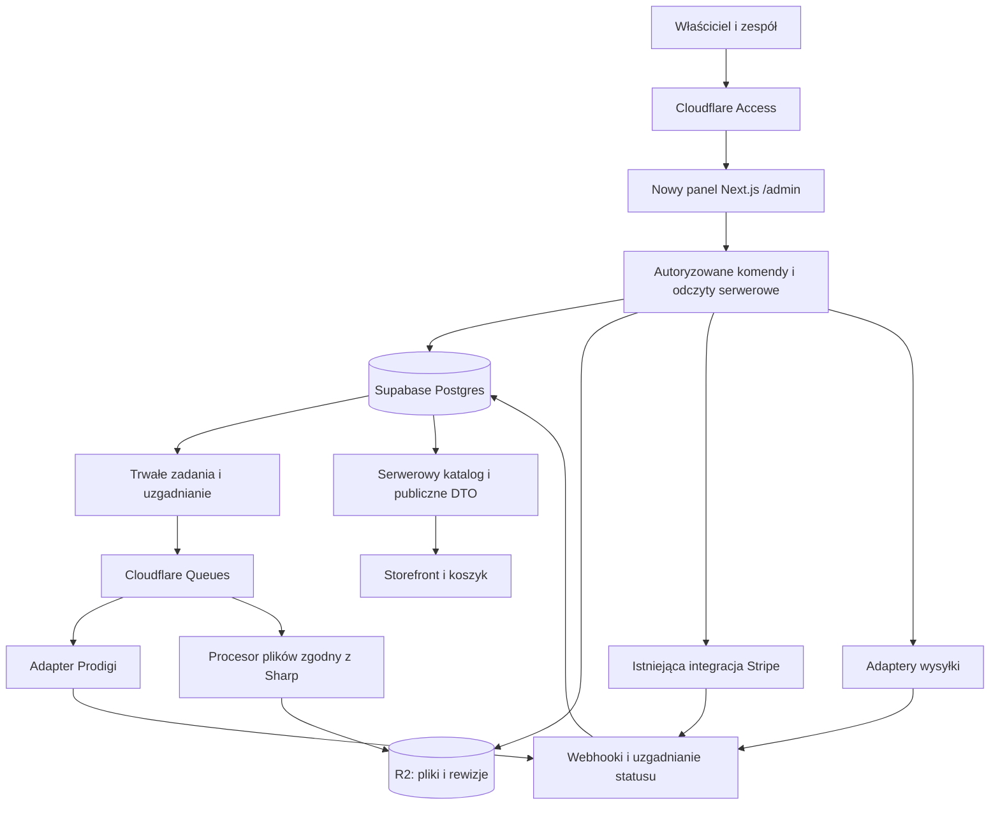

# Nowy CMS dla Anna Ciok Studio — dopasowanie do ceramics-drop

Data: 2026-09-09. Status: **propozycja architektury i zakresu**, do wykorzystania przy projektowaniu i implementacji. Nie oznacza zatwierdzenia wszystkich decyzji ani wykonania przebudowy.

Podstawa: odczyt lokalnego repozytorium `E:/repositories/ceramics-drop`, jego instrukcji, kodu, migracji i dokumentacji oraz aktualnej dokumentacji wskazanych bibliotek. Nie wykonywano operacji na produkcyjnej bazie, płatnościach, przesyłkach ani zamówieniach Prodigi. Stan wdrożenia migracji i zewnętrznych usług nie został w tym badaniu zweryfikowany.

## 1. Rekomendacja

Zbudować od podstaw **panel do prowadzenia studia i sklepu**, wewnątrz obecnej aplikacji Next.js, pod `/admin`. Zaprojektować od nowa jego nawigację, ekrany i procesy. Zachować sprawdzone mechanizmy płatności, rezerwacji, realizacji zamówień, publikacji plików i integracji. Rozbudować ich kontrakty tam, gdzie obecnie nie umożliwiają samodzielnej pracy w panelu.

Najważniejsza zmiana to doprowadzenie katalogu do stanu, w którym **produkt utworzony wyłącznie w CMS-ie można opublikować i kupić bez edycji plików oraz wdrożenia aplikacji**. Obecne `CATALOG_SOURCE=db` jeszcze tego nie zapewnia: koszyk, kuracja kolekcji, część treści i onboarding plików nadal zależą od kodu.

Przy około 100 produktach nie ma uzasadnienia dla nowego systemu mikroserwisów, osobnego silnika e-commerce ani migracji infrastruktury. Złożoność tego projektu wynika z plików produkcyjnych, wariantów, publikacji w czterech językach i obsługi wyjątków w zamówieniach.

## 2. Kontekst biznesowy z tego repozytorium

Uwzględniam decyzje właściciela zapisane w [źródle prawdy dla copy](../copy-source-of-truth.md). Dokument rozróżnia decyzje od propozycji i zaznacza, że nie wszystkie zostały wdrożone.

- Marka: **Anna Ciok Studio**. Główna sprzedaż online: **Fine Art Print**, reprodukcje w edycji otwartej.
- Ceramika obecnie dostępna do zakupu podczas umówionej wizyty w pracowni w Güímar na Teneryfie. Panel ma zarządzać prezentacją przedmiotów i ich prawdziwymi stanami, zachowując możliwość przyszłych dropów online.
- Obecność ceramiki w showroomie nie oznacza sprzedaży ani aktualnej dostępności w pracowni. Nie wolno masowo zamieniać tych stanów na „sprzedane”.
- Standardowe printy mają konfigurację rozmiaru i oprawy. Dostawa w obecnym kodzie obejmuje UE27 i Wielką Brytanię, na adres odbiorcy. Nie należy automatycznie rozszerzać jej na wszystkie kierunki obsługiwane przez Prodigi.
- PL/EN/ES/DE to obecne języki sklepu. Nazwy kolekcji i produktów pozostają oryginalne; stable ID produktu jest czym innym niż nazwa i numer wyświetlany klientowi.
- Karta podarunkowa z zachowywanym saldem jest wymaganiem docelowym. Obecny mechanizm jest jednorazowym kodem promocyjnym; sam ekran salda nie zrealizuje tej decyzji.

Mieszany model działalności — przedmioty w pracowni oraz POD — **nie oznacza obecnie mieszanego koszyka**. `validateCart()` odrzuca połączenie ceramiki i printów; karty podarunkowe również mają osobny tor. Przebudowa CMS-a nie powinna po cichu zmieniać tego kontraktu. Źródła: [checkout](../../src/lib/checkout.ts), [tworzenie zamówienia](../../src/app/api/checkout/route.ts), [karty podarunkowe](../gift-cards.md).

## 3. Co zachować, co przebudować

| Obszar | Co rzeczywiście istnieje | Decyzja dla nowego CMS-a |
|---|---|---|
| Hosting | Next.js App Router, OpenNext, Cloudflare Worker | Zachować; nowy panel w tym samym repo |
| Dostęp administratora | Cloudflare Access, walidacja JWT w Workerze | Zachować tożsamość; uporządkować autoryzację poszczególnych operacji |
| Dane | Supabase/Postgres, serwerowy klient, migracje SQL | Rozszerzać istniejący model; bez równoległej bazy CMS |
| Płatności | PaymentIntent, Payment Element, idempotencja checkoutu, webhooki | Zachować. Migracja do Checkout Sessions nie jest warunkiem CMS-a |
| Realizacja printów | Cloudflare Queues, `fulfilment_jobs`, Prodigi, ponowienia, uzgadnianie statusów | Zachować; dodać zrozumiały panel operacyjny |
| Pliki | R2, rewizje assetów, kontrola gotowości, podpisany dostęp | Zachować; zaprojektować pełny onboarding z panelu |
| Ceramika | `piece_state`, rezerwacje, dropy, private sale, showroom | Zachować reguły; oddzielić dostępność od prezentacji i kanału sprzedaży |
| Katalog | DB w runtime, ale struktura i część konsumentów zależne od rejestrów kodowych | Przeprowadzić migrację do katalogu zarządzanego przez CMS |
| Treści | Dokumenty, wersje, szkice, publikacja i fallback tłumaczeń | Zachować historię; zmienić edycję i ograniczenia zależne od rejestrów |
| Stary interfejs | Istniejące strony i komponenty `/admin` | Nie traktować jako wzorca; zastępować nowymi ekranami |
| DHL | W przeszukanych `src`, `scripts`, `config` brak samodzielnego adaptera; nazwa występuje m.in. w testowych danych przewoźników | Osobna integracja dopiero dla określonego procesu i umowy |

Istnienie kodu i testów nie oznacza, że każdy mechanizm został w tym badaniu certyfikowany jako bezbłędny. „Zachować” oznacza wykorzystać jako punkt wyjścia i chronić jego istniejące gwarancje testami podczas przebudowy.

Źródła: [worker.ts](../../worker.ts), [wrangler.jsonc](../../wrangler.jsonc), [admin/actions.ts](../../src/lib/admin/actions.ts), [katalog](../../src/lib/catalog/repository.ts), [Prodigi](../../src/server/prodigi/), [realizacja zamówień](../../src/server/fulfilment/).

## 4. Najważniejsze ograniczenia odkryte w kodzie

### 4.1. Katalog w bazie nadal wymaga wdrożeń kodu

W [cart-lines.ts](../../src/lib/cart-lines.ts) przeglądarkowy resolver koszyka korzysta z `registryProductById` i `registryPrintById`. Nieznany produkt jest pomijany. Serwerowy checkout korzysta z innych, świadomych `CATALOG_SOURCE` accessorów. Produkt może więc istnieć w DB, a nadal nie działać poprawnie w koszyku.

[Nazwy i kolekcje printów](../../src/lib/print-curation.ts) pochodzą z JSON-a; walidacja narzuca dzisiejszy zestaw kolekcji i ich strukturę. [Grupowanie kolekcji](../../src/lib/print-collections.ts) umieszcza nieprzypisany produkt w grupie zastępczej, ale nie pozwala redaktorowi zarządzać przynależnością bez kodu. [Etykiety administratora](../../src/lib/admin/products.ts) również korzystają z rejestrów.

**Wymagana zmiana:** jeden serwerowy model odczytu katalogu oraz publiczny, ograniczony DTO do rozwiązywania zawartości koszyka. Bez ujawniania klienta service-role w przeglądarce. Kolekcje, przypisania, kolejność i nazwy muszą być edytowalnymi danymi. Reguły technicznie obsługiwanych osi wariantów mogą nadal pozostać w kodzie.

### 4.2. Backfill może cofnąć pracę wykonaną w panelu

[seed.ts](../../src/lib/catalog/seed.ts) projektuje dane z rejestrów, cen i map SKU do tabel. `backfill_catalog` zastępuje warianty i media dla synchronizowanych produktów. Ma przydatne zabezpieczenia stanów i publikacji; nie jest jednak neutralnym importem wobec przyszłych zmian redaktora.

**Wymagana zmiana:** po przełączeniu odpowiedzialności kodowe seedy służą testom lub kontrolowanej migracji, nie bieżącej synchronizacji katalogu. Potrzebna jest blokada przypadkowego uruchomienia starego backfillu na katalogu zarządzanym przez CMS. Zachowujemy ID, relacje zamówień i dotychczasowe URL-e.

### 4.3. „Pole w bazie” nie oznacza „działa w sklepie”

[Schemat edycji produktu](../../src/lib/catalog/schemas.ts) pozwala obecnie na ograniczony zestaw metadanych. `slug` nie jest kluczem routingu. Indywidualne EUR/GBP dla ceramiki nie zastępują tabel cen kategorii. Ceny printów liczy wspólny cennik; pola cen w wariantach nie są automatycznie jego zamiennikiem.

**Wymagana zmiana:** każde pole nowego edytora ma wskazanego konsumenta: karta produktu, PDP, koszyk, checkout, metadane lub integracja. Nie pokazujemy formularza dającego pozorną kontrolę. Zmiana URL-a wymaga routingu i przekierowania, a nie samego zapisu `slug`.

### 4.4. Treści produktu również są powiązane z kodem

[Schematy CMS](../../src/lib/cms/schemas.ts) wyprowadzają dozwolone identyfikatory notatek z rejestrów produktów. Nowe ID z DB wymaga zmiany tego mechanizmu. [Lista dokumentów edytowalnych](../../src/lib/admin/content.ts) jest zamknięta; istnienie ogólnego typu dokumentu nie oznacza pełnej obsługi przez sklep.

Zapis szkicu wylicza numer wersji przez odczyt maksimum i późniejszy insert. Przy równoległej edycji tego samego dokumentu/języka może wystąpić kolizja ograniczenia unikalności. Publikacja jest atomowym RPC, natomiast wpis audytu jest wykonywany później. Podobnie aktualizacja metadanych produktu nie ma warunku oczekiwanej wersji, a audyt jest best-effort.

**Wymagana zmiana:** przypisanie treści do realnych produktów, zapis z kontrolą wersji i czytelną obsługą konfliktu. Przydzielanie wersji oraz audyt danej mutacji powinny być atomowe. Dla efektów zewnętrznych audyt zapisuje próbę i wynik operacji, zamiast udawać wspólną transakcję SQL ze Stripe.

### 4.5. Przygotowanie pliku do druku jest osobnym procesem

[Onboarding](../../scripts/print-assets-onboard.ts) i [przygotowanie plików](../../scripts/print-assets-prepare.ts) wykorzystują lokalny filesystem i Sharp. Upload obrazka na stronę nie zastępuje przygotowania plików produkcyjnych, proofów i rewizji.

**Wymagana zmiana:** panel zleca trwałe zadanie przetwarzania. Procesor w środowisku Node zgodnym z używanym Sharp pobiera źródło z R2, przygotowuje wyniki, zapisuje je w R2 i raportuje rezultat. Docelowe środowisko procesora trzeba dobrać i sprawdzić na rzeczywistym największym pliku. Nie zakładamy, że obecny lokalny skrypt uruchomi się bez zmian w żądaniu Next.js na Workers. Sama flaga zgodności Node nie gwarantuje zgodności całej aplikacji; zob. [Cloudflare Node.js compatibility](https://developers.cloudflare.com/workers/runtime-apis/nodejs/).

CLI może pozostać etapem przejściowym. Pełne kryterium „obsługa bez kodu” wymaga dostępnego procesora sterowanego panelem, bez ręcznego uruchamiania CLI przez właściciela.

## 5. Dobór bibliotek — po uwzględnieniu repo

Lockfile podczas odczytu zawierał Next.js **16.2.9**, React **19.2.7**, OpenNext Cloudflare **1.19.11**, Stripe SDK **22.2.1**, Supabase JS **2.110.8**. Są to wersje zapisane w lockfile, nie deklaracja najnowszych wydań ani potwierdzenie wersji wdrożonych. Przebudowa nie wymaga hurtowej aktualizacji zależności.

| Potrzeba | Wybór | Powód i ograniczenie |
|---|---|---|
| Interaktywne komponenty | **Base UI** + własne cienkie komponenty panelu | Nie wymusza gotowego wyglądu; pasuje do obecnego plain CSS i tokenów |
| Style | Istniejące custom properties, osobne style panelu | Zachowujemy konwencję repo; większa gęstość i czytelność niż w storefront |
| Formularze | **React Hook Form + `@hookform/resolvers` + obecny Zod** | Formularze zależnych wariantów, walidacja per pole, dirty state; serwer waliduje ponownie |
| Tabele | **TanStack Table** | Selekcja, filtry, sortowanie, kolumny; własne komórki z miniaturą, statusem i akcjami |
| Filtry w URL | **nuqs** | Powrót do tej samej listy, kopiowanie adresu, zachowanie sortowania i filtrów |
| Dane początkowe | Server Components i serwerowe funkcje odczytu | Bez nadmiarowego API między komponentem serwerowym a własnym backendem |
| Mutacje | Route Handlers pod `/api/admin`, wspólne komendy domenowe | Rozwijamy istniejący wzorzec i zachowujemy współdzielenie z CLI |
| Odświeżanie zadań | Początkowo ograniczony polling; **TanStack Query**, jeśli potrzebny wspólny stan wielu widoków | Nie dublować automatycznie każdego odczytu RSC drugim cache klienta |
| Edytor tekstu | Pola i kontrolowane sekcje; **Tiptap dopiero dla uzasadnionego rich text** | Obecne schematy i renderery nie są uniwersalnym edytorem HTML/JSON |
| Obrazki | R2, istniejące helpery obrazów, natywne `img`/`srcSet` | Zachować proporcje dzieł i konwencję projektu |
| Zadania i monitoring | Obecne Cloudflare Queues, cron i Sentry | Nie dokładamy drugiego orkiestratora tylko dla panelu |
| Testy | Obecne Vitest, Playwright, pgTAP | Testować reguły i procesy na tych samych narzędziach |

Podstawy doboru: [Base UI quick start](https://base-ui.com/react/overview/quick-start), [TanStack Table overview](https://tanstack.com/table/latest/docs/overview), [oficjalne resolvery RHF](https://github.com/react-hook-form/resolvers), [nuqs i wspierane wersje frameworków](https://nuqs.dev/docs/installation). Wersje nowych bibliotek należy przypiąć po sprawdzeniu ich peer dependencies oraz małym buildzie przez OpenNext; dokumentacja potwierdza przeznaczenie, ale nie zastępuje testu w tym repo.

Zmiana względem ogólnego researchu: **shadcn/Tailwind nie jest tu domyślnym wyborem**, ponieważ repo nie używa Tailwind. Payload, Medusa i Refine dodawałyby kolejną warstwę konwencji do istniejącej domeny. Trigger.dev, Supabase Storage i nowe logowanie administratorów przez Supabase zastępowałyby mechanizmy, które już są. Nie ma obecnie konkretnej korzyści uzasadniającej takie migracje.

## 6. Jak powinien wyglądać nowy panel

Nawigacja powinna odpowiadać pracy właściciela. To propozycja niezależna od starego UI; szczegółowy wygląd wymaga projektu ekranów i przykładów najbardziej uciążliwych obecnych czynności.

| Sekcja | Zadanie użytkownika | Najważniejszy widok |
|---|---|---|
| **Do zrobienia** | Sprawdzić, co wymaga reakcji | Zamówienia z problemem, zwroty, niegotowe publikacje; każde z konkretną kolejną czynnością |
| **Produkty** | Dodać lub poprawić ofertę | Fine Art Print / Ceramika; lista i edytor z podglądem |
| **Kolekcje** | Ułożyć ofertę i prezentację | Kolekcje printów, kolejność prac, osobno dropy ceramiki |
| **Zamówienia** | Obsłużyć zakup od zapłaty do zakończenia | Historia zdarzeń, pozycje, płatność, realizacja i wszystkie paczki |
| **Zwroty i reklamacje** | Rozwiązać sprawę klienta | Sprawa powiązana z pozycjami, dowodami, decyzją i rozliczeniem |
| **Treści** | Zmienić stronę i opisy | Sekcje strony, cztery języki, podgląd szkicu, historia publikacji |
| **Pliki** | Wybrać zdjęcie albo sprawdzić gotowość do druku | Galeria, źródła, proofy, rewizje, użycia pliku |
| **Ceny i promocje** | Kontrolować ceny oraz rabaty | Wspólny cennik printów, waluty, dostawa, promocje; karty po wdrożeniu salda |
| **Ustawienia** | Zarządzać rynkami i dostępem | Konfiguracja biznesowa; stan integracji w wydzielonym widoku |

Właściciel nie powinien rozpoczynać dnia od wykresów. Ekran startowy ma mówić np. „Zwrot pieniędzy utworzony, produkcji nie udało się zatrzymać” i prowadzić do sprawy. Szczegóły techniczne, identyfikatory API i próby kolejki pozostają dostępne w rozwijanej diagnostyce.

### Kluczowe komponenty

- **ProductEditor**: zakładki Dane / Warianty / Media / Treści i SEO / Publikacja. Stały pasek stanu zapisu; wyraźne rozróżnienie „Zapisz szkic” i „Opublikuj”.
- **VariantMatrix**: tylko obsługiwane kombinacje, zbiorcze operacje, wskazanie brakującego pliku lub SKU. Główny widok używa nazw handlowych, techniczne mapowanie jest szczegółem.
- **AssetPicker i ProofReview**: rozdzielenie ilustracji sklepowej od pliku produkcyjnego; powiększenie proofu, wymiary, rewizja, zgoda na publikację tej konkretnej wersji.
- **PublishReadiness**: lista konkretnych braków z przejściem do pola; wyliczana po stronie serwera z tej samej reguły, która blokuje publikację.
- **OrderTimeline i ShipmentList**: osobne stany płatności, produkcji i przesyłek; brak jednego mylącego badge „gotowe”.
- **LocaleEditor**: porównanie języków, stan szkicu/publikacji, widoczne źródło fallbacku. Brak tłumaczenia nie może wyglądać jak gotowa lokalizacja.
- **ConflictNotice**: po zapisie przez drugą osobę pokazuje konflikt i możliwość porównania; nie nadpisuje po cichu.

Kryteria UX: obsługa klawiaturą, czytelny focus i błędy, status nieoparty wyłącznie na kolorze, zachowanie filtrów po powrocie, ostrzeżenie o niezapisanej pracy, możliwość sprawdzenia zamówienia i podjęcia podstawowej akcji z telefonu. Dla około 100 produktów nie potrzeba rozbudowanego wirtualizowanego grida. Zamówienia będą rosły, więc ich filtrowanie i paginacja powinny działać na serwerze.

## 7. Procesy, które muszą działać od początku do końca

### A. Dodanie Fine Art Print

1. Utworzenie szkicu z nowym stabilnym ID, nazwą i kolekcją. Duplikacja istniejącego wzoru nie kopiuje powiązań historycznych zamówień.
2. Wybór wariantów z obsługiwanej macierzy i istniejącej, zweryfikowanej mapy SKU. Dodanie całkowicie nowej technologii druku może nadal wymagać prac integracyjnych.
3. Upload źródła i zdjęć; przygotowanie plików wariantów przez procesor; prezentacja postępu i błędów.
4. Weryfikacja proofów, wymiarów oraz gotowości wszystkich aktywnych wariantów. Zachowanie obecnego mechanizmu rewizji i możliwości awaryjnego wycofania assetu.
5. Opisy, media, alternatywne teksty, SEO i podgląd w PL/EN/ES/DE. Polityka wymaganych tłumaczeń jest jawna; obecny fallback per język nie jest po cichu zastępowany blokadą wszystkich czterech wersji.
6. Podgląd cen detalicznych w walutach i kosztu realizacji z datą jego sprawdzenia. Publikacja przez serwerową komendę.
7. Produkt pojawia się w kolekcji, PDP, koszyku, checkout i miejscach generujących dane katalogowe, bez deployu.

### B. Ceramika i przyszły drop

Edytor rozdziela stan fizyczny (`available/reserved/sold`), obecność w showroomie, publikację produktu i możliwość sprzedaży online. Dziś zakup w pracowni nie ma automatycznie włączać internetowej wysyłki. Przyszły drop używa istniejących reguł i rezerwacji; historycznie sprzedany przedmiot pozostaje sprzedany.

Nie zastępujemy `piece_state` ogólnym polem `stock_quantity` w wariancie. W obecnym modelu unikat to konkretny przedmiot. Jeżeli pojawią się serie identycznych sztuk, potrzebny będzie dodatkowy model ewidencji ilościowej i atomowych rezerwacji, a nie tylko nowe pole w formularzu.

### C. Zamówienie i problem z realizacją

Karta zamówienia pokazuje snapshot zakupionych pozycji, kwoty i walutę, historię płatności, powiązanie z Prodigi/InPost, paczki i następne dozwolone działania. Dane historyczne nie są odbudowywane z dzisiejszej nazwy lub ceny produktu.

Ponowienie realizacji używa istniejącego zadania, klucza idempotencji i stanu dostawcy. Timeout API nie dowodzi, że zamówienie nie zostało utworzone. Obecna kolejka ma mechanizmy retry i uzgadniania; nie zastępujemy ich przyciskiem tworzącym nowe zamówienie przy każdym kliknięciu. Cloudflare Queues zapewnia dostarczenie co najmniej raz, więc deduplikacja nadal jest potrzebna. [Gwarancje Queues](https://developers.cloudflare.com/queues/reference/delivery-guarantees/).

### D. Zwrot lub reklamacja

[refundOrder](../../src/lib/admin/actions.ts) realizuje pełny zwrot w Stripe i osobno próbuje zatrzymać POD; wynik zatrzymania jest już udostępniony wywołującemu. Nowy panel musi to pokazać. „Pieniądze zwrócone” nie oznacza „produkcja anulowana”.

Repo ma też [zwrotną przesyłkę InPost](../../src/lib/return.ts) dla kwalifikujących się zamówień ceramicznych. To nie jest pełny system spraw reklamacyjnych. Potrzebujemy sprawy z powodem, pozycjami i ilościami, załącznikami, decyzją, przesyłką zwrotną, rozliczeniem oraz historią działań. Dla printów ścieżka kontaktu z dostawcą jest osobna od rozliczenia klienta.

Zwroty częściowe wymagają rozbudowy backendu i uzgadniania webhooków; nie wystarczy odsłonić parametr kwoty w Stripe. Stan fizyczny zwróconej ceramiki nie powinien automatycznie oznaczać ponownej gotowości do sprzedaży bez przyjęcia i oceny przedmiotu.

## 8. Architektura i odpowiedzialność za dane

Diagram przedstawia docelowy przepływ. Postgres nie wysyła sam wiadomości do Queue: trwały zapis zadania, jego wysłanie i ponowienie muszą mieć jawnego wykonawcę. Dla fulfilment wykorzystujemy istniejący mechanizm; nowe zadania plików powinny mieć analogicznie trwały zapis i odzyskiwanie po awarii, z osobną kolejką od płatnych zleceń druku.

Proponowane granice:

- `src/app/admin`: routing i składanie ekranów; nowa implementacja UI.
- Komponenty panelu: współdzielone kontrolki oraz komponenty procesów, stylowane zgodnie z repo.
- `src/lib/admin`: autoryzowane przypadki użycia i odczyty pod panel. UI i CLI mogą korzystać z tych samych reguł.
- `src/lib/catalog`, CMS, pricing: reguły produktów, publikacji i cen, niezależne od wyglądu panelu.
- `src/server`: integracje, pliki, realizacja. Zewnętrzne odpowiedzi mapowane na wewnętrzny wynik z czytelnym rozróżnieniem sukcesu, odrzucenia i nieustalonego rezultatu.
- `supabase/migrations`: ewolucja schematu i atomowe operacje. Nie wprowadzamy drugiego systemu migracji ani ORM bez konkretnej potrzeby.

### Zmiany danych — rozszerzenia, nie migracja wszystkiego do JSON-a

| Dane | Kierunek |
|---|---|
| Produkty, warianty, media | Rozszerzyć obecne tabele o brakujące dane edycyjne; stabilne ID, spójne reguły publikacji |
| Kolekcje i przypisania | Przenieść kurację i kolejność z config do danych; zachować aktualną prezentację podczas migracji |
| Treści produktowe | Relacja do produktu i języka; adaptacja obecnych wersji zamiast utraty historii |
| Wersja edycji | Jawna oczekiwana rewizja przy zapisie; konflikt 409 zamiast cichego nadpisania |
| Pliki i przetwarzanie | Źródło, rewizja, pochodne, walidacja, zadanie, błąd, użycia w wariantach i zamówieniach |
| Przesyłki | Docelowo wiele rekordów przypisanych do zamówienia i jego pozycji; identyfikatory dostawcy i środowiska |
| Sprawy zwrotów | Nowa domena powiązana z pozycjami zamówienia, decyzjami i rozliczeniami |
| Karty podarunkowe | Osobny rejestr emisji, rezerwacji i zużyć salda; odrębny projekt kontraktu płatności |

Nie projektujemy dziś pełnego nowego schematu SQL. Najpierw trzeba ustalić, które istniejące kolumny i RPC obsłużą wymagania, oraz przygotować migrację danych i kompatybilność odczytów.

## 9. Ceny, dostawy i integracje wymagają szczególnej uwagi

**Ceny.** [Cennik printów](../../src/lib/print-pricing.ts) operuje na cenie bazowej EUR i regułach przeliczeń, a [jego accessor](../../src/lib/print-pricing-config/get.ts) może przejść na wartości domyślne w kodzie po błędzie DB. Dzisiejsza procedura wymaga także utrzymania zgodności domyślnego cennika z trwałą zmianą w panelu. Pełny CMS musi zlikwidować konieczność ręcznej synchronizacji kodu po zmianie cen.

Docelowo ostatnia zatwierdzona konfiguracja jest wersjonowana jako dane. Awaria odczytu nie może po cichu przywracać starej ceny przy tworzeniu płatności; checkout powinien korzystać z zatwierdzonej, weryfikowalnej wersji albo czytelnie zatrzymać zakup. Prezentacja może mieć osobną politykę danych zastępczych, z monitoringiem ich wieku. Repo ma już mechanizmy fallbacku katalogu — trzeba je dostosować, a nie zakładać, że nie istnieją.

Kwoty katalogowe są obecnie w jednostkach głównych, a zamówienia i Stripe w najmniejszych jednostkach. Zachować jawne konwersje na granicach; nie przeliczać całej bazy bez migracji. Panel powinien pokazywać cenę klienta, koszt dostawcy i marżę szacunkową osobno, wraz z walutą, datą i tym, jakie koszty uwzględniono.

**Dostawa printów.** [Obecny cennik wysyłki](../../src/lib/print-shipping.ts) jest stałą tabelą, a nie bieżącą wyceną dostawcy. Dokument copy zapisuje pojedynczą wycenę live z 9 września różniącą się od starszej tabeli sandbox. To przesłanka do przeglądu kosztów, nie dowód jednej różnicy dla całej oferty. Nowy panel powinien umożliwiać kontrolę tabeli i porównanie z datowaną wyceną; nie musi uzależniać każdego checkoutu od dostępności API wycen.

**Prodigi i wiele paczek.** [merge.ts](../../src/server/prodigi/merge.ts) zapisuje podstawowy tracking jednej przesyłki; pełna tablica jest zachowana w surowej odpowiedzi. Pierwszy nowy widok może pokazać bezpiecznie zmapowane wszystkie przesyłki już z tych danych. Normalizacja jest potrzebna przed pełną obsługą zdarzeń i operacji per paczka. Nie należy automatycznie utożsamiać zakończenia pracy dostawcy z doręczeniem. [Kontrakt Prodigi](https://www.prodigi.com/print-api/docs/reference/).

**InPost i DHL.** Istniejący InPost to konkretny tor ShipX związany z ceramiką. Należy go zachować dla historii i odpowiednich przyszłych procesów; nie oferować automatycznie dla printów ani wysyłek z Teneryfy. Samo pojawienie się „DHL” jako przewoźnika w odpowiedzi Prodigi nie wymaga własnego API DHL. Bezpośredni adapter wymaga ustalenia kraju nadania, produktu DHL, konta i tego, kto kupuje etykietę. To decyzja funkcjonalna przed wyborem endpointów.

**Karty.** Przed wdrożeniem salda trzeba określić walutę, atomową rezerwację środków w checkout, zwolnienie po wygaśnięciu, potwierdzenie zużycia oraz reguły zwrotu środków. Istniejących jednorazowych kart nie wolno przekształcać w saldo na podstawie domysłu o niewykorzystanej wartości. CMS pokazuje rzeczywisty typ instrumentu do zakończenia migracji.

## 10. Dostęp, środowiska i wdrożenie

[Worker](../../worker.ts) weryfikuje Access dla `/admin` i `/api/admin`, usuwa podszyty nagłówek aktora i ustawia go na podstawie zweryfikowanej tożsamości. [access.ts](../../src/lib/admin/access.ts) zawiera opcjonalną listę dozwolonych e-maili. Nowe trasy muszą pozostać pod rzeczywistą ochroną; przeniesienie panelu pod `/studio` wymagałoby zmiany granicy autoryzacji.

Każda mutacja potrzebuje autoryzacji po stronie serwera. Proponuję mały zestaw uprawnień do edycji treści, publikacji, obsługi zamówień i zwrotów pieniędzy; początkowo jedna rola właściciela, bez rozbudowanego kreatora ról. Nie należy mylić Cloudflare Access z uprawnieniem do dowolnej operacji biznesowej. Klient service-role omija RLS; nie można opierać na RLS bezpieczeństwa takich odczytów.

Konfiguracja `wrangler.jsonc` pokazuje różne kolejki preview i produkcji, ale tę samą nazwę bucketu R2. Nie zakładamy izolacji testów tylko dlatego, że adres zawiera „preview”. Przed testami zapisów nowego panelu potrzebne są izolowane dane, zasoby i środowiska dostawców. Nie należy wgrywać testowego źródła pod produkcyjną rewizją.

Repo wymaga webpack i zachowania obecnego `middleware.ts`; nie migrujemy go przy okazji do `proxy.ts`. [OpenNext config](../../open-next.config.ts) używa cache opartego o statyczne zasoby. Odczyty katalogu/cennika pozostają bezpośrednie zgodnie z [AGENTS.md](../../AGENTS.md). Nie dokładamy `unstable_cache` ani obietnicy natychmiastowej publikacji przez samo `revalidateTag`. Trwałe cache i unieważnianie wymagają osobnej, kompletnej konfiguracji. [Dokumentacja cache OpenNext](https://opennext.js.org/cloudflare/caching).

W repo trwa osobna praca nad copy i modelem sprzedaży. Ten dokument nie zmienia jej treści ani nie publikuje nowych deklaracji. Istnieją też [plany hardeningu](../superpowers/plans/2026-08-12-remediation-00-master-index.md); ich datowane statusy należy zweryfikować przed implementacją, a istotne zadania autoryzacji i webhooków skoordynować z przebudową.

## 11. Kolejność realizacji

### Etap 1 — pierwszy pełny proces i fundament danych

Zaprojektować szczegółowo listę produktów, edytor Fine Art Print oraz panel gotowości publikacji. Wykonać migrację kuracji/treści i resolvera koszyka konieczną do obsługi nowego ID, kontrolę wersji i blokadę starego backfillu. Uruchomić szkielet nowego panelu pod chronioną ścieżką, z ograniczonym zakresem funkcji.

**Dowód odbioru:** produkt utworzony tylko przez nowy panel z istniejącymi, gotowymi assetami przechodzi cały zakup testowy bez edycji kodu. To pierwszy pionowy zakres, nie obietnica zakończonego onboardingu źródeł.

### Etap 2 — pełna obsługa oferty bez CLI

Uruchomić onboarding plików z procesorem, proofy, warianty, kolekcje, treści, rewizje cen i galerie ceramiki. Przygotować migrację istniejących danych z porównaniem przed/po i planem cofnięcia.

**Dowód odbioru:** właściciel dodaje nowy wzór od pliku źródłowego do publikacji bez terminala, zmiany JSON-a i deployu. Zmiany cen nie wymagają aktualizacji stałych w kodzie.

### Etap 3 — codzienna obsługa sprzedaży

Nowy ekran zamówienia, wszystkie paczki, lista wymagających reakcji, bezpieczne ponowienia istniejących zadań, pełne zwroty, sprawy zwrotów/reklamacji i historia czynności. Rozbudowa backendu zwrotów częściowych, jeśli mają należeć do pierwszego kompletnego wydania.

**Dowód odbioru:** operator potrafi rozpoznać i obsłużyć opłacone zamówienie z nieudaną realizacją oraz zwrot, po którym POD nie dało się anulować.

### Etap 4 — domknięcie i przełączenie panelu

Zastąpić pozostałe potrzebne moduły: promocje, zarządzanie dropami, ustawienia, odpowiednie operacje historyczne. Usunąć stare UI dopiero po przeniesieniu potrzebnych możliwości i odłączeniu jego zapisów. Zostawić współdzielone komendy, migracje i historię danych. Nie prowadzić dwóch niezależnych edytorów tych samych danych bez wspólnej kontroli wersji.

**Osobne zależności biznesowe:** saldo kart, bezpośredni DHL, koszyk mieszany i magazyn ilościowy. Nie są automatycznie częścią zamiany UI. Saldo jest już zapisanym wymaganiem docelowym i wymaga osobnego wdrożenia; pozostałe zależą od potwierdzonego procesu sklepu.

Rollback panelu nie może przywracać niezgodnego, kodowego katalogu. Migracje najpierw rozszerzają schemat; poprzedni zgodny odczyt i nowe dane muszą współistnieć do momentu kontrolowanego przełączenia. Kopia bazy i plan odzyskania plików to dwa elementy, bo assety są w R2.

## 12. Kryteria odbioru i testy mające znaczenie

| Scenariusz | Wymagany wynik |
|---|---|
| Nowe ID nieobecne w rejestrze kodowym | Poprawna nazwa, kolekcja, PDP, koszyk i zakup testowy bez deployu |
| Zmiana kolekcji i kolejności | Aktualizacja prezentacji bez zmiany stabilnych ID i nazw historycznych zamówień |
| Zapis w dwóch kartach | Konflikt wersji; żadnego cichego nadpisania |
| Publikacja niegotowego wariantu | Serwer odmawia i wskazuje brakujący warunek |
| Ponowne przetworzenie zadania/webhooka | Bez drugiego płatnego zamówienia i bez drugiego refundu |
| Timeout po wywołaniu dostawcy | Widoczny stan nieustalony i uzgodnienie przed ponowieniem skutku |
| Nowa rewizja pliku | Nowe zakupy używają nowej wersji, stare snapshoty pozostają spójne |
| Dwie paczki Prodigi | Widoczne osobno; brak trackingu jednej nie ukrywa drugiej |
| Refund i odmowa anulowania POD | Oddzielne, prawdziwe wyniki oraz sprawa do obsługi |
| Ceramika w showroomie | Nie jest automatycznie oznaczona jako sprzedana ani kupowalna online |
| Zmiana cennika i awaria DB | Brak niezauważonego naliczenia starej ceny z kodu |
| Nieuprawniona mutacja i sfałszowany aktor | Odrzucenie na serwerze, także przez bezpośrednie API |
| Publikacja treści | Właściwy język i jawny fallback; podgląd nie udostępnia publicznie szkiców |
| Powrót do listy i obsługa klawiaturą | Zachowany kontekst i dostępne najważniejsze działania |

Przy implementacji: testy jednostkowe reguł i adapterów, testy SQL dla współbieżności i atomowych zapisów, Playwright dla rzeczywistych procesów. Integracje Stripe/Prodigi sprawdzać w izolowanych trybach testowych. Po zmianach kodu wykonać wymagane lint/typecheck/testy i build OpenNext; sam `next build` nie potwierdza zachowania Workera, Access i kolejki. Nie ma potrzeby uruchamiania testów aplikacji dla samego niniejszego dokumentu.

## 13. Decyzje pozostałe przed szczegółową implementacją

1. Które 2–3 czynności i cechy starego panelu najbardziej przeszkadzają właścicielowi — wpływa to na projekt ekranów, nie zatrzymuje powyższej diagnozy danych.
2. Czy pierwsze wydanie obsługuje tylko właściciela, czy również redaktora/obsługę zamówień; które operacje wymagają osobnych uprawnień.
3. Czy DHL oznacza własne nadawanie paczek przez studio, czy tylko prezentację przewoźnika przydzielonego przez POD; skąd miałyby być nadawane paczki.
4. Czy w pierwszym pełnym wydaniu potrzebne są zwroty częściowe i saldo kart; jakie reguły rozliczeń zatwierdzono w powiązanej pracy nad modelem sprzedaży.
5. Jak duże są rzeczywiste pliki źródłowe, jak często dochodzą nowe wzory i gdzie uruchomić procesor, aby właściciel nie musiał obsługiwać infrastruktury.

Pierwszy zakres implementacyjny powinien obejmować **nowy edytor Fine Art Print oraz pełną drogę produktu z bazy do zakupu**. To sprawdzi, czy przebudowa daje samodzielność w prowadzeniu sklepu, zanim powstanie wiele ekranów opartych na tych samych ograniczeniach.
