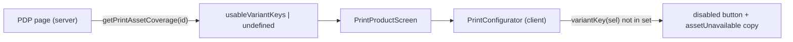

# Plan: Print Asset Pipeline code-review fixes

Five independent fixes. Order = descending priority/value. **F1–F4 are in scope; F5 is deferred** (real race, but already fail-closed at checkout, and the fix is high-churn for a low-frequency edge — build only on explicit approval).

Throughout, the authoritative invariant is: **checkout is the correctness boundary, storefront gating is best-effort UX.** The webhook and `validateCart` already fail closed. F1 only makes the failure visible earlier and more gracefully; it must never be treated as a security control.

Ground truth confirmed against the current codebase:

- `product_variants.variant_key` is written via `variantKey(sel)` in `src/lib/catalog/seed.ts` (`${size}:${framed}:${mount}:${frameColour}`), so it is byte-identical to what `variantKey(sel)` produces at runtime and what checkout resolves. F1's set-membership comparison is valid.
- The checkout route **already** maps `print_asset_unavailable -> 409` and `print_asset_error -> 503` (`src/app/api/checkout/route.ts`), and CartView **already** handles the 409 (`src/components/shop/CartView.tsx`). F3's remaining work is docs + the 503 branch + one i18n key.
- The publish RPC audit line is `nullif(current_setting('app.actor_email', true), '')` (`supabase/migrations/20260711120000_print_fulfilment_assets.sql:297`); all pgTAP calls are positional 3-arg, so a trailing defaulted param is backward-compatible.

---

## F1 — Storefront reflects asset readiness (server-side gate on print PDP)

**Goal:** a print variant without a `usable` asset (revoked/retired after activation, or a variant added without re-publish) is not addable on the PDP. Today the block only surfaces at payment time as `print_asset_unavailable`. Move the signal forward to the configurator while keeping checkout authoritative.

**Data flow** (mirrors how ceramic sold-IDs are merged at render time):



### Changes

1. **`src/app/[locale]/(pdp)/[slug]/[id]/page.tsx`** — in the `PRINT_SLUG` branch, fetch coverage alongside existing async work in the `Promise.all`, tolerant of failure:

```ts
import { getPrintAssetCoverage } from '@/server/print-assets/repository';

// inside the print branch, add to the existing Promise.all:
const coverage = await getPrintAssetCoverage(design.id).catch(() => null);

const usableVariantKeys =
  coverage && coverage.variants.length > 0
    ? coverage.variants.filter((v) => v.usable).map((v) => v.variantKey)
    : undefined; // undefined = do NOT gate (registry mode / no rows / fetch error)
```

- `undefined` deliberately means "don't gate", so an incomplete backfill or a transient repository error never bricks the store. An empty array (`[]`) is a real "nothing usable" signal and *will* gate every variant.
- Pass `usableVariantKeys` to `<PrintProductScreen … />`.

2. **`src/components/shop/PrintProductScreen.tsx`** — add prop and forward it:

```ts
export async function PrintProductScreen({
  design,
  noteOverride,
  usableVariantKeys,
}: {
  design: PrintDesign;
  noteOverride?: string;
  usableVariantKeys?: string[];
}) {
  // …
  <PrintConfigurator design={design} usableVariantKeys={usableVariantKeys} />
```

3. **`src/components/shop/PrintConfigurator.tsx`**:

- Add prop `usableVariantKeys?: string[]` to the component signature.
- Import `variantKey` from `@/lib/print-cart` (already exported; add to the existing import from that module).
- Compute readiness:

```ts
const assetReady = usableVariantKeys == null || usableVariantKeys.includes(variantKey(sel));
const available = isVariantAvailable(design, sel) && assetReady;
```

- **Handle the in-cart edge (do not lose the remove path).** The current render is a three-way branch: `cartHasCeramics && !inCart` → disabled; else `available` → add/remove button; else → unavailable disabled. If `assetReady` is folded into `available`, a variant that is **already in the cart** but has become non-usable would fall into the "unavailable" disabled branch and the buyer could not remove it from the PDP. Preserve removal: gate only the *add*, never the *remove*. Concretely, keep the interactive button reachable when `inCart` even if `!assetReady` (removal is always allowed), and only block the add action:

```tsx
// button is interactive when: (available) OR (already in cart — so it can be removed)
) : available || inCart ? (
  <button
    /* existing add/remove button; onClick already no-ops the add path when inCart via remove() */
  >
    {inCart ? t('print.inCart') : t('print.addToCart')}
    <Icon name={inCart ? 'check' : 'arrow'} className="btn-arrow" />
  </button>
) : (
  // disabled branch — pick copy by cause:
  <button type="button" className="btn btn-primary lb-add" disabled aria-disabled="true" data-testid="print-add">
    {isVariantAvailable(design, sel) ? t('print.assetUnavailable') : t('print.unavailable')}
  </button>
)}
```

  Rationale for the copy split: `print.unavailable` = structurally not offered (retired/never sold); `print.assetUnavailable` = offered but temporarily un-buyable (asset not ready / revoked). Two distinct buyer meanings.

4. **i18n** — add key `print.assetUnavailable` to `messages/pl.json`, `messages/en.json`, `messages/es.json`, `messages/de.json`. Suggested copy (adapt to house tone; do not alter existing keys):
   - pl: "Ten wariant jest chwilowo niedostępny"
   - en: "This option is temporarily unavailable"
   - es: "Esta opción no está disponible temporalmente"
   - de: "Diese Option ist vorübergehend nicht verfügbar"

### Notes & non-goals

- `getPrintAssetCoverage` reads `variant_key` from `product_variants`; confirmed identical format to `variantKey(sel)` — no normalization needed.
- The `/fine-art-prints` collection grid is intentionally **not** gated (server_gate scope is PDP only).
- **Cache staleness is expected.** PDPs may be statically rendered / ISR-cached, so coverage can lag a publish/revoke until revalidation. This is acceptable because checkout re-resolves and fail-closes. Do not add cache-busting for this; it is a UX nicety, not a guarantee.

### Acceptance

- New unit test in `src/components/shop/` (configurator): given `usableVariantKeys=['30x40:false:false:none']`, a selection matching a non-listed key renders the disabled button with `print.assetUnavailable`; a matching key renders the enabled add button; `usableVariantKeys={undefined}` never gates.
- A variant already in cart that becomes non-usable still renders an interactive button that removes it.
- Manual: a print PDP whose active variant has no ready asset shows disabled + `print.assetUnavailable`.

---

## F3 — Checkout 409/503 contract + client recovery for 503

The server side already exists (`route.ts` returns 409 `print_asset_unavailable` / 503 `print_asset_error`; `checkout.ts` result type carries both). This fix documents the contract and adds the missing **client** handling for 503, which today falls through to the generic `!res.ok` branch (resets attemptId, shows generic error).

### Changes

1. **`AGENTS.md`**, "API error responses" section — add:
   - `409 { error: 'print_asset_unavailable' }` — no ready/usable asset for the requested print variant (runs before reservation/PI).
   - `503 { error: 'print_asset_error' }` — transient Supabase failure while resolving the print asset; safe to retry, runs before any reservation/PI.

2. **`src/components/shop/CartView.tsx`** — add a dedicated 503 branch **before** the generic `if (!res.ok)` branch (currently ~line 406). Mirror the **429 pattern**: this error fires before reservation/PI, so nothing consumed the attemptId — **keep** it and invite retry (do NOT call `resetAttemptId()`; the generic branch would otherwise needlessly discard a still-valid idempotency key):

```ts
if (res.status === 503) {
  // Transient asset-resolution failure — fires before any reserve/Stripe work,
  // so the attemptId is untouched and still good. Keep it and let the buyer retry.
  pushDataLayer(buildEngagementEvent('checkout_error', { reason: 'print_asset_error', status: 503 }));
  setCheckoutError(t('cart.printAssetError'));
  return;
}
```

   Placement: after the `429` block and before `if (!res.ok)`. (Optionally parse the body to confirm `error === 'print_asset_error'`, but a bare 503 from this route is unambiguous.)

3. **i18n** — add `cart.printAssetError` to all four `messages/*.json` (sits beside the existing `cart.printAssetUnavailable`). Copy should say "try again in a moment", e.g.:
   - pl: "Coś chwilowo nie zadziałało. Spróbuj ponownie za chwilę."
   - en: "Something went wrong for a moment. Please try again."
   - es: "Algo falló momentáneamente. Inténtalo de nuevo."
   - de: "Etwas ist kurz schiefgelaufen. Bitte versuche es erneut."

### Acceptance

- Unit test (CartView): a mocked 503 with `{ error: 'print_asset_error' }` renders `cart.printAssetError`, does **not** call `resetAttemptId`, and pushes `checkout_error` with `reason: 'print_asset_error', status: 503`.
- Existing 409 `print_asset_unavailable` handling remains untouched and green.

---

## F4 — Audit actor_email in publish RPC + CLI

Today `scripts/print-assets-publish.ts` cannot set `app.actor_email` reliably through supabase-js/PostgREST (no per-session GUC), so every publish audit row records `actor_email = null`. Fix by passing the actor explicitly, exactly as `revokePrintAsset` already does.

### Changes

1. **New migration** `supabase/migrations/<ts>_publish_actor_email.sql`:
   - `drop function publish_print_asset_revision(text, text, jsonb);` — required, because adding a parameter cannot be done via `create or replace`.
   - Recreate the function with a trailing `p_actor_email text default null` (last param, so all positional 3-arg callers — including every pgTAP call — keep working).
   - In the body, change the audit insert's actor expression from
     `nullif(current_setting('app.actor_email', true), '')`
     to
     `coalesce(p_actor_email, nullif(current_setting('app.actor_email', true), ''))`.
   - **Copy the full, unchanged body** from `supabase/migrations/20260711120000_print_fulfilment_assets.sql:145` onward — only the signature line and the audit actor line change. Preserve `language plpgsql`, `set search_path = public, pg_temp`, the `FOR UPDATE` product lock, and the OUT-parameter aliasing discipline (bare `product_id`/`revision` are ambiguous — SQLSTATE 42702; keep the table-qualified aliases).
   - Before writing, grep `supabase/` for `publish_print_asset_revision` to confirm no grant/policy pins the old 3-arg OID that a `drop function` would invalidate.

2. **`scripts/print-assets-publish.ts`** — add an optional `--actor <email>` flag; pass it as `p_actor_email` in the `supabase.rpc('publish_print_asset_revision', { …, p_actor_email })` call. When omitted, pass `null` (RPC default preserves current behavior).

3. **`supabase/tests/print_fulfilment_assets.sql`** — existing 3-arg calls need no change (default applies). Optionally add one assertion that a 4-arg call lands `p_actor_email` in `catalog_audit_log.actor_email`.

4. **`docs/print-asset-runbook.md`** — one line in the publish section documenting `--actor`.

### Acceptance

- `supabase db start && supabase test db` passes (existing pgTAP unchanged; new assertion green if added).
- Running publish with `--actor foo@bar` writes `actor_email = 'foo@bar'` to the audit row; without it, `null`.

---

## F2 — Wire print-asset:smoke into CI (post-deploy)

Prod deploys via Cloudflare Workers Builds, not GitHub Actions, so "post-deploy" is a **separate** workflow (manual/scheduled), not a step in `.github/workflows/ci.yml`. The smoke needs secrets and an existing `ready`/`retired` asset (none exists before fap01 publishes), so it must degrade gracefully to green.

### Changes

1. **`scripts/print-asset-smoke.ts`** — add a `--allow-missing` flag. When no `ready`/`retired` asset exists, exit `0` with a clear log line (`skipped: no sellable asset yet`) instead of erroring. After fap01 publishes it becomes a real gate (HEAD ≠ 200 → non-zero exit). The "no asset" detection lives in this script (the asset lookup), so **`src/lib/print-asset-smoke.ts` needs no change** — that lib only performs the HEAD probe and is already correct.

2. **New workflow** `.github/workflows/post-deploy-smoke.yml`:
   - Triggers: `workflow_dispatch` (manual post-deploy) and `schedule`. **Prefer daily (or dispatch-only) until fap01 is live** — hourly is noise while the smoke is a no-op skip.
   - Step: `npm ci` → `npm run print-asset:smoke -- --origin https://anna-ciok.studio --json --allow-missing`.

3. **`docs/plans/print-asset-pipeline.md`** (Phase 6 CI bullet) + runbook: before fap01 the workflow is green (skip); after fap01 it is a hard gate.

### Side effect to flag before implementing (call out in the PR/commit)

This puts **`SUPABASE_SERVICE_ROLE_KEY` and `PRINT_ASSET_TOKEN_SECRET` into GitHub repository secrets** — today those live only in Cloudflare / `.dev.vars`. That is a second copy of your most sensitive credentials in another system. Mitigations to consider: use the narrowest key that still lets the smoke read one asset row, restrict the workflow to the default branch, and keep the schedule infrequent. Do not proceed silently — surface this trade-off.

### Acceptance

- With no sellable asset present, the workflow (and local `npm run print-asset:smoke -- --allow-missing`) exits 0 and logs the skip.
- With a `ready`/`retired` asset and a broken signed URL, it exits non-zero.

---

## F5 — Atomic revoke under product lock (DEFERRED — do not implement without explicit approval)

**Race:** `revokePrintAsset` reads assignments (finds none), a concurrent `publish` assigns the asset to an active variant, then revoke flips `ready→revoked` — leaving an active variant pointing at a `revoked` asset. This is **already fail-closed at checkout** (buyer is safely blocked), just an inconsistent DB state. The correct fix is serializing revoke against publish on the same `products FOR UPDATE` lock, which requires moving the logic into an RPC.

If and only if approved:

- New migration `supabase/migrations/<ts>_revoke_print_asset_rpc.sql`: function `revoke_print_asset(p_asset_id uuid, p_force boolean default false, p_actor_email text default null)` that, under `perform 1 from products … for update`, replicates the checks in `src/server/print-assets/revoke.ts` (`asset_not_found` / `already_revoked` / `invalid_status` / `still_assigned`), does the status CAS, and writes the audit — all in one transaction. Mirror the publish fn's `set search_path = public, pg_temp` hardening and OUT-param aliasing discipline (SQLSTATE 42702).
- `src/server/print-assets/revoke.ts`: replace the manual reads/writes with a single `supabase.rpc('revoke_print_asset', …)`, mapping the returned `reason` onto the existing `RevokePrintAssetResult`. Contract unchanged, so `src/lib/admin/print-asset-actions.ts` and the route stay as-is.
- `src/server/print-assets/revoke.test.ts`: rewrite mocks from `.from().select()…` chains to `supabase.rpc('revoke_print_asset')` (~318-line rewrite — the dominant cost here).
- Add pgTAP assertions in `supabase/tests/print_fulfilment_assets.sql` for the revoke paths.

**Recommendation: defer.** Low-frequency edge, already fail-closed, large test rewrite. Revisit only if the inconsistent-state cleanup becomes an operational burden.

---

## Verification (after F1–F4)

- `npm run lint`
- `npm run typecheck` (runs both `tsconfig.json` and `tsconfig.worker.json`)
- `npm test` (adds F1 configurator test + CartView 503 test)
- `npm run build`
- pgTAP (F4): `supabase db start && supabase test db`
- Manual: a print PDP with a variant lacking a ready asset shows the disabled button + `print.assetUnavailable`; a valid variant adds normally; an in-cart-but-now-unusable variant can still be removed.

## Out of scope (Phase 6 operator gates, not code)

Real crops in `config/print-assets/fap01.json`, sandbox matrix pass-through, legacy R2 inventory, live-rollout sign-off.
